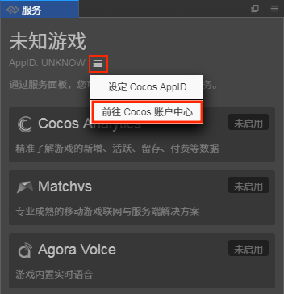
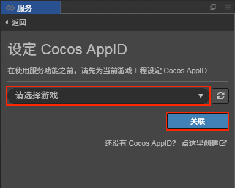

# 设定 Cocos AppID

Cocos AppID 用于联通 Cocos 账号、Cocos Creator 游戏工程和第三方服务账号体系。用户只需要在 Cocos 账户中心创建游戏，并在项目中设定 Cocos AppID 后，就可以开始使用 Cocos Service 提供的一键接入功能。

## 操作步骤

- 在 Cocos Creator 中打开需要接入 Cocos Service 的项目，找到 **服务** 面板。若该面板已经关闭，可以在 **菜单栏 -> 面板 -> 服务** 中重新打开。
- 若首次使用，需要前往 [Cocos 账户中心](https://auth.cocos.com/#/) 注册用户账号以及创建游戏，可点击 **AppID** 后的  按钮，然后选择 **前往 Cocos 账户中心**：

    

    账号注册完成后根据需要创建个人／公司游戏：

    

- 若 Cocos 账户中心已有游戏，可直接在 **服务** 面板中设置 Cocos AppID。点击 **AppID** 后的  按钮，选择 **设定 Cocos AppID**，跳转到 **设定 Cocos AppID** 面板。

    
        
    选择需要使用服务的游戏，然后点击 **关联** 按钮

    

在简单的 **创建游戏** 和 **设定 AppID** 之后，便可以开始体验一键式接入服务的迅捷和便利。

---

继续前往 [一键开通服务](oneclick-provisioning.md)。
