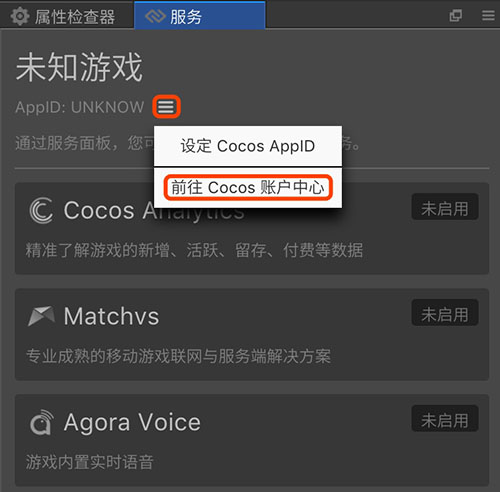
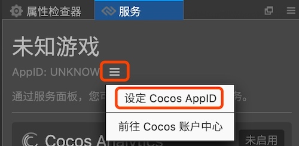
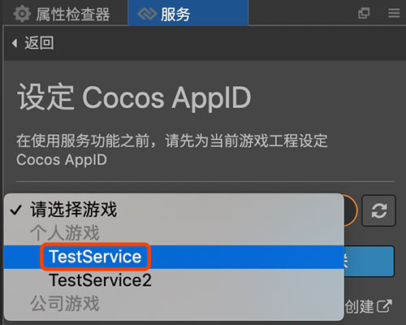
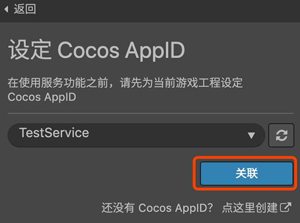

#设定 Cocos AppID
Cocos AppID 用于联通 Cocos 账号、Cocos Creator 游戏工程和第三方服务账号体系。用户只需要在 Cocos 后台注册游戏，并在项目中进行 Cocos AppID 设定后，就可以开始使用 Cocos Service 提供的一键接入功能。

- 在 Cocos Service 项目中，找到服务面板。若该面板已经关闭，可以在 **菜单 > 面板 > 服务** 中重新打开。
- 若从未在后台设置游戏，可点击 AppID 后方 
**按钮 > 前往 Cocos 账户中心**，根据需要创建个人／公司游戏：

    

    

- 若后台已有游戏，在 Cocos Service 服务面板，点击 App ID 后方 
**按钮 > 设定 Cocos AppID** ，选择需要使用服务的游戏，点击关联按钮。

    
    
    

在简单的 **创建游戏** 和 **设定 AppID** 之后，便可以开始体验一键式接入服务的迅捷和便利。

---

继续前往 [一键开通服务](oneclick-provisioning.md)。

