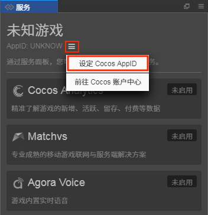
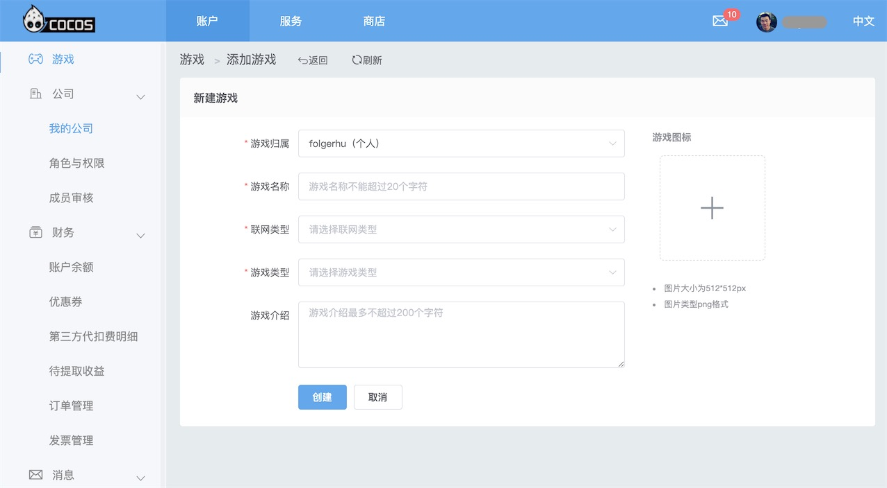
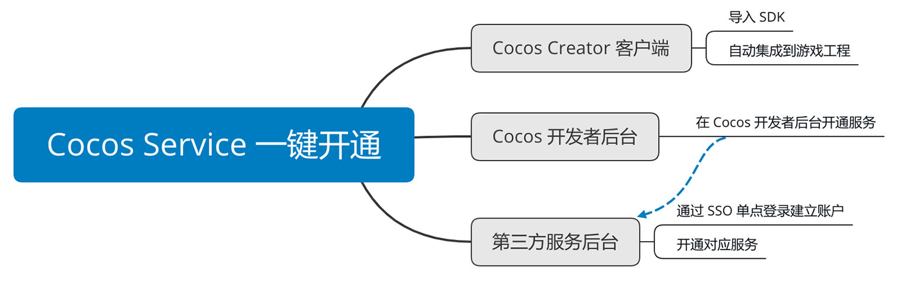
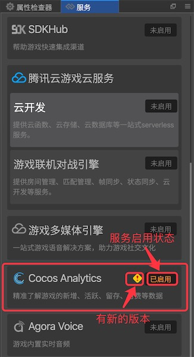
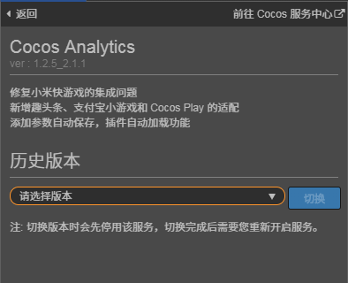

> **注意**：此版本文档已归档不再维护，请移步至 [最新版本](https://service.cocos.com/document/zh/user-guide.html)。

# 服务面板操作指南

## 使用方式

### 设定 Cocos AppID

Cocos AppID 是游戏的唯一标识。大多数服务在使用时都会产生一些跟游戏关联的数据，或者 SDK 在被调用时，需要知道是被哪个游戏调用，以免数据混杂，所以必须要有一个唯一标识。因此，在使用服务之前，必须先为游戏工程设定 Cocos AppID，然后才能开始使用各种服务。

- 在 Cocos Creator **菜单栏 -> 面板 -> 服务** 打开服务面板，进入服务面板主界面，点击 **AppID** 后的  按钮进行设定：

    

- 如果开发者是首次使用 Cocos 还没有 AppID，开发者可以前往 Cocos 账户中心注册开发者账号以及创建游戏：

    

### 一键开通服务

游戏工程设定 Cocos AppID 后，便可以直接一键开通服务。只需要点击一下开通按钮，Cocos Service 将自动完成服务开通、服务商账号联通以及 SDK 集成等工作。

下面以接入 Cocos Analytics 服务为例：

- 在 **服务** 面板中，选择 **Cocos Analytics** 项，进入 Cocos Analytics 服务面板。
- 点击右上角的 **启用** 按钮以启用统计服务。首次开通会弹出是否开通服务的提示框，点击 **确认开通** 即可开通服务。

  

- 开通服务后，接下来开发者即可直接在游戏中调用服务所提供的各项功能了。详细的使用可点击服务详情页上方的“使用指南”按钮了具体了解。

## 服务面板说明

服务面板包括 **主面板** 和 **服务详情页** 两部分。

### 主面板

* 主面板列举了所有可用服务，并且可以一目了然地查看当前游戏开通了哪些服务。
*  图标显示当前服务有更新，开发者可以进入该服务的详情页进行升级。

### 服务详情页

服务详情页通常由 **基本信息**、**通用说明** 和 **插件扩展** 三部分组成。以 Cocos Analytics 服务为例：

#### 基本信息栏

- 使用指南：前往对应服务的官方文档。
- 前往控制台：前往对应服务的控制后台，通常服务的一些参数等信息开发者需要前往该服务的控制后台获取。
- Sample 工程：基本上每个服务我们都会提供 Sample 工程，开发者可以直接打开 Sample 工程来快速体验服务所提供的功能。
- 版本管理：点击 **版本号** 即可打开版本管理面板，查看该版本说明。点击 **请选择版本** 可在下拉框中切换 **其他历史版本**。

    

#### 通用说明

- 计费：详情可参考 [计费与充值](billing-and-charge.md)。
- 支持平台：包括 Android、iOS、HTML5、微信小游戏，各服务支持的平台有所不同。

#### 插件扩展

开通服务时，服务面板会下载对应服务的插件，并将插件扩展的内容显示在面板上。各服务会根据自身需要进行设计，可能有额外说明或者配置。
