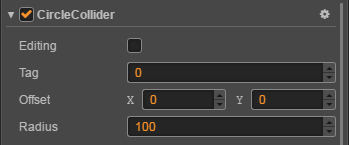

# Collider 组件参考

点击 **属性检查器** 下面的 **添加组件** 按钮，然后从 **碰撞组件** 中选择需要的 **Collider** 组件，即可添加 **Collider** 组件到节点上。

## Collider 组件属性

| 属性 |   功能说明
| -------------- | ----------- |
| Tag | 标签。当一个节点上有多个碰撞组件时，在发生碰撞后，可以使用此标签来判断是节点上的哪个碰撞组件被碰撞了。
| Editing | 是否编辑此碰撞组件，只在编辑器中有效

## 详细说明

一个节点上可以挂多个碰撞组件，这些碰撞组件之间可以是不同类型的碰撞组件。

碰撞组件目前包括了 **Polygon（多边形）**，**Circle（圆形）**，**Box（矩形）** 这几种碰撞组件，这些组件都继承自 **Collider** 组件，所以 **Collider** 组件的属性它们也都享有。

### Polygon（多边形）碰撞组件属性

| 属性 |   功能说明
| -------------- | ----------- |
| Regenerate Points | 根据组件所在节点上的 Sprite 组件的贴图像素点来自动生成相应轮廓的顶点。
| Threshold | 指明生成贴图轮廓顶点间的最小距离，值越大则生成的点越少，可根据需求进行调节。
| Offset    | 组件相对于节点的 **偏移量**。
| Points    | 组件的 **顶点数组**。

### Circle（圆形）碰撞组件属性

| 属性 |   功能说明
| ------ | ----- |
| Offset | 组件相对于节点的 **偏移量**。
| Radius | 组件的 **半径**。

### Box（矩形）碰撞组件属性

| 属性 |   功能说明
| -------------- | ----------- |
| Offset | 组件相对于节点的 **偏移量**。
| Size | 组件的 **长宽**。

更多关于 **Collider** 的信息请前往 [碰撞系统](../physics/collision/index.md)
