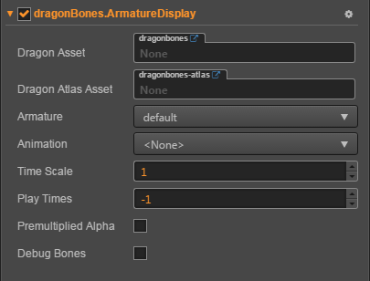

# DragonBones 组件参考

DragonBones 组件对骨骼动画（DragonBones）资源，进行渲染和播放。

点击**属性检查器**下面的添加组件按钮，然后从添加渲染组件中选择 DragonBones，即可添加 DragonBones 组件到节点上。

DragonBones 组件在脚本中的操作请参考 example cases 中的 DragonBones 测试例。

## DragonBones 属性

| 属性 |   功能说明
| -------------- | ----------- |
|Dragon Asset| DragonBones 导出后的骨骼数据（.json）文件
|Dragon Atlas Asset| DragonBones 导出后的图集数据（.json）文件
|Armature| 当前使用的 Armature 名称
|Animation| 当前播放的动画名称
|Time Scale| 播放速度
|Play Times| 动画播放次数（-1 表示使用配置文件中的默认值；0 表示无限循环；>0 表示循环次数）
|Debug Bones| 显示骨骼

> 注意：当使用 DragonBones 组件时，Node 节点上 `Anchor` 与 `Size` 是无效的。
