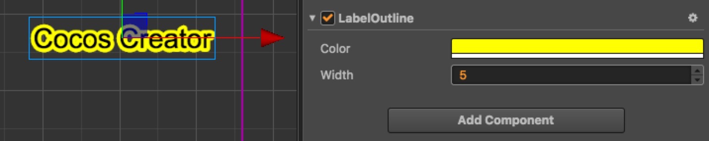

# LabelOutline 组件参考

LabelOutline 组件将为所在节点上的 Label 组件添加描边效果，只能用于系统字体或者 TTF 字体。

点击 **属性检查器** 下面的 **添加组件** 按钮，然后从 **渲染组件** 中选择 **LabelOutline**，即可添加 LabelOutline 组件到节点上。

LabelOutline 组件在 Label 组件的 Cache Mode 属性设置为 CHAR 时不生效，除了原生平台，但是原生平台也只有在使用 TTF 字体时是生效的。

LabelOutline 组件的脚本接口请参考 [LabelOutline API](../../../api/zh/classes/LabelOutline.html)。

## LabelOutline 属性

| 属性 | 功能说明
| ------- | ------- |
| Color  | 描边的颜色
| Width  | 描边的宽度
