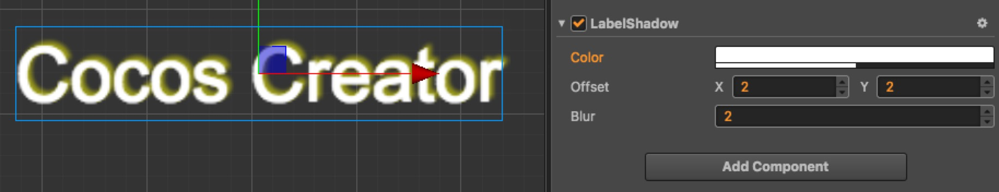

# LabelShadow 组件参考

LabelShadow 组件可以为 Label 组件添加阴影效果，但只能用于系统字体或者 TTF 字体。

点击 **属性检查器** 下面的 **添加组件** 按钮，然后从 **添加渲染组件** 中选择 **LabelShadow**，即可添加 LabelShadow 组件到节点上。

描边脚本接口请参考 [LabelShadow API](../../../api/zh/classes/LabelShadow.html)。

## LabelShadow 属性

| 属性 | 功能说明
| -------- | -------- |
| Color  | 阴影的颜色
| Offset | 字体与阴影的偏移
| Blur   | 阴影的模糊程度
