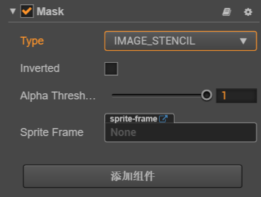

# Mask（遮罩）组件参考

Mask 用于规定子节点可渲染的范围，带有 Mask 组件的节点会使用该节点的约束框（也就是 **属性检查器** 中 Node 组件的 **Size** 规定的范围）创建一个渲染遮罩，该节点的所有子节点都会依据这个遮罩进行裁剪，遮罩范围外的将不会渲染。

点击 **属性检查器** 下面的 **添加组件** 按钮，然后从 **渲染组件** 中选择 **Mask**，即可添加 Mask 组件到节点上。注意该组件不能添加到有其他渲染组件（如 **Sprite**、**Label** 等）的节点上。

遮罩的脚本接口请参考 [Mask API](../../../api/zh/classes/Mask.html)。

## Mask 属性

| 属性  |   功能说明           |
| -------------- | ----------- |
| Type           | 遮罩类型。包括 **RECT**、**ELLIPSE**、**IMAGE_STENCIL** 三种类型，详情可查看 [Type API](../../../api/zh/enums/Mask.Type.html)
| Inverted       | 布尔值，反向遮罩
| Alpha Threshold| Alpha 阈值，该属性为浮点类型，仅在 Type 设为 **IMAGE_STENCIL** 时才生效。 只有当模板像素的 alpha 值大于该值时，才会绘制内容。 该属性的取值范围是 0 ~ 1，1 表示完全禁用。
| Sprite Frame   | 遮罩所需要的贴图，只在遮罩类型设为 **IMAGE_STENCIL** 时生效
| Segements      | 椭圆遮罩的曲线细分数，只在遮罩类型设为 **ELLIPSE** 时生效

**注意**：节点添加了 Mask 组件之后，所有在该节点下的子节点，在渲染的时候都会受 Mask 影响。
