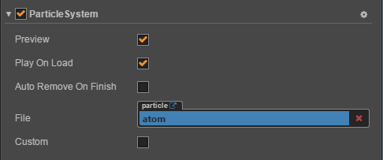
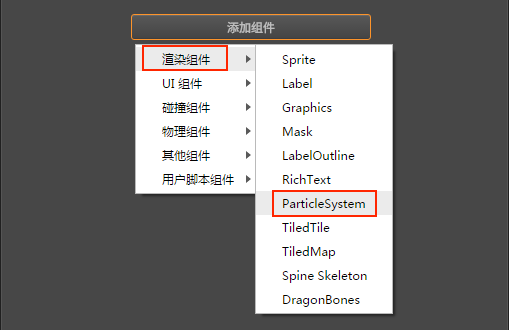

# ParticleSystem 组件参考

## 概述

该组件是用来读取 [粒子资源](../asset-workflow/particle.md) 数据，并且对其进行一系列例如播放、暂停、销毁等操作。



## 创建方式

ParticleSystem 组件可通过编辑器和脚本两种方式创建，如下所示

### 1、通过编辑器创建

  点击 **属性检查器** 下方的 **添加组件** 按钮，然后从 **渲染组件** 中选择 **ParticleSystem**，即可添加 ParticleSystem 组件到节点上。

  

### 2、通过脚本创建

  ```js
  // 创建一个节点
  var node = new cc.Node();
  // 将节点添加到场景中
  cc.director.getScene().addChild(node);
  // 添加粒子组件到 Node 上
  var particleSystem = node.addComponent(cc.ParticleSystem);
  // 接下去就可以对 particleSystem 这个对象进行一系列操作了
  ```

  ParticleSystem 的脚本接口请参考 [ParticleSystem API](../../../api/zh/classes/ParticleSystem.html)。

## ParticleSystem 属性

| 属性 |   功能说明
| -------------- | ----------- |
| Preview               | 在编辑器模式下预览粒子，启用后选中粒子时，粒子将自动播放
| Play On Load          | 如果设置为 true 运行时会自动发射粒子
| Auto Remove On Finish | 粒子播放完毕后自动销毁所在的节点
| File                  | Plist 格式的粒子配置文件
| Custom                | 是否自定义粒子属性。开启该属性后可自定义以下部分粒子属性
| Sprite Frame          | 自定义的粒子贴图
| Duration              | 发射器生存时间，单位秒，-1 表示持续发射
| Emission Rate         | 每秒发射的粒子数目
| Life                  | 粒子的运行时间及变化范围
| Total Particle        | 粒子最大数量
| Start Color           | 粒子初始颜色
| Start Color Var       | 粒子初始颜色变化范围
| End Color             | 粒子结束颜色
| End Color Var         | 粒子结束颜色变化范围
| Angle                 | 粒子角度及变化范围
| Start Size            | 粒子的初始大小及变化范围
| End Size              | 粒子结束时的大小及变化范围
| Start Spin            | 粒子开始自旋角度及变化范围
| End Spin              | 粒子结束自旋角度及变化范围
| Source Pos            | 发射器位置
| Pos Var               | 发射器位置的变化范围。（横向和纵向）
| Position Type         | 粒子位置类型，包括 **FREE**、**RELATIVE**、**GROUPED** 三种。详情可参考 [PositionType API](../../../api/zh/enums/ParticleSystem.PositionType.html)
| Emitter Mode          | 发射器类型，包括 **GRAVITY**、**RADIUS** 两种。详情可参考 [EmitterMode API](../../../api/zh/enums/ParticleSystem.EmitterMode.html)
| Gravity               | 重力。仅在 Emitter Mode 设为 **GRAVITY** 时生效
| Speed                 | 速度及变化范围。仅在 Emitter Mode 设为 **GRAVITY** 时生效
| Tangential Accel      | 每个粒子的切向加速度及变化范围，即垂直于重力方向的加速度。仅在 Emitter Mode 设为 `GRAVITY` 时生效
| Radial Accel          | 粒子径向加速度及变化范围，即平行于重力方向的加速度。仅在 Emitter Mode 设为 **GRAVITY** 时生效
| Rotation Is Dir       | 每个粒子的旋转是否等于其方向。仅在 Emitter Mode 设为 **GRAVITY** 时生效
| Start Radius          | 初始半径及变化范围，表示粒子发射时相对发射器的距离。仅在 Emitter Mode 设为 **RADIUS** 时生效
| End Radius            | 结束半径。仅在 Emitter Mode 设为 **RADIUS** 时生效
| Rotate Per S          | 粒子每秒围绕起始点的旋转角度及变化范围。仅在 Emitter Mode 设为 **RADIUS** 时生效
| Src Blend Factor      | 混合显示两张图片时，原图片的取值模式。可参考 [BlendFactor API](../../../api/zh/enums/BlendFactor.html)
| Dst Blend Factor      | 混合显示两张图片时，目标图片的取值模式。可参考 [BlendFactor API](../../../api/zh/enums/BlendFactor.html)
