# Spine 组件参考

Spine 组件支持 Spine 导出的数据格式，并对骨骼动画（Spine）资源进行渲染和播放。

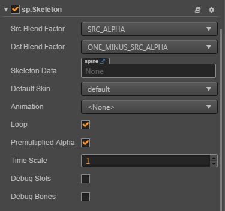

选中节点，点击 **属性检查器** 下方的 **添加组件 -> 渲染组件 -> Spine Skeleton** 按钮，即可添加 Spine 组件到节点上。

Spine 的脚本接口请参考 [Skeleton API](../../../api/zh/classes/Skeleton.html)。

## Spine 属性

| 属性 |   功能说明
| --------------------- | ------------------ |
| Skeleton Data         | 骨骼信息数据，拖拽 Spine 导出后的骨骼资源到该属性中
| Default Skin          | 选择默认的皮肤
| Animation             | 当前播放的动画名称
| Animation Cache Mode  | 渲染模式，默认 `REALTIME` 模式。（v2.0.9 中新增）<br>1. **REALTIME** 模式，实时运算，支持 Spine 所有的功能。<br>2. **SHARED_CACHE** 模式，将骨骼动画及贴图数据进行缓存并共享，相当于预烘焙骨骼动画。拥有较高性能，但不支持动作融合、动作叠加，只支持动作开始和结束事件。至于内存方面，当创建 N(N>=3) 个相同骨骼、相同动作的动画时，会呈现内存优势。N 值越大，优势越明显。综上 `SHARED_CACHE` 模式适用于场景动画，特效，副本怪物，NPC 等，能极大提高帧率和降低内存。<br>3. **PRIVATE_CACHE** 模式，与 `SHARED_CACHE` 类似，但不共享动画及贴图数据，且会占用额外的内存，仅存在性能优势，如果大量使用该模式播放动画可能会造成卡顿。当想利用缓存模式的高性能，但又存在换装的需求，因此不能共享贴图数据时，那么 `PRIVATE_CACHE` 就适合你。
| Loop                  | 是否循环播放当前动画
| Premultiplied Alpha   | 图片是否启用贴图预乘，默认为 True。<br>当图片的透明区域出现色块时需要关闭该项，当图片的半透明区域颜色变黑时需要启用该项。
| Time Scale            | 当前骨骼中所有动画的时间缩放率
| Debug Slots           | 是否显示 slot 的 debug 信息
| Debug Bones           | 是否显示骨骼的 debug 信息
| Debug Mesh            | 是否显示 mesh 的 debug 信息
| Use Tint              | 是否开启染色效果，默认关闭。（v2.0.9 中新增）
| Enable Batch          | 是否开启动画合批，默认关闭。（v2.0.9 中新增）<br>开启时，能减少 Drawcall，适用于大量且简单动画同时播放的情况。<br>关闭时，Drawcall 会上升，但能减少 CPU 的运算负担，适用于复杂的动画。

> **注意**：当使用 Spine 组件时，**属性检查器** 中 Node 组件上的 **Anchor** 与 **Size** 属性是无效的。

## Spine 换装

下面通过一个范例介绍 Spine 如何换装。我们将会通过替换插槽的 attachment 对象，将绿色框中的手臂替换为红色框中的手臂。

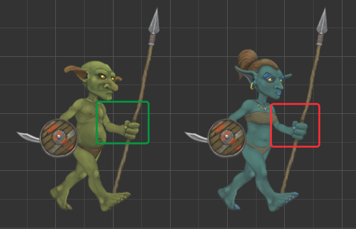

1. 首先在 **层级管理器** 中新建一个空节点，重命名为 goblingirl。在 **属性检查器** 中添加 Spine 组件，并将资源拖拽至 Spine 组件的 Skeleton Data 属性框中，然后将 Default Skin 属性设置成红色框中用于替换的皮肤。可更改 Spine 组件的 Animation 属性用于设置开发者想要播放的动画。

    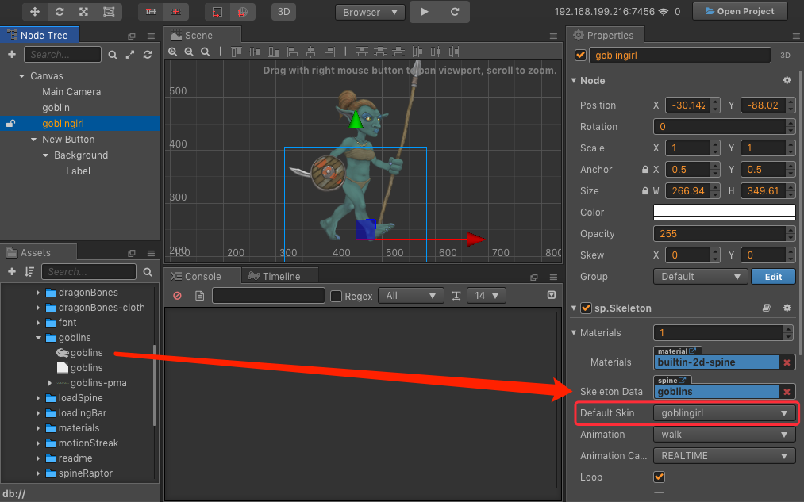

2. 再次新建一个空节点并重命名为 goblin，添加 Spine 组件，并将资源拖拽至 Spine 组件的 Skeleton Data 属性框中。然后将 Default Skin 属性设置成绿色框中想要替换的皮肤，如下图所示：

    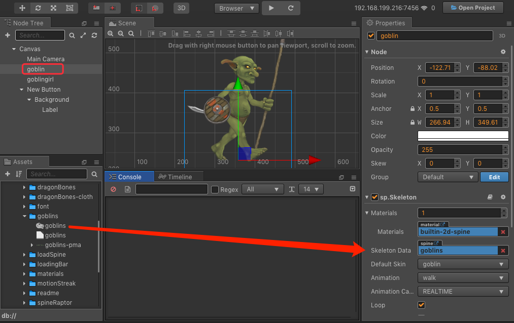

3. 在 **资源管理器** 中新建一个 JavaScript 脚本，编写组件脚本。脚本代码如下：

    ```js
    cc.Class({
        extends: cc.Component,

        properties: {
            goblin: {
                type: sp.Skeleton,
                default: null,
            },
            goblingirl: {
                type: sp.Skeleton,
                default: null,
            }
        },

        start () {
            let parts = ["left-arm", "left-hand", "left-shoulder"];
            for (let i = 0; i < parts.length; i++) {
                let goblin = this.goblin.findSlot(parts[i]);
                let goblingirl = this.goblingirl.findSlot(parts[i]);
                let attachment = goblingirl.getAttachment();
                goblin.setAttachment(attachment);
            }
        }
    });
    ```

4. 然后将脚本组件挂载到 Canvas 节点或者其他节点上，即将脚本拖拽到节点的 **属性检查器** 中。再将 **层级管理器** 中的 goblingirl 节点和 goblin 节点分别拖拽到脚本组件对应的属性框中，并保存场景。

    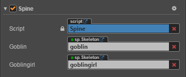

5. 点击编辑器上方的预览按钮，可以看到绿色框中的手臂已经被替换。

    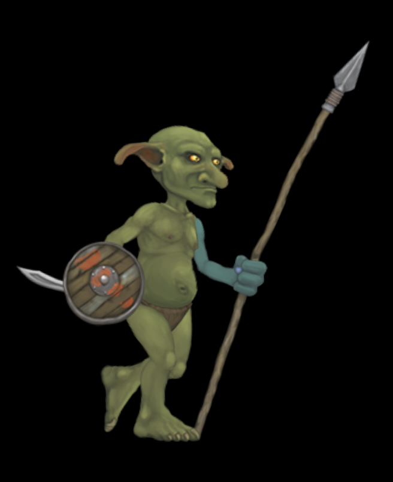

## Spine 顶点效果

顶点效果只有当 Spine 处于 REALTIME 模式时有效，下面通过一个范例介绍 Spine 如何设置顶点效果。

1. 首先在 **层级管理器** 中新建一个空节点并重命名。然后在 **属性检查器** 中添加 Spine 组件，并将资源拖拽至 Spine 组件的 Skeleton Data 属性框中，设置好 Spine 组件属性。

2. 在 **资源管理器** 中新建一个 JavaScript 脚本，编写组件脚本。脚本代码如下：

    ```js
    cc.Class({
        extends: cc.Component,

        properties: {
            skeleton : {
                type: sp.Skeleton,
                default: null,
            }
        },

        start () {
            this._jitterEffect = new sp.VertexEffectDelegate();
            // 设置好抖动参数。
            this._jitterEffect.initJitter(20, 20);
            // 调用 Spine 组件的 setVertexEffectDelegate 方法设置效果。
            this.skeleton.setVertexEffectDelegate(this._jitterEffect);
        }
    });
    ```

3. 然后将脚本组件挂载到 Canvas 节点或者其他节点上，即将脚本拖拽到节点的 **属性检查器** 中。再将 **层级管理器** 中的节点拖拽到脚本组件对应的属性框中，并保存场景。

4. 点击编辑器上方的预览按钮，即可看到 Spine 动画的顶点抖动的效果。关于代码可参考 **SpineMesh** 范例（[GitHub](https://github.com/cocos/example-projects/tree/master/assets/cases/spine) | [Gitee](https://gitee.com/mirrors_cocos-creator/example-cases/tree/master/assets/cases/spine)）。

## Spine 挂点

在使用骨骼动画时，经常需要在骨骼动画的某个部位上挂载节点，以实现节点与骨骼动画联动的效果。我们可以通过使用编辑器和脚本两种方式来实现 Spine 挂点，下面用一个范例来介绍 Spine 如何使用挂点将星星挂在龙的尾巴上，并随着龙的尾巴一起晃动。

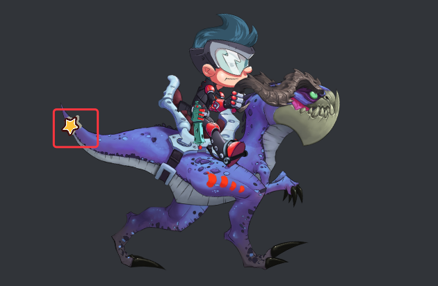

### 通过编辑器实现 Spine 挂点

1. 首先在 **层级管理器** 中新建一个空节点并重命名。选中该节点然后在 **属性检查器** 中添加 Spine 组件，并将资源拖拽至 Spine 组件的 Skeleton Data 属性框中，设置好 Spine 组件属性。然后点击 Spine 组件下方的 **生成挂点** 按钮。

    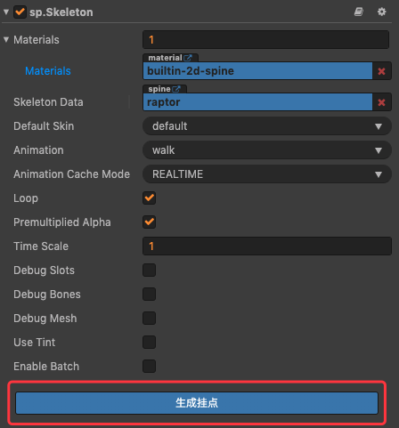

2. 点击 **生成挂点** 按钮后，**层级管理器** 中 Spine 组件所在节点的下方，会以节点树的形式生成所有骨骼。

    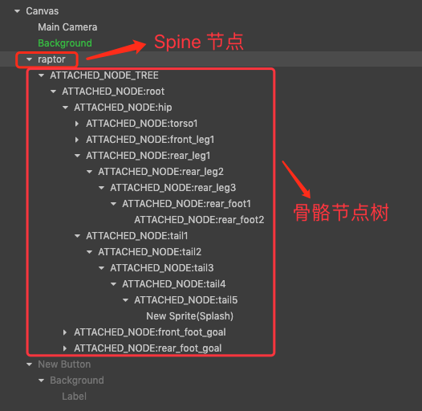

3. 在 **层级管理器** 中选中目标骨骼节点（龙的尾巴）作为父节点，创建一个 Sprite 节点为子节点。

    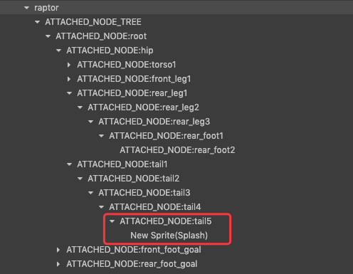

    即可看到在 **场景编辑器** 中龙的尾巴上已经挂了一个 Sprite。

    

4. 最后将星星资源拖拽到 Sprite 组件的 Sprite Frame 属性上。保存场景，点击编辑器上方的预览按钮，即可看到星星挂在龙的尾巴上，并随着龙的尾巴一起晃动。具体可参考 example-case 中的 **SpineAttach** 范例（[GitHub](https://github.com/cocos/example-projects/tree/master/assets/cases/spine) | [Gitee](https://gitee.com/mirrors_cocos-creator/example-cases/tree/master/assets/cases/spine)）。

> **注意**：Spine 挂点完成后，即可删除 **层级管理器** 中无用的骨骼节点，以减少运行时的计算开销。注意目标骨骼节点的父节点都不可删。

### 通过脚本实现 Spine 挂点

1. 跟通过编辑器实现的步骤类似，首先先创建一个挂有 Spine 组件的节点，并设置好 Spine 组件的属性。

2. 创建要挂载到骨骼动画上的星星预制资源，预制资源相关可参考 [Prefab](../asset-workflow/prefab.md) 文档。

3. 在 **资源管理器** 中新建一个 JavaScript 脚本，编写组件脚本。脚本代码如下：

    ```js
    cc.Class({
        extends: cc.Component,

        properties: {
            skeleton: {
                type: sp.Skeleton,
                default: null,
            },
            // 将要添加到骨骼动画上的预制体
            targetPrefab: {
                type: cc.Prefab,
                default: null,
            },
            // 目标骨骼名称
            boneName: "",
        },

        onLoad () {
            this.generateSomeNodes();
        },

        generateAllNodes () {
            // 取得挂点工具
            let attachUtil = this.skeleton.attachUtil;
            attachUtil.generateAllAttachedNodes();
            // 因为同名骨骼可能不止一个，所以需要返回数组
            let boneNodes = attachUtil.getAttachedNodes(this.boneName);
            // 取第一个骨骼作为挂点
            let boneNode = boneNodes[0];
            boneNode.addChild(cc.instantiate(this.targetPrefab));
        },

        destroyAllNodes () {
            let attachUtil = this.skeleton.attachUtil;
            attachUtil.destroyAllAttachedNodes();
        },

        // 生成指定骨骼名称节点树的方法
        generateSomeNodes () {
            let attachUtil = this.skeleton.attachUtil;
            let boneNodes = attachUtil.generateAttachedNodes(this.boneName);
            let boneNode = boneNodes[0];
            boneNode.addChild(cc.instantiate(this.targetPrefab));
        },

        // 销毁指定骨骼名称节点的方法
        destroySomeNodes () {
            let attachUtil = this.skeleton.attachUtil;
            attachUtil.destroyAttachedNodes(this.boneName);
        }
    });
    ```

4. 将脚本挂载到 Canvas 节点或者其他节点上，即将脚本拖拽到节点的 **属性检查器** 中。然后再将对应的节点或者资源拖拽到脚本组件的属性框中，并保存场景。

    

    若不知道目标骨骼的名称，可点击 Spine 组件中的 **生成挂点** 按钮，然后在 **层级管理器** 中 Spine 节点下生成的骨骼节点树中查找。查找完成后再删除 Spine 节点下的骨骼节点树即可。

## Spine 碰撞检测

通过 Spine 挂点功能可以对骨骼动画的某个部位做碰撞检测，Spine 如何实现挂点请参考前面 Spine 挂点部分章节。下面通过一个范例来介绍 Spine 如何实现碰撞检测，通过判断人物脚与地面接触与否来实现当人物跑动时，动态地改变地面颜色。

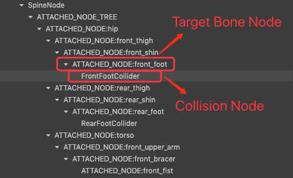

1. 与通过编辑器实现 Spine 挂点的前两个步骤一样，创建好 Spine 节点后，点击 Spine 组件中的 **生成挂点** 按钮。

2. 然后在 **层级管理器** Spine 节点下的骨骼节点树中选中目标骨骼节点（人物的脚）作为父节点，再创建一个空节点（重命名为 FrontFootCollider）作为子节点。

    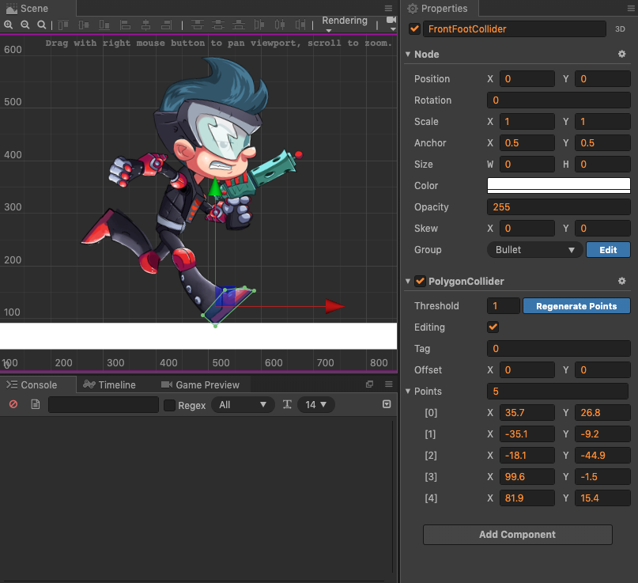

3. 在 **层级管理器** 中选中 FrontFootCollider 节点，在 **属性检查器** 中点击 **添加组件 -> 碰撞组件 -> Polygon Collider**，然后设置好碰撞组件参数。该节点便会随着骨骼动画一起运动，从而碰撞组件的包围盒也会实时地与骨骼动画保持同步。

    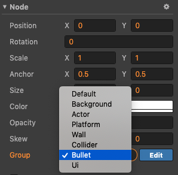

4. 在 **层级管理器** 中创建一个 Sprite 节点作为地面。选中该节点，然后在 **属性检查器** 中设置好位置大小等属性，并添加 **BoxCollider** 碰撞组件。

5. 在 **资源管理器** 中新建一个 JavaScript 脚本，然后将脚本挂载到地面节点上。脚本代码可参考：

    ```js
    cc.Class({
        extends: cc.Component,

        properties: {
            
        },

        start () {
            cc.director.getCollisionManager().enabled = true;
            cc.director.getCollisionManager().enabledDebugDraw = true;
            this.stayCount = 0;
        },

        onCollisionEnter (other, self) {
            this.stayCount++;
        },

        onCollisionExit (other, self) {
            this.stayCount--;
        },

        update () {
            if (this.stayCount > 0) {
                this.node.color = cc.color(0, 200, 200);
            } else {
                this.node.color = cc.color(255, 255, 255);
            }
        }
    });
    ```

6. 设置碰撞组件所在节点的分组，添加分组的方法请参考文档 [碰撞分组管理](../physics/collision/collision-group.md)。

    

    

    

7. 点击编辑器上方的预览按钮，即可看到效果。具体可参考 example-case 中的 **SpineCollider** 范例（[GitHub](https://github.com/cocos/example-projects/tree/master/assets/cases/spine)  | [Gitee](https://gitee.com/mirrors_cocos-creator/example-cases/tree/master/assets/cases/spine)）。

> **注意**：由于挂点的实现机制导致基于挂点的碰撞检测，存在延迟一帧的问题。
