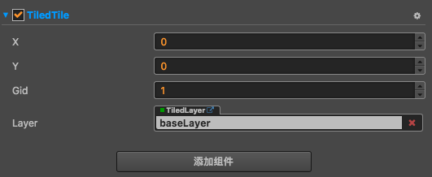

# TiledTile 组件参考

TiledTile 组件可以单独对某一个地图块进行操作。

## 使用方式

1. 编辑器中创建：在 Layer 节点下创建一个 Node，并点击该 Node **属性检查器** 下面的 `添加组件` 按钮，
从 `添加渲染组件` 中选择 `TiledTile`，即可添加 TiledTile 组件到节点上，然后设置组件上的属性进行操作地图块。

    

    相关 TiledTile 脚本接口请参考 [TiledTile API](../../../api/zh/classes/TiledTile.html)

2. 代码中创建：在代码中设置地图块有两种方式，当你在某个 LAYER 中设置了 TILEDTILE 之后，他所在位置的 TILE 就会被取代

    ```
    // 1. 通过对一个节点添加 TiledTile 组件进行创建
    //-- 首先：创建一个新节点
    var node = new cc.Node();       
    //-- 然后：把该节点父节点设置为任意的 layer 节点
    node.parent = this.layer.node;  
    //-- 最后：添加 TiledTile 组件到该节点上返回 TiledTile 对象，就可以对他进行一系列操作
    var tiledTile node.addComponent(cc.TiledTile);  
    ...
    
    --------------------------------------------------------------------
        
    // 2. 通过 getTiledTileAt 进行获取 TiledTile 
    // 获取 layer 上横向坐标为 0，纵向坐标为 0 的 TiledTile 对象，就可以对他进行一系列操作
    var tiledTile = this.layer.getTiledTileAt(0, 0);
    ....    
    ```

    相关 Layer 脚本接口请参考 [TiledLayer API](../../../api/zh/classes/TiledLayer.html)

    注意: 只能在地图中现有的地图块 gid 来进行切换块的样式，无法通过自定义 sprite frame 来切换块样式。

## TiledTile 属性

| 属性 |   功能说明
| ------| ----------- |
| x     | 指定 TiledTile 的横向坐标，以地图块为单位
| y     | 指定 TiledTile 的纵向坐标，以地图块为单位
| gid   | 指定 TiledTile 的 gid 值，来切换 TiledTile 的样式
| layer | 获取 TiledTile 属于哪一个 TiledLayer（只读）

## 可作用到 TiledTile 上的节点属性

| 属性 |   功能说明
| ------| ----------- |
| position | 可对指定的 TiledTile 进行 `平移` 操作
| rotation | 可对指定的 TiledTile 进行 `旋转 `操作
| scale    | 可对指定的 TiledTile 进行 `缩放` 操作
| color    | 可对指定的 TiledTile 进行 `颜色` 操作
| opacity  | 可对指定的 TiledTile 进行 `透明度` 操作
| skew     | 可对指定的 TiledTile 进行 `倾斜角度` 操作
