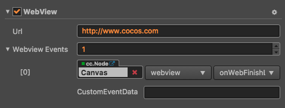

# WebView 组件参考

WebView 是一种显示网页的组件，该组件让你可以在游戏里面集成一个小的浏览器。由于不同平台对于 WebView 组件的授权、API、控制方式都不同，还没有形成统一的标准，所以目前只支持 Web、iOS 和 Android 平台。



点击 **属性检查器** 下方的 **添加组件** 按钮，然后从 **UI 组件** 中选择 **WebView**，即可添加 WebView 组件到节点上。

WebView 的脚本接口请参考 [WebView API](../../../api/zh/classes/WebView.html)。

## WebView 属性

| 属性          | 功能说明      |
| -------------- | -------------- |
| Url            | 指定一个 URL 地址，这个地址以 http 或者 https 开头，请填写一个有效的 URL 地址。 |
| Webview Events | WebView 的回调事件，当 webview 在加载网页过程中，加载网页结束后或者加载网页出错时会调用此函数。 |

> **注意**：在 **Webview Events** 属性的 **cc.Node** 中，应该填入的是一个挂载有用户脚本组件的节点，在用户脚本中便可以根据用户需要使用相关的 WebView 事件。

## WebView 事件

### WebViewEvents 事件

| 属性            | 功能说明 |
| --------------  | -----------  |
| Target          | 带有脚本组件的节点。   |
| Component       | 脚本组件名称。      |
| Handler         | 指定一个回调函数，当网页加载过程中、加载完成后或者加载出错时会被调用，该函数会传一个事件类型参数进来。详情见下方的 **WebView 事件回调参数** 部分 |
| CustomEventData | 用户指定任意的字符串作为事件回调的最后一个参数传入。 |

详情可参考 API 文档 [Component.EventHandler 类型](../../../api/zh/classes/Component.EventHandler.html)

### WebView 事件回调参数

| 名称           | 功能说明     |
| -------------- | ----------- |
| LOADING        | 表示网页正在加载过程中。 |
| LOADED         | 表示网页加载已经完毕。   |
| ERROR          | 表示网页加载出错了。     |

详情可参考 [WebView 事件](../../../api/zh/classes/WebView.html#%E4%BA%8B%E4%BB%B6) 或者参考引擎自带的 example-cases 范例中的 **10_webview**（[GitHub](https://github.com/cocos/example-projects/tree/master/assets/cases/02_ui/10_webview) | [Gitee](https://gitee.com/mirrors_cocos-creator/example-cases/tree/master/assets/cases/02_ui/10_webview)）。

## 详细说明

目前此组件只支持 Web（PC 和手机）、iOS 和 Android 平台（v2.0.0～2.0.6 版本不支持），Mac 和 Windows 平台暂时还不支持，如果在场景中使用此组件，那么在 PC 的模拟器里面预览的时候可能看不到效果。

此控件暂时不支持加载指定 HTML 文件或者执行 Javascript 脚本。

### 通过脚本代码添加回调

#### 方法一

这种方法添加的事件回调和使用编辑器添加的事件回调是一样的，通过代码添加，你需要首先构造一个 `cc.Component.EventHandler` 对象，然后设置好对应的 `target`、`component`、`handler` 和 `customEventData` 参数。

```js
//here is your component file
cc.Class({
    name: 'cc.MyComponent',
    extends: cc.Component,
    properties: {
       webview: cc.WebView,
    },

    onLoad: function() {
        var webviewEventHandler = new cc.Component.EventHandler();
        webviewEventHandler.target = this.node; //这个 node 节点是你的事件处理代码组件所属的节点
        webviewEventHandler.component = "cc.MyComponent";
        webviewEventHandler.handler = "callback";
        webviewEventHandler.customEventData = "foobar";

        this.webview.webviewEvents.push(webviewEventHandler);
    },

    //注意参数的顺序和类型是固定的
    callback: function(webview, eventType, customEventData) {
        //这里 webview 是一个 WebView 组件对象实例
        // 这里的 eventType === cc.WebView.EventType enum 里面的值
        //这里的 customEventData 参数就等于你之前设置的 "foobar"
    }
});
```

#### 方法二

通过 `webview.node.on('loaded', ...)` 的方式来添加

```js
//假设我们在一个组件的 onLoad 方法里面添加事件处理回调，在 callback 函数中进行事件处理:

cc.Class({
    extends: cc.Component,
    properties: {
        webview: cc.WebView,
    },

    onLoad: function () {
        this.webview.node.on('loaded', this.callback, this);
    },

    callback: function (event) {
        //这里的 event 是一个 EventCustom 对象，你可以通过 event.detail 获取 WebView 组件
        var webview = event.detail;
        //do whatever you want with webview
        //另外，注意这种方式注册的事件，也无法传递 customEventData
    }
});
```

同样的，你也可以注册 `loading`、`error` 事件，这些事件的回调函数的参数与 `loaded` 的参数一致。

## 如何与 WebView 内部页面进行交互

### 调用 WebView 内部页面

```js
cc.Class({
    extends: cc.Component,
    properties: {
        webview: cc.WebView,
    },

    onLoad: function () {
        // 这里的 Test 是你 webView 内部页面代码里定义的全局函数
        this.webview.evaluateJS('Test()');
    }
});
```

#### 注意: Web 平台上的跨域问题需要自行解决

### WebView 内部页面调用外部的代码

目前 Android 与 iOS 用的机制是，通过截获 URL 的跳转，判断 URL 前缀的关键字是否与之相同，如果相同则进行回调。

1. 通过 `setJavascriptInterfaceScheme` 设置 URL 前缀关键字
2. 通过 `setOnJSCallback` 设置回调函数，函数参数为 URL

```js
cc.Class({
    extends: cc.Component,
    properties: {
        webview: cc.WebView,
    },
    // onLoad 中设置会导致 API 绑定失效，所以请在 start 中设置 webview 回调。
    start: function () {
        // 这里是与内部页面约定的关键字，请不要使用大写字符，会导致 location 无法正确识别。
        var scheme = "testkey";

        function jsCallback (target, url) {
            // 这里的返回值是内部页面的 URL 数值，需要自行解析自己需要的数据。
            var str = url.replace(scheme + '://', ''); // str === 'a=1&b=2'
            // webview target
            console.log(target);
        }

        this.webview.setJavascriptInterfaceScheme(scheme);
        this.webview.setOnJSCallback(jsCallback);
    }
});
```

因此当你需要通过内部页面交互 WebView 时，应当设置内部页面 URL：`testkey://(后面你想要回调到 WebView 的数据)`。WebView 内部页面代码如下：

```html
<html>
<body>
    <dev>
        <input type="button" value="触发" onclick="onClick()"/>
    </dev>
</body>
<script>
    function onClick () {
        // 其中一个设置 URL 方案
        document.location = 'testkey://a=1&b=2';
    }
</script>
</html>
```

由于 Web 平台的限制，导致无法通过这种机制去实现，但是内部页面可以通过以下方式进行交互：

```html
<html>
<body>
    <dev>
        <input type="button" value="触发" onclick="onClick()"/>
    </dev>
</body>
<script>
    function onClick () {
        // 这里的 parent 其实就是外部的 window
        // 这样一来就可以访问到定义在 cc 的函数了
        parent.cc.TestCode();
        // 如果 TestCode 是定义在 window 上，则
        parent.TestCode();
    }
</script>
</html>
```

#### 再强调一遍: Web 平台上的跨域问题需要自行解决
