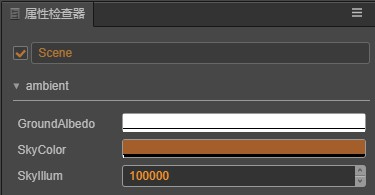

# 环境光

在生活中，错综复杂的光线与凹凸不平的物体表面相互反射，使得整个环境都被照亮，仿佛整个场景被一层环境光所笼罩。通过调节环境光，是调节环境整体光照最为直接的方式，也是一种有效表达环境气氛的方式。

 Cocos Creator 中的环境光，如下图所示：

## 环境光面板

以下介绍了面板的所有属性：

属性 | 解释
---|---
**groundAlbedo** | 地面反射光
**skyColor** | 天空颜色
**skyIllum** | 天空亮度

---

返回 [光照](light.md) 说明文档。
