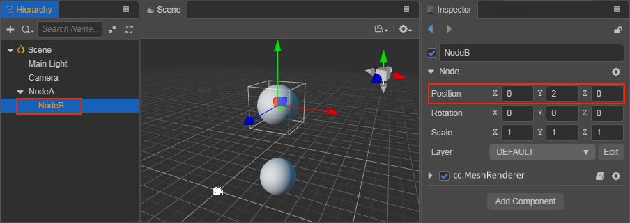

# 坐标系和节点变换属性

在文档 [场景编辑器](../../editor/scene/index.md) 和 [节点和组件](node-component.md) 中，我们介绍了可以通过 **变换工具 Gizmo** 和编辑 **属性检查器** 中节点的属性来变更节点的显示行为。这篇文档我们将会深入了解节点所在场景空间的坐标系，以及节点的 **位置（Position）**、**旋转（Rotation）**、**缩放（Scale）** 三大变换属性的工作原理。

## 坐标系

我们已经知道可以为节点设置位置属性，那么一个有着特定位置属性的节点在游戏运行时将会呈现在屏幕上的什么位置呢？就好像日常生活的地图上有了经度和纬度才能进行卫星定位，我们也要先了解 Cocos Creator 3.0 的坐标系，才能理解节点位置的意义。

### 世界坐标系（World Coordinate）

世界坐标系也叫做绝对坐标系，在 Cocos Creator 3.0 游戏开发中表示场景空间内的统一坐标体系，「世界」用来表示我们的游戏场景。

Creator 3.0 的世界坐标系采用的是笛卡尔右手坐标系，默认 x 向右，y 向上，z 向外，同时使用 -z 轴为正前方朝向。

### 本地坐标系（Local Coordinate）

本地坐标系也叫相对坐标系，是和节点相关联的坐标系。每个节点都有独立的坐标系，当节点移动或改变方向时，和该节点关联的坐标系将随之移动或改变方向。

Creator 3.0 的 **节点（Node）** 之间可以有父子关系的层级结构，我们通过修改节点的 `Position` 属性设定的节点位置是该节点相对于父节点的 **本地坐标系**，而非世界坐标系。

最后在绘制整个场景时 Creator 会把这些节点的本地坐标映射成世界坐标系坐标。 
假设场景中有三个节点：NodeA、NodeB、NodeC，节点的结构如下图所示：

当场景中包含不同层级的节点时，会按照以下的流程确定每个节点在世界坐标系下的位置：

1. 从场景根级别开始处理每个节点，上图中 NodeA 就是一个根级别节点。首先根据 NodeA 的 **位置（Position）** 属性，在世界坐标系中确定 NodeA 的本地坐标系原点位置（也就是 `Position`）。
2. 接下来处理 NodeA 的所有直接子节点，也就是上图中的 NodeB（以及其他和 NodeB 平级的节点）。根据 NodeB 的 `Position` 属性，在 NodeA 的本地坐标系中确定 NodeB 在世界坐标系中的位置。
3. 之后不管有多少级节点，都继续按照层级高低依次处理，每个节点都使用父节点的坐标系和自身位置属性来确定在世界坐标系中的位置。

## 变换属性

节点包括了 **位置（Position）**、**旋转（Rotation）** 和 **缩放（Scale）** 三个主要的变换属性，下面我们依次介绍。

### 位置（Position）

**位置（Position）** 由 `X`、`Y` 和 `Z` 属性组成，分别规定了节点在当前坐标系 x 轴、y 轴和 z 轴上的坐标，默认为 `(0, 0, 0)`。

上图中节点 NodeA 的世界坐标是 `(50, 50, 50)`，子节点 NodeB 的本地坐标是 `(0, 2, 0)`，此时若将 NodeB 移动到场景根目录，可以看到 NodeB 的世界坐标变成了 `(50, 52, 50)`：

由此可见，子节点 NodeB 的 `Position` 是以父节点 NodeA 的 `Position` 为坐标系原点的。

如果父节点 NodeA 改变 `Position`，子节点 NodeB 也会跟着改变位置（世界坐标系），但是子节点 NodeB 的 `Position` 属性不会发生变化，因为子节点 NodeB 在以父节点 NodeA 的 `Position` 为原点的本地坐标系中没有发生变化。

在 **场景编辑器** 中，可以随时使用 [移动变换工具](../../editor/toolbar/index.md#%E7%A7%BB%E5%8A%A8%E5%8F%98%E6%8D%A2%E5%B7%A5%E5%85%B7) 来改变节点位置。

### 旋转（Rotation）

**旋转（Rotation）** 由 `X`、`Y` 和 `Z` 属性组成，默认为 `(0, 0, 0)`，是另外一个会对节点本地坐标系产生影响的重要属性。当改变 `X` 属性时，表示节点会以 x 轴为中心进行逆时针/顺时针旋转，以此类推，改变 `Y` 或者 `Z` 属性时也是一样的。
- 当属性值为 **正** 时，节点 **逆时针** 旋转。
- 当属性值为 **负** 时，节点 **顺时针** 旋转。

上图所示的节点层级关系和前一张图相同，只是节点 NodeA 在 z 轴上的 **旋转（Rotation）** 属性设为了 **60** 度，可以看到除了 NodeA 本身在以 z 轴为中心 **逆时针** 旋转了 60 度之外，其子节点 NodeB 也以 NodeA 的 z 轴为中心，一起 **逆时针** 旋转了 60 度。这也意味着旋转属性会影响到子节点。

> **注意**：节点上的四元数 [rotation](__APIDOC__/zh/classes/scene_graph.node-1.html#rotation) 属性，表示的是绕任意轴旋转的角度。而 **属性检查器** 中的 `Rotation` 所对应的属性是欧拉角属性 [EulerAngles](__APIDOC__/zh/classes/scene_graph.node-1.html#eulerangles)，在脚本中可通过 `Node.eulerAngles` 获取 `Rotation` 的值。这两个属性可以根据需求分别使用，在使用 API 时请一定要注意它们和编辑器面板属性名的对应区别。

在 **场景编辑器** 中，可以随时使用 [旋转变换工具](../../editor/toolbar/index.md#%E6%97%8B%E8%BD%AC%E5%8F%98%E6%8D%A2%E5%B7%A5%E5%85%B7) 来设置节点的旋转。

### 缩放（Scale）

**缩放（Scale）** 属性也是由 `X`、`Y` 和 `Z` 三个属性组成，分别表示节点在 x 轴、y 轴和 z 轴上的缩放倍率，默认为 `(1, 1, 1)`。

上图所示的节点层级关系和介绍 `Position` 时的相同。将节点 NodeA 的缩放属性设为 `(2, 1, 1)`，也就是将 NodeA 在 x 轴方向放大到原来的 **2** 倍，y 轴和 z 轴则保持不变。可以看到子节点 NodeB 也在 x 轴方向放大到了原来的两倍，所以缩放属性会影响所有子节点。

在子节点上设置的缩放属性会和父节点的缩放叠加作用，子节点的子节点会将每一层级的缩放属性全部 **相乘** 来获得在世界坐标系下显示的缩放倍率。这一点和 **位置**、**旋转** 属性其实是一致的，只不过 **位置** 和 **旋转** 属性是 **相加** 作用，而 **缩放** 属性是 **相乘**，作用表现得更加明显。

**缩放** 属性不会影响当前节点的 **位置** 和 **旋转**，但会影响子节点的 **位置**。

在 **场景编辑器** 中，可以随时使用 [缩放变换工具](../../editor/toolbar/index.md#%E7%BC%A9%E6%94%BE%E5%8F%98%E6%8D%A2%E5%B7%A5%E5%85%B7) 来修改节点缩放。
