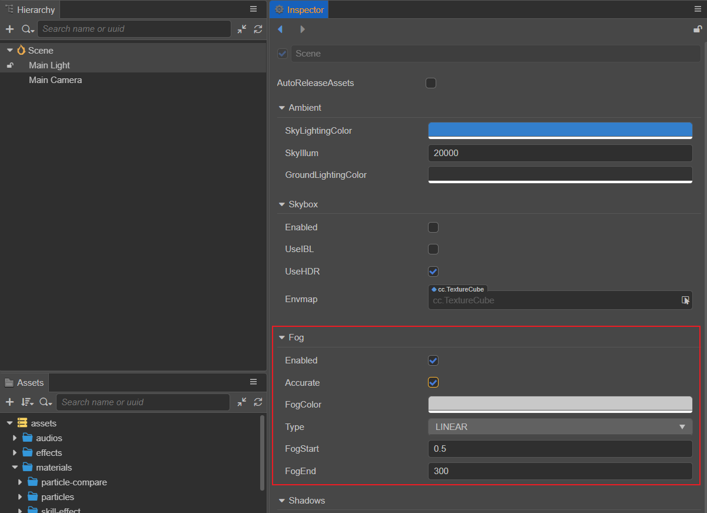
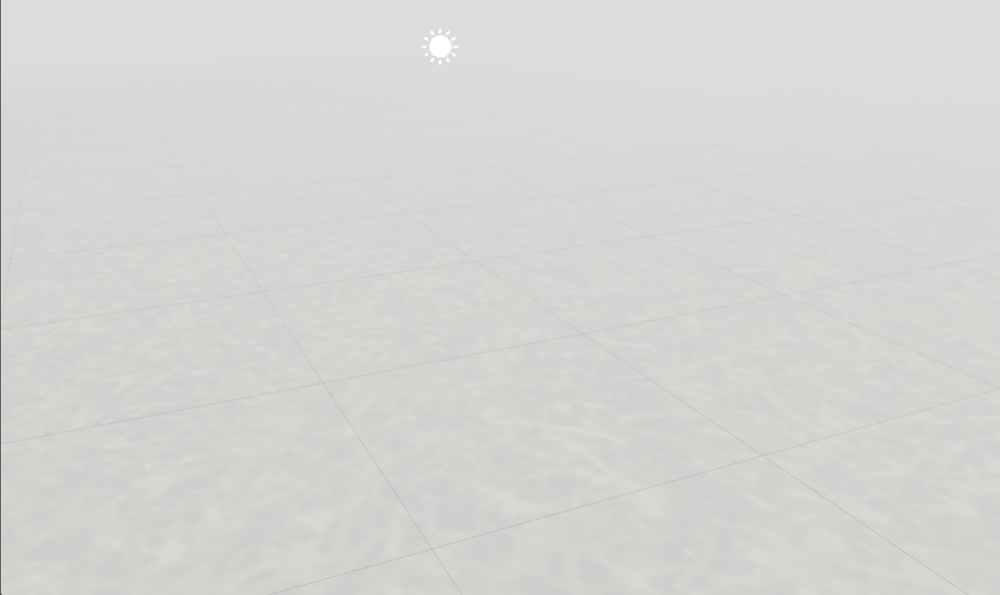
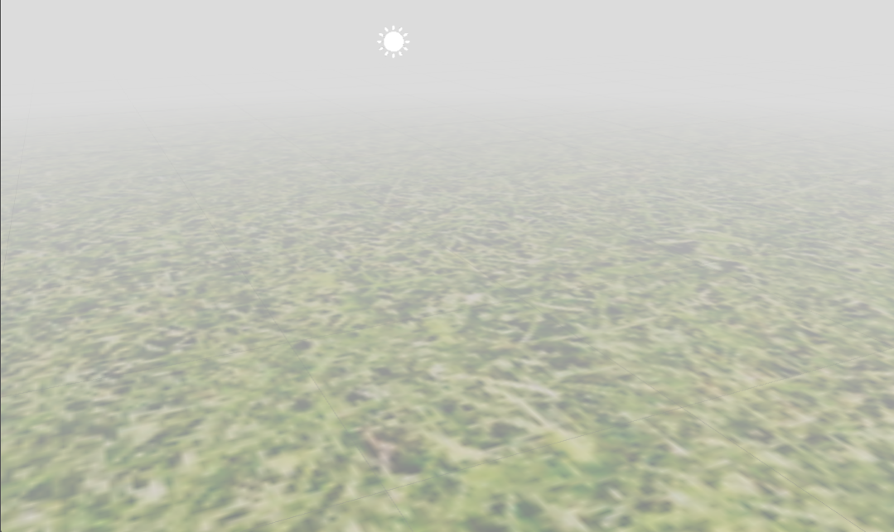
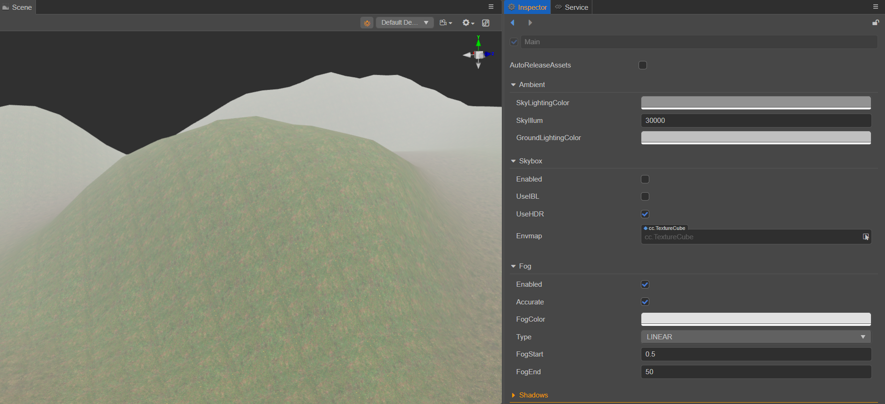
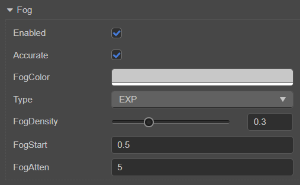
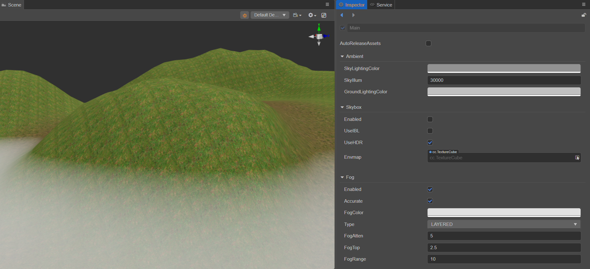

# 全局雾

全局雾用于在游戏中模拟室外环境中的雾效果。在游戏中除了用于雾效表现外，还可以用于隐藏摄像机远剪切平面外的模型来提高渲染的性能。

全局雾的类型目前包括 **线性雾**、**指数雾**、**指数平方雾**、**层雾** 四种，详情请参考下文 **全局雾类型** 部分的内容。

## 开启全局雾

在 **层级管理器** 中选中场景根节点，然后在 **属性检查器** 的 **Fog** 组件中勾选 **Enabled** 属性即可开启全局雾。



## 精确雾效计算（Accurate）

在 v3.4 之前，Creator 默认使用的是基于 **顶点** 的雾效计算，这在 **顶点数较少而体积较大** 的物体上会出现异常的雾效过渡效果。因此为了解决该问题，Creator 从 v3.4 开始增加了 **Accurate** 选项，用于开启基于 **像素** 的精确雾效计算。


当不勾选 **Accurate** 选项，即未开启精确雾效时的效果如下：



当勾选 **Accurate** 选项，即开启精确雾效时的效果如下：



### 版本升级 — Cocos Shader（Effect）迁移

当旧项目升级到 v3.4 时，**所有调用到 `CC_APPLY_FOG` 的 Shader 代码都需要修改，增加第二个参数 `worldPos`**。例如：

- 原代码如下：

    ```ts
    CC_APPLY_FOG(finalColor);
    ```

- 升级到 v3.4 后需要改成：

    ```ts
    CC_APPLY_FOG(finalColor, v_position.xyz);
    ```

## 全局雾类型

全局雾的雾效类型包括 **线性雾**（LINEAR）、**指数雾**（EXP）、**指数平方雾**（EXP_SQUARED）、**层雾**（LAYERED）四种。类型取决于 **相机** 与 **模型顶点** 的计算结果，这个计算结果称为 **雾效混合因子**。雾效混合因子决定了雾效颜色和模型颜色的混合方式，最终展现出来的不同的全局雾效果。

### 线性雾（Linear）



线性雾相关属性说明如下：

| 属性  | 说明  |
| :--- | :---- |
| **Enabled**  | 勾选该项以开启全局雾   |
| **Accurate** | 若勾选该项，使用像素雾计算，像素雾在顶点数少面积大的物体上有更精确的雾化效果；<br> 若不勾选该项，使用顶点雾计算，顶点雾具有更好的性能。|
| **FogColor** | 设置全局雾的颜色 |
| **Type**     | 全局雾的雾效类型 |
| **FogStart** | 雾效影响的起始位置 |
| **FogEnd**   | 雾效影响的结束位置 |

线性雾的雾效混合因子计算公式为：

**f = (FogEnd - Cam_dis) / (FogEnd - FogStart)**

- 当 `Cam_dis = FogEnd`，也就是相机与模型顶点的距离等于 `FogEnd` 时，混合因子的计算结果为 0，此时物体为全雾效。

- 当 `Cam_dis = FogStart`，也就是相机与模型顶点的距离等于 `FogStart` 时，混合因子的计算结果为 1，此时物体不受任何雾效的影响。

在相机与模型顶点的距离固定的情况下，若要增加线性雾的浓度，有以下两种方式：

1. 固定 `FogStart` 数值，减小 `FogEnd` 数值。
2. 减小 `FogStart` 数值，固定 `FogEnd` 数值。

如果要调整合适的雾效浓度，最好同时对 `FogStart` 和 `FogEnd` 属性进行适当的调整。

### 指数雾（Exponential）和指数平方雾（Exponential Squared）



指数雾和指数平方雾的属性一致，这里以指数雾为例：

| 属性 | 说明 |
| :---| :--- |
| **Enabled**    | 是否开启全局雾   |
| **Accurate**   | 若勾选该项，使用像素雾计算，像素雾在顶点数少面积大的物体上有更精确的雾化效果；<br> 若不勾选该项，使用顶点雾计算，顶点雾具有更好的性能。 |
| **FogColor**   | 设置全局雾的颜色 |
| **Type**       | 全局雾的雾效类型 |
| **FogDensity** | 雾效浓度，取值范围为 0 ~ 1，值越大浓度越高 |
| **FogStart**   | 雾效影响的起始位置 |
| **FogAtten**   | 雾效衰减系数，该值越小则雾越浓     |

**指数雾** 的雾效混合因子计算公式为：

**f = e^(-max(0, distance-fogStart) * fogDensity)**

**指数平方雾** 的雾效混合因子计算公式为：

**f = e^(-max(0, distance-fogStart) * fogDensity)²**

开发者可以通过 `FogStart` 来调整全局雾在远近的分布，通过 `FogDensity` 和 `FogAtten` 来调整雾在不同位置的浓度。

### 层雾（Layered）

层雾（Layered）平行于水平面，具有一定的高度。可在场景世界坐标系垂直方向上的任一位置设定层雾的顶部，以此来确定雾的高低。



| 属性 | 说明 |
| :---| :--- |
| **Enabled**    | 是否开启全局雾   |
| **Accurate**   | 若勾选该项，使用像素雾计算，像素雾在顶点数少面积大的物体上有更精确的雾化效果；<br> 若不勾选该项，使用顶点雾计算，顶点雾具有更好的性能。 |
| **FogColor**   | 设置全局雾的颜色 |
| **Type**       | 全局雾的雾效类型 |
| **FogAtten**   | 雾效衰减系数，该值越小则雾越浓     |
| **FogTop**     | 模型顶点在世界坐标系垂直方向上的位置，小于该位置时所有的顶点都会受到雾效效果的影响   |
| **FogRange**   | 雾化效果从设置的 **FogTop** 向下所影响的范围 |

层雾的雾效计算相比其他三种雾效类型稍显复杂，引入了 `FogTop` 的概念，同时还需要在 **X-Z** 平面进行距离计算。

层雾在现实中还是比较常见的，高耸入云的山脉和建筑物都有它的身影，如果能合理利用，相信对场景展现效果有不错的提升，但与此同时计算量也会有一定的增大，开发者可根据需要决定是否使用。
