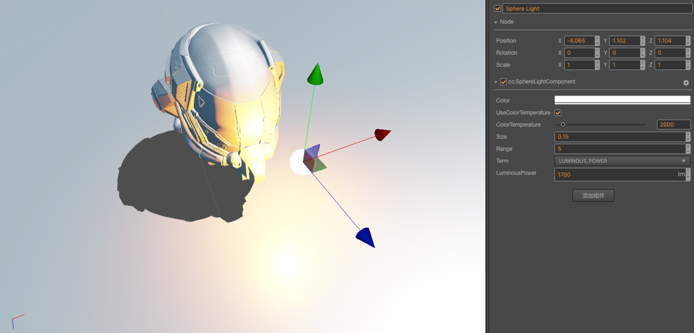
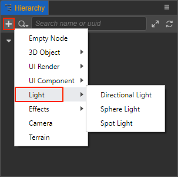

# 光照

本章主要介绍 Cocos Creator 中光照的工作方式和使用方式。

光照是指光的照射，Creator 中光照的实现模拟了光对真实世界的影响。在场景中添加光源可以使场景产生相应的光照和阴影效果，获得更好的视觉效果。

## 添加光源

添加光源有以下两种方式：

- 在 **层级管理器** 中点击左上角的 **+** 按钮，选择 **光源**，然后根据需要选择光源类型就可以创建一个带有对应类型 **光源组件** 的节点到场景中。

  

- 在 **层级管理器** 中选择需要添加光源的节点，然后点击 **属性检查器** 下方的 **添加组件** 按钮，选择 **Light**，即可选择所需的光源组件到节点上。

  

## 基于物理的光照

Cocos Creator 中采用光学度量单位来描述光源参数。基于光学度量单位，我们可以将光源的相关参数全部转化为真实世界中的物理值。这样，设计人员可根据相关灯光的工业参数以及真实环境的实际物理参数来调节光照强度、颜色、范围等信息，使整体光照效果更加符合真实的自然环境。

具体内容可参考 [基于物理的光照](light/pbr-lighting.md)。

## 光源类型

光源类型目前包括 **平行光**、**球面光**、**聚光灯**、**环境光** 四种，详情可参考下方文档：

- [平行光](./light/lightType/dir-light.md)
- [球面光](./light/lightType/sphere-light.md)
- [聚光灯](./light/lightType/spot-light.md)
- [环境光](./light/lightType/ambient.md)

## 基于多 Pass 的多光源支持

超着色器（Uber Shader）目前在一些性能受限的平台上仍然是主流方案，但随着硬件性能的增强和画质需求的提高，固定数量的光源再也无法满足实际应用的需求，于是就有了支持多光源的方案 — **多遍绘制**。具体的内容可参考 [基于多 Pass 的多光源支持](light/additive-per-pixel-lights.md)。

## 光照贴图

在光源固定的场景中使用光照贴图代替实时的光照计算，可以减少资源消耗，从而提高场景运行效率。

具体内容可参考 [光照贴图](light/lightmap.md)。
