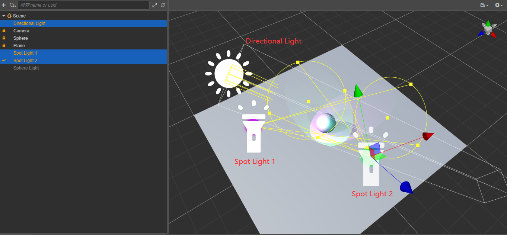

# 基于多 Pass 的多光源支持

首先我们使用 Cocos 中的默认的光照材质。

就如题图所示，我们在场景中放置了一个球体，然后打上一盏平行光，在打上两盏聚光灯，放置在球形的周围。

在看看 Status 下的 Draw Call:

我们来打开Frame Debug来看看这些到底是如何渲染到屏幕上去的:

第一遍，先渲染 Main Light 的 base color。

第二遍，渲染 light_1 的 Lighting pass。

第三遍，渲染 light_2 的 Lighting pass。

这种渲染路径就是 Forward-Pipeline，Forward 由两个 Pass 组成 第一个 Pass 叫 BasePas，用来绘制一个平行光带来的光照，另一个 Pass 叫 LightPass，负责绘制剩余灯光的光照，可以预见到一个物体被多个灯光照射到了，就会多个 Draw Call。

这种渲染方式的好处在于可以更多的添加光照效果，即使在移动端，也有不错的表现。
