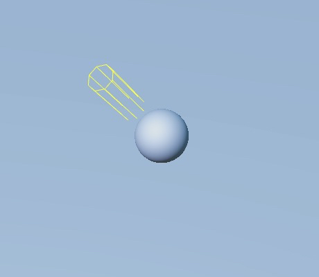

# 平行光

平行光是最常见的一种光源，也可以理解为场景中的主导性光源（主方向光）。光照效果不受 **光源位置** 和 **朝向** 的影响，适合用于实现太阳光。但是旋转会影响到平行光照射的方向，而光照方向又会影响到模型接受光照的范围以及模型产生阴影的位置。

> **注意**：Cocos Creator 目前只支持一个主方向光。若同时添加多个，则以最后一个添加的为准。

在场景中添加平行光的方式可参考 [光照](../light.md)。

平行光组件相关接口，请参考 [DirectionalLight API](__APIDOC__/zh/#/docs/3.3/zh/component-light/Class/DirectionalLight)。

## 平行光属性

| 属性 | 说明 |
| :------ | :-- |
| Color | 设置光源颜色 |
| UseColorTemperature | 是否启用色温 |
| ColorTemperature | 调节色温 |
| StaticSettings | 设置静态灯光，详情请参考 [光照贴图](./lightmap.md) |
| illumination | 照度，单位 **勒克斯（lx）** |
