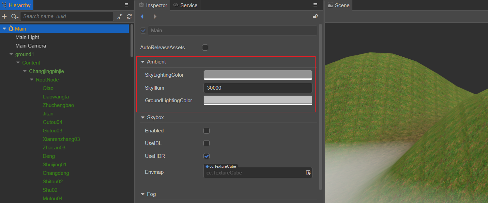
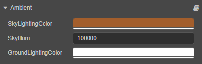

# 环境光

在生活中，错综复杂的光线与凹凸不平的物体表面相互反射，使得整个环境都被照亮，仿佛被一层光均匀笼罩，这个光一般称为环境光，也称为漫射环境光。

因为环境光可以均匀地照亮场景中的所有物体，常用于解决模型背光面全黑的问题，一般需要配合其他类型的光源一起使用。例如场景中只有一个平行光，那么在模型的背光源处会显得非常暗，加入环境光则可以提升模型背部的亮度，显得更加美观。

在 **层级管理器** 中选中 **Scene**，然后在 **属性检查器** 的 **ambient** 组件中即可设置环境光属性。

> **注意**：由于环境光是没有方向的，所以不能产生阴影。

## 环境光属性

| 属性 | 说明 |
| :--- | :--- |
| SkyColor | 设置天空颜色 |
| SkyIllumination | 调节天空亮度 |
| GroundAlbedo | 设置地面反射光 |

环境光可配合天空盒一起使用，详情可参考 [天空盒](/zh/concepts/scene/skybox.md)。
