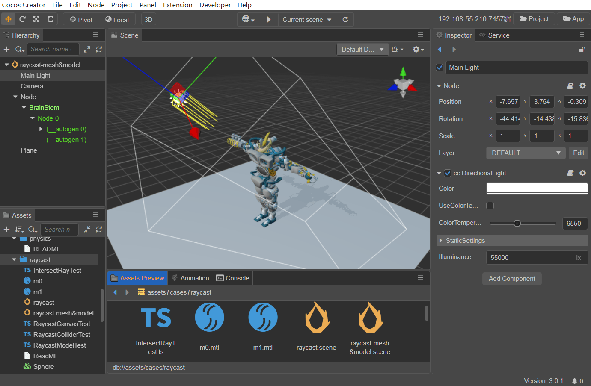
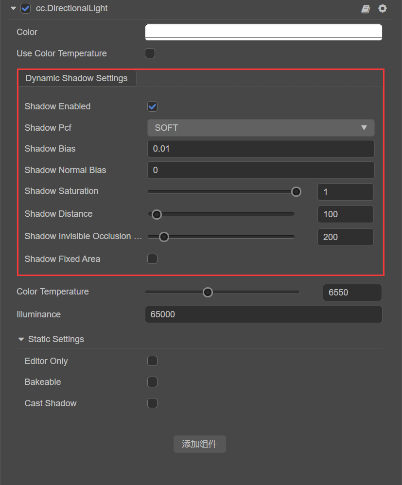
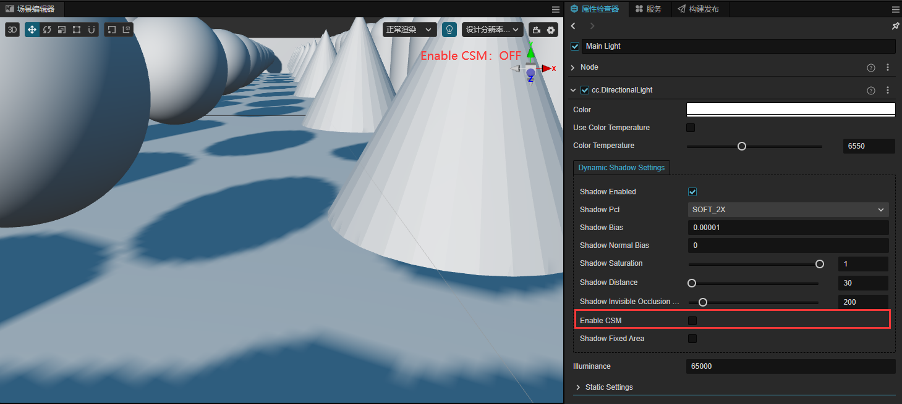
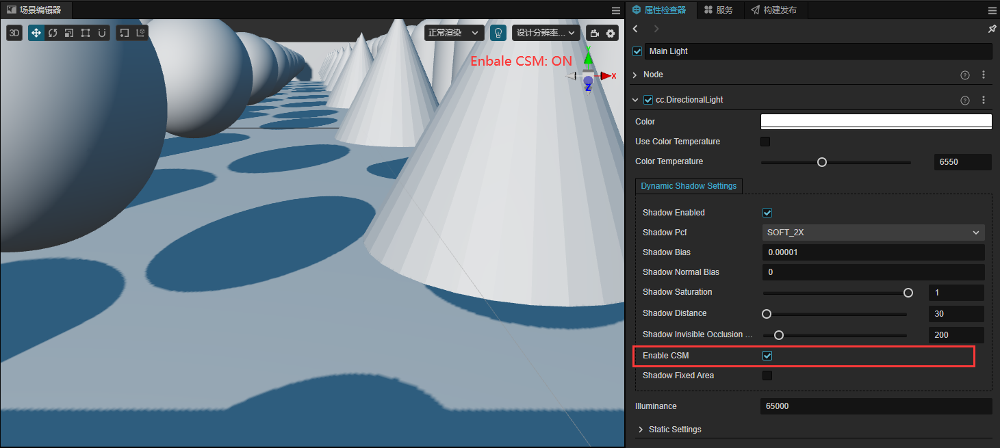
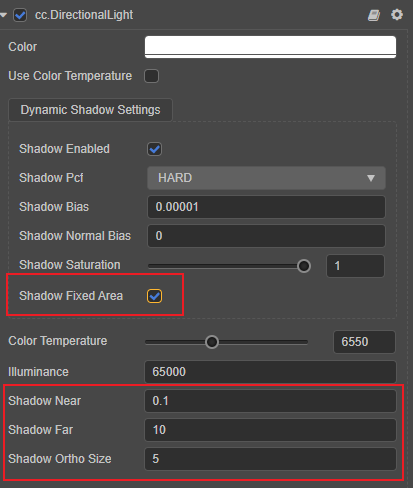

# 平行光

平行光又称为方向光（Directional Light），是最常用的一种光源，模拟了无限远处的光源发出的光线，常用于实现太阳光。

因为光源与被照射目标的距离是未定义的（无限远），所以光照效果不受 **光源位置** 和 **朝向** 的影响（如下图，平行光在平面上产生的光照亮度都是一样的）。但是 **旋转** 会影响到平行光照射的方向，而光照方向又会影响到模型接受光照的范围以及模型产生阴影的位置。可通过编辑器左上角的 [旋转变换工具](../../../../editor/toolbar/index.md#%E6%97%8B%E8%BD%AC%E5%8F%98%E6%8D%A2%E5%B7%A5%E5%85%B7) 来调整平行光照射的方向。

在场景中添加平行光的方式可参考 [添加光源](index.md)。

> **注意**：Cocos Creator 目前只支持一个平行光。若同时添加多个，则以最后一个添加的为准。

新建场景时，默认会自动创建一个 `Main Light` 平行光节点。

平行光组件相关接口，请参考 [DirectionalLight API](__APIDOC__/zh/class/DirectionalLight)。

> **注意**：从 v3.5 开始，**平行光阴影** 从场景设置面板中独立出来，不在全局设置阴影属性。

## 平行光属性

| 属性 | 说明 |
| :------ | :-- |
| Color | 设置光源颜色 |
| UseColorTemperature | 是否启用色温 |
| ColorTemperature | 调节色温 |
| StaticSettings | 设置静态灯光，详情请参考 [光照贴图](../lightmap.md) |
| Illumination | 照度，单位 **勒克斯（lx）** |

### 平行光阴影属性

阴影属性需要在场景中开启阴影。开启方法为请参考 [阴影 - 开启阴影](../shadow.md#%E5%BC%80%E5%90%AF%E9%98%B4%E5%BD%B1)。

开启阴影后，平行光 **属性检查器** 会展示 **动态阴影设置** 如下图：

其属性和说明请参考 [阴影 - 平行光阴影属性](../shadow.md#%E5%B9%B3%E8%A1%8C%E5%85%89%E9%98%B4%E5%BD%B1%E5%B1%9E%E6%80%A7)

### 平行光阴影属性

| 属性 | 说明 |
| :------ | :-- |
| ShadowEnabled | 是否开启平行光阴影 |
| ShadowPcf | 设置阴影边缘反走样等级，目前支持 **HARD**、**SOFT**、**SOFT_2X**，详情可参考下文 **PCF 软阴影** 部分的介绍。 |
| ShadowBias | 设置阴影偏移值，防止 z-fiting |
| ShadowNormalBias | 设置法线偏移值，防止曲面出现锯齿状 |
| ShadowSaturation | 调节阴影饱和度，建议设置为 **1.0**。若需要减小方向光阴影的饱和程度，推荐通过增加环境光来实现，而不是调节该值 |
| ShadowInvisibleOcclusionRange | 设置 Camera 可见范围外的物体产生的阴影是否需要投射到可见范围内，若需要则调大该值即可  |
| ShadowDistance | 设置 Camera 可见范围内显示阴影效果的范围，阴影质量与该值的大小成反比 |
| Enable CSM | 设置是否开启 Cascaded Shadow Map 模式 |
| FixedArea | 设置是否手动控制 Camera 可见范围内显示阴影效果 |

#### Enable CSM 模式

基础的阴影贴图方法对于大型场景渲染显得力不从心，很容易出现阴影抖动和锯齿边缘现象。Cascaded Shadow Maps(CSM)方法根据对象到观察者的距离分块提供深度纹理来解决上述问题。它将相机的视锥体分割成若干部分，然后为分割的每一部分生成独立的深度贴图。

对于近处的场景使用较高质量的阴影贴图，对于远处的场景使用较低质量的阴影贴图，在两张阴影贴图过渡的地方选择其中一张使用。因为远处的对象只占画面的很少一部分像素，而近处的对象占据了画面的很大一部分，这样保证了观察者在近处看到的阴影质量较高，远处的阴影质量较低。

- 关闭CSM：

    

- 开启CSM：

    

#### FixedArea 模式

FixedArea 模式用于设置是否手动控制 Camera 可见范围内显示阴影效果的范围：

- 若不勾选该项（默认），则引擎会使用和 CSM（级联阴影算法）模式相同的裁切流程和相机计算，根据 Camera 的方向和位置来计算阴影产生的范围。
- 若勾选该项，则根据手动设置的 `Near`、`Far`、`OrthoSize` 属性来控制阴影产生的范围。阴影会跟随方向光节点的位置，在方向光包围盒附近分布，而非跟随相机。

   

| 属性 | 说明 |
| :------ | :-- |
| ShadowFixedArea | 是否开启固定区域的阴影 |
| ShadowNear | 设置主光源相机的近裁剪面 |
| ShadowFar | 设置主光源相机的远裁剪面 |
| ShadowOrthoSize | 设置主光源相机的正交视口大小，阴影质量与该值的大小成反比 |

### PCF 软阴影

百分比渐近过滤（PCF）是一个简单、常见的用于实现阴影边缘反走样的技术，通过对阴影边缘进行平滑处理来消除阴影贴图的锯齿现象。原理是在当前像素（也叫做片段）周围进行采样，然后计算样本跟片段相比更接近光源的比例，使用这个比例对散射光和镜面光成分进行缩放，然后再对片段着色，以达到模糊阴影边缘的效果。

目前 Cocos Creator 支持 **硬采样**、**4 倍采样（SOFT 模式）**、**9 倍采样（SOFT_2X 模式）**，倍数越大，采样区域越大，阴影边缘也就越柔和。

## 支持动态合批提高性能

对于材质中已经开启 instancing 的模型，平面阴影也会自动同步使用 instancing 绘制，详情请参考 [动态合批](../../../engine/renderable/model-component.md#%E5%85%B3%E4%BA%8E%E5%8A%A8%E6%80%81%E5%90%88%E6%89%B9)。
