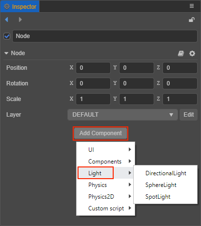

# 光源

光源决定了物体所受到的光照的颜色、色温、强度、方向、以及产生的阴影效果等。目前 Creator 支持的光源类型包括：

- [平行光](dir-light.md)
- [球面光](sphere-light.md)
- [聚光灯](spot-light.md)
- [环境光](ambient.md)

## 添加光源

添加光源有以下两种方式：

1. 在 **层级管理器** 中点击左上角的 **+** 按钮，选择 **光源**，然后根据需要选择光源类型就可以创建一个带有对应类型 **光源组件** 的节点到场景中。

    

2. 在 **层级管理器** 中选择需要添加光源的节点，然后点击 **属性检查器** 下方的 **添加组件** 按钮，选择 **Light**，即可选择所需的光源组件到节点上。

    
