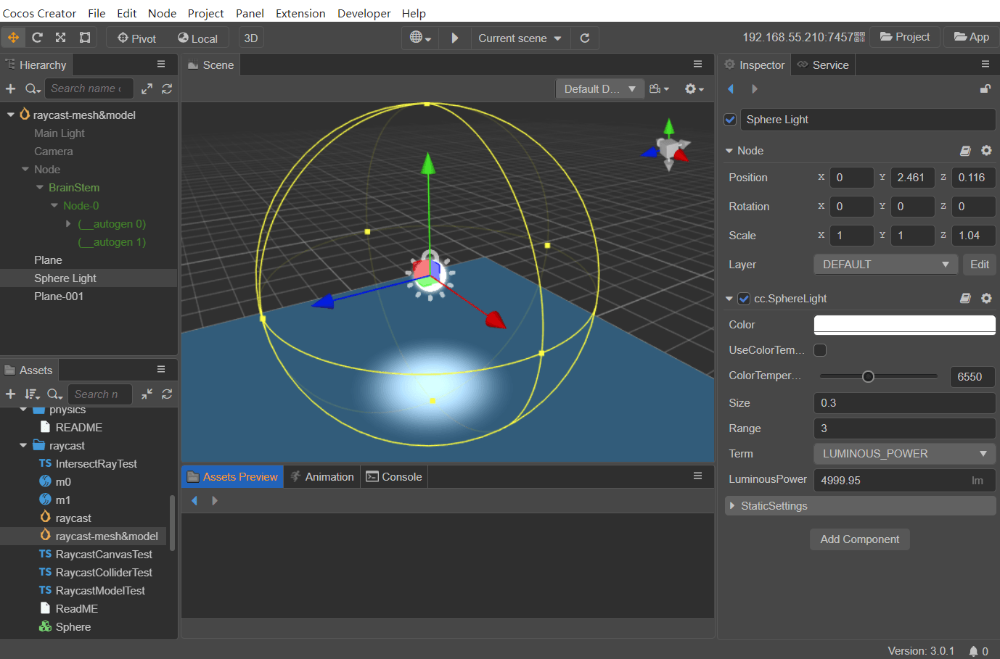
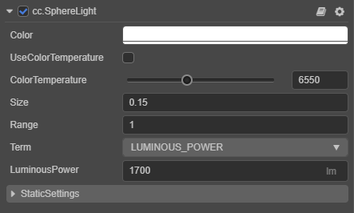

# 球面光

Cocos Creator 3.x 的球面光与 v2.x 的点光源（Point Light）类似。

球面光会向所有方向均匀地发散光线，接近于蜡烛产生的光线。物体受到的光照强度会随着跟光源距离的增大而减弱，当距离超过设置的光照影响范围（`Range` 属性），则光照强度为 0。

在编辑器中可以直观地看到光源位置和它的照射范围，如下图所示。通过修改 属性检查器 中点光源组件的 Range 属性即可调整点光源的光照范围。

球面光在实际应用中可用于模拟火把、蜡烛、灯泡等光源，照亮四周一定距离内的环境。

在场景中添加球面光的方式可参考 [光照](/zh/concepts/scene/light.md)。

球面光组件接口请参考 [SphereLight API](https://docs.cocos.com/creator/3.0/api/zh/classes/component_light.spherelight.html)。

## 球面光属性

| 属性 | 说明 |
| :---- | :---- |
| Color | 设置光源颜色 |
| UseColorTemperature | 是否启用色温 |
| ColorTemperature | 调节色温 |
| Size | 设置光源大小（目前该属性在实际运行中不生效，我们会在后续版本进行优化，请关注版本更新公告） |
| Range | 设置光照影响范围 |
| Term | 设置光照强度单位的类型，包括 **光通量（LUMINOUS_POWER**）和 **亮度（LUMINANCE）** 两种 |
| LuminousPower | 光通量，单位 **流明（lm）** 当 **Term** 设置为 **LUMINOUS_POWER** 时生效 |
| Luminance | 亮度，单位 **坎德拉每平方米（cd/m2）** 当 **Term** 设置为 **LUMINANCE** 时生效 |
| StaticSettings | 静态灯光设置，详情请参考 [光照贴图](/zh/concepts/scene/light/lightmap.md) |

>**注意**：球面光目前暂不支持显示阴影，我们会在后续版本进行优化，请关注版本更新公告。
