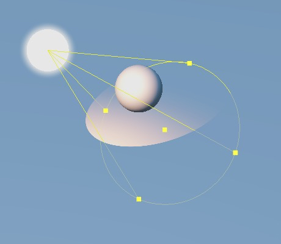
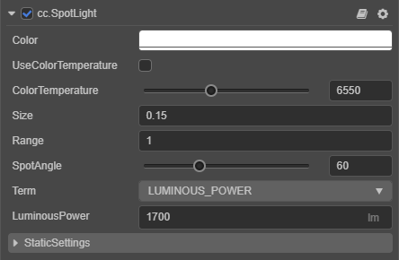

# 聚光灯

**聚光灯** 是由一个点向一个方向发射一束光线，接近于手电筒产生的光线。聚光灯比其他类型的光源多了 `SpotAngle` 属性，用于调整聚光灯的光照范围。和球面光相比，聚光灯也具有指定的位置和光线衰减范围。不同的是聚光灯有一个角度约束。简单而言，它的工作原理类似于手电筒或舞台照明灯。

在场景中添加聚光灯的方式可参考 [光照](../light.md)。

聚光灯组件接口请参考 [SpotLight API](__APIDOC__/zh/classes/component_light.spotlight.html)。

## 聚光灯属性

| 属性 | 说明 |
| :------ | :--- |
| Color | 设置光源颜色 |
| UseColorTemperature | 是否启用色温 |
| ColorTemperature | 调节色温 |
| Size | 设置光源大小 |
| Range | 设置光照影响范围 |
| SpotAngle | 调整聚光角度，控制光照范围 |
| Term | 设置光照强度单位类型，包括 **光通量（LUMINOUS_POWER）** 和 **亮度（LUMINANCE）** 两种 |
| LuminousPower | 光通量，单位 **流明（lm）** 当 **Term** 设置为 **LUMINOUS_POWER** 时生效 |
| Luminance | 亮度，单位 **坎德拉每平方米（cd/m2）** 当 **Term** 设置为 **LUMINANCE** 时生效 |
| StaticSettings | 静态灯光设置，详情请参考 [光照贴图](./lightmap.md) |
