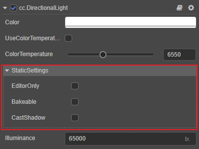
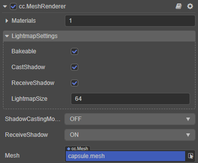
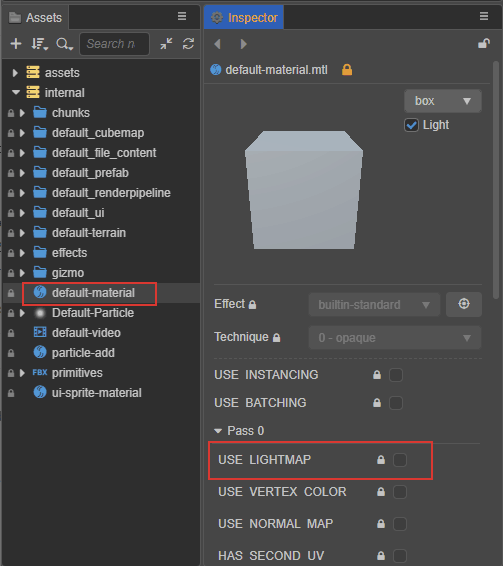
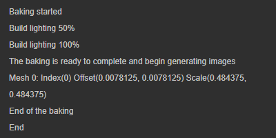
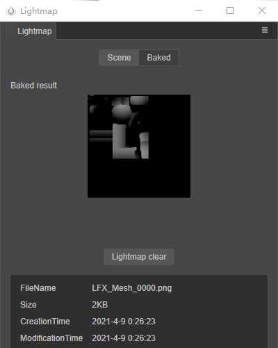

# 光照贴图

> **注意**：光照贴图功能目前暂不支持 Apple M1（Silicon）架构的设备，预计在 v3.1 支持。

光照贴图是由 **烘焙系统** 通过计算场景中所有光源对模型的影响而生成的。在光源固定的场景中，使用光照贴图代替实时的光照计算，可以减少资源消耗，从而提高场景运行效率。

## 光照贴图面板

点击编辑器菜单栏的 **项目 -> 光照贴图**，打开光照贴图面板。烘焙系统生成光照贴图过程中，将根据面板设置的各参数，计算并生成结果。

### 属性说明

| 参数 | 说明 |
| :--- | :--- |
| MSAA | 多重采样，可选值包括：1、2、4、8 |
| Resolution | 生成的光照贴图的分辨率，可选值包括：128、256、512、1024、2048 |
| Gamma | Gamma 矫正值 |
| GIScale | 全局光照缩放系数 |
| GISamples | 全局光照采样系数 |
| AOLevel | AO（Ambient Occlusion，环境光遮蔽）级别 |
| AOStrength | AO 强度 |
| AORadius | AO 半径 |
| AOColor | AO 颜色 |

## 生成光照贴图

1. 在 **层级管理器** 中选中光源节点（带有光源组件的节点），然后在 **属性检查器** 中设置光源组件的 **StaticSettings**，勾选 `Bakeable` 属性（目前不支持同时使用多个 [平行光/主方向光](./dir-light.md)）。

    

	- **EditorOnly**：是否只在编辑器中生效
	- **Bakeable**：是否烘焙静态光照
	- **CastShadow**：是否投射静态阴影

2. 在 **层级管理器** 中选中要生成光照贴图的模型节点（带有 [MeshRenderer 组件](./../../../engine/renderable/model-component.md)），然后在 **属性检查器** 中设置 **LightmapSettings**，勾选 `Bakeable` 属性。
	
	
	
	- **Bakeable**：是否烘焙静态光照
	- **CastShadow**：是否投射静态阴影
	- **RecieveShadow**：是否接受静态阴影
	- **LightMapSize**：模型光照贴图尺寸

    > 注意：要生成光照贴图的模型有以下两点要求：
    > 
    > 1. 美术人员在制作模型资源时，除了模型本身的 UV，还需要另外包含一套 UV，用于光照贴图。
    > 
    > 2. 模型的 Materials 需要开启 **USE LIGHTMAP** 渲染选项，例如：
    > 
    > 

3. 打开 **光照贴图** 面板，并设置好对应参数。然后点击 **生成光照贴图** 按钮，会弹出一个文件存储对话框，需要指定一个文件夹（必须在 `assets` 目录下）用于存放生成的光照贴图数据信息。
   
    
   
    即可看到在 **光照贴图** 面板下方输出了烘焙进度的日志信息。

	

4. 烘焙结束后可在 **光照贴图** 面板的 **Baked** 页面查看生成的光照贴图，以及文件名、尺寸等相关信息。生成的光照贴图将由游戏引擎处理使用，无需用户操作。

    

	- **烘焙结果**：显示烘焙后生成的光照贴图。
	- **清空光照贴图**：用于删除生成的光照贴图。
	- **信息输出面板**：显示生成的光照贴图的文件名、大小等相关信息。
