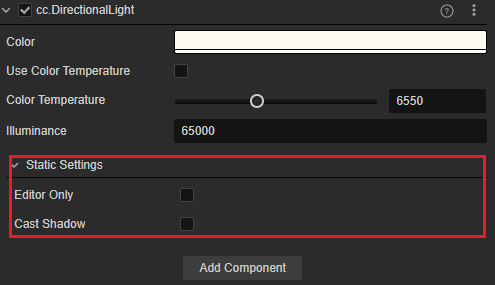
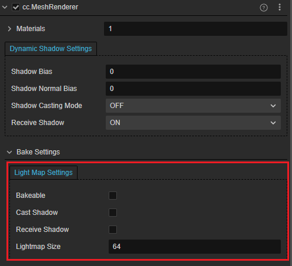
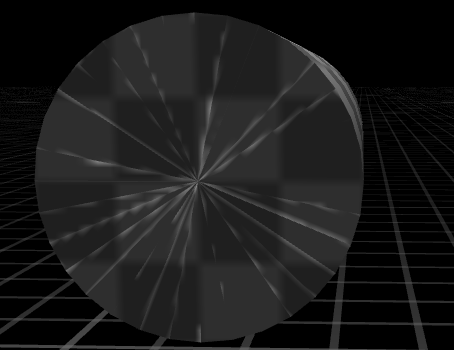
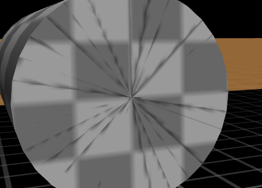
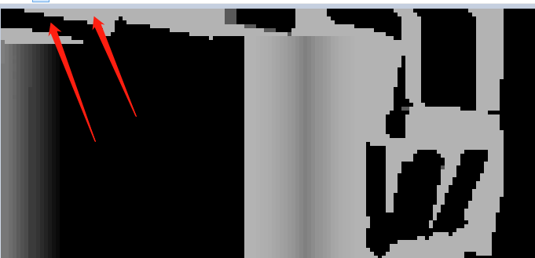
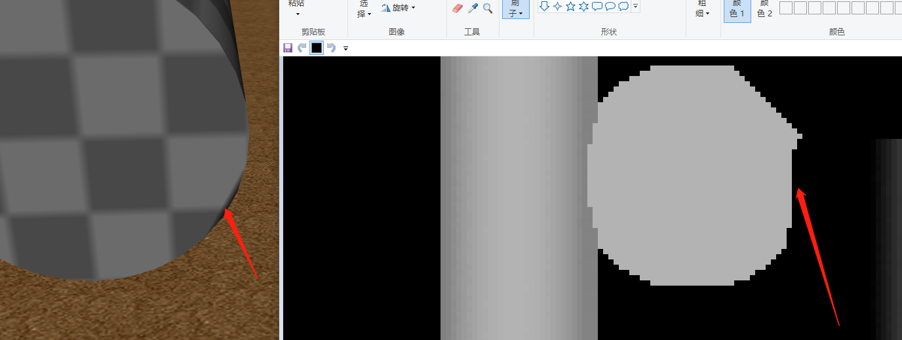
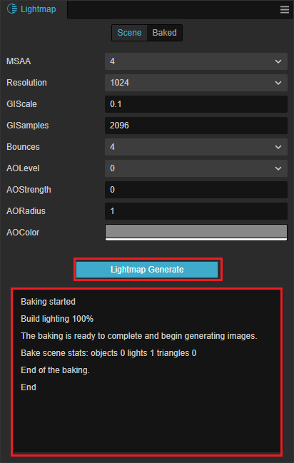
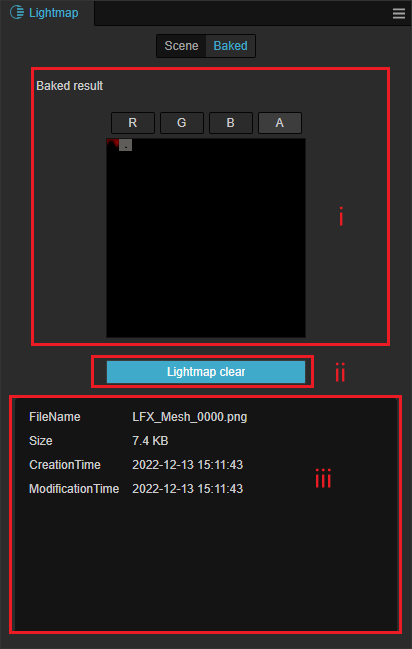

# 光照贴图

烘焙系统会对光源稳定的静态物体所受到的光照和阴影等进行预先计算，计算产生的结果存放在一张纹理贴图中，这张贴图我们称之为 **光照贴图**。

生成的光照贴图 Creator 会在运行时自动处理并使用。在光源固定的场景中，使用光照贴图代替实时的光照计算，可以减少资源消耗，从而提高场景运行效率。

## 光照贴图面板

点击编辑器菜单栏的 **项目 -> 光照贴图**，打开光照贴图面板。面板由 **Scene** 和 **Baked** 两个页面组成。

- **Scene**：主要用于配置生成光照贴图相关的参数。
- **Baked**：主要用于展示生成的光照贴图及其相关信息。

具体内容请查看下方 **生成光照贴图** 部分的内容。

### 属性说明

**Scene** 页面各参数的说明如下：

| 参数 | 说明 |
| :--- | :--- |
| MSAA | 多重采样，可选值包括：1、2、4、8 |
| Resolution | 生成的光照贴图的分辨率，可选值包括：128、256、512、1024、2048 |
| Gamma | Gamma 矫正值 |
| GIScale | 全局光照缩放系数 |
| GISamples | 全局光照采样系数 |
| AOLevel | AO（Ambient Occlusion，环境光遮蔽）级别 |
| AOStrength | AO 强度 |
| AORadius | AO 半径 |
| AOColor | AO 颜色 |

## 生成光照贴图

1. 在 **层级管理器** 中选中光源节点（带有光源组件），然后在 **属性检查器** 中设置光源组件的 **StaticSettings**，勾选 `Bakeable` 属性（目前不支持同时使用多个 [主方向光](./lightType/dir-light.md)）。

    

    - **EditorOnly**：是否只在编辑器中生效

    - **Bakeable**：是否烘焙静态光照

    - **CastShadow**：是否投射静态阴影

2. 在 **层级管理器** 中选中要生成光照贴图的模型节点（带有 [MeshRenderer 组件](./../../../engine/renderable/model-component.md)），然后在 **属性检查器** 中设置 **LightmapSettings**，勾选 `Bakeable` 属性。

    

    - **Bakeable**：是否烘焙静态光照

    - **CastShadow**：是否投射静态阴影

    - **ReceiveShadow**：是否接受静态阴影

    - **LightmapSize**：模型光照贴图尺寸

    > **注意**：要生成光照贴图的模型有以下两点要求：
    >
    > 1. 美术人员在制作模型资源时，除了模型本身的 UV，还需要另外包含一套 UV，用于光照贴图。
    >
    > 2. 模型的 Materials 需要开启 **USE LIGHTMAP** 渲染选项，例如：
    >
    >    

3. 光照贴图UV
	不同与纹理的UV, 光照贴图UV不能重叠

	> **注意**：不正确的UV产生错误：
	>
        > 1. 不同平面的uv交错在一起
	>
	>    
	>    
	>    
        >
        > 2. UV块间没有保留间隔
	> 
        >    

4. 打开 **光照贴图** 面板，并设置好对应参数。然后点击 **生成光照贴图** 按钮，会弹出一个文件存储对话框，需要指定一个文件夹（必须在 `assets` 目录下）用于存放生成的光照贴图数据信息。即可看到在 **光照贴图** 面板下方输出了烘焙进度的日志信息。

    

5. 烘焙结束后可在 **光照贴图** 面板的 **Baked** 页面查看生成的光照贴图，以及文件名、尺寸等相关信息。生成的光照贴图引擎会自动处理使用，无需开发者手动操作。

    

    1. **烘焙结果**：显示烘焙后生成的光照贴图，格式为 **RGBE8**，可根据需要选择 **R**/**G**/**B** 选项查看光照贴图对应的通道。
    2. **清空光照贴图**：用于删除生成的光照贴图及相关信息。
    3. **信息输出面板**：显示生成的光照贴图的文件名、大小等相关信息。
