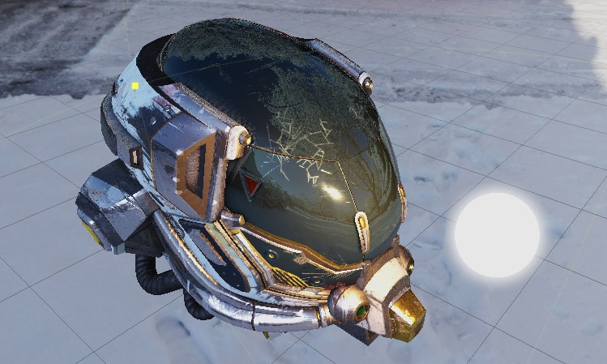
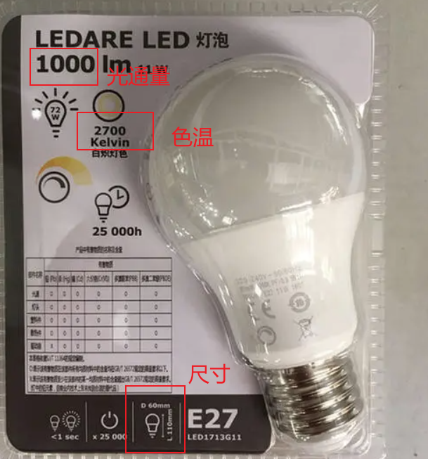

# 基于物理的光照

## 真实世界中的光源

基于物理的光照符合真实世界中的光源描述，在真实环境中，我们所见到的光源产品都具有自身的工业参数，我们先来看一个宜家的灯泡💡

从产品包装上，我们可以了解到这个灯泡的几个重要工业参数：
- **光通量**
- **色温**
- **尺寸**

这三个重要参数影响真实世界中的光源表现效果，下面我们来重点讲解一下这三个参数的物理意义。

## 光学度量单位

**光学度量单位（Photometric Unit）** 是用来计算光的强弱（大小）和方向的一门科学：

- **光通量（Luminous Flux）**

  单位 **流明（lm）**，单位时间内光源所发出或者被照物体所接收的总光能。改变光源大小不会影响场景照明效果。

- **亮度（Luminance）**

  单位 **坎德拉每平方米（cd/m2）**，单位面积光源在给定方向上，在每单位面积内所发出的总光通量。改变光源大小会影响场景照明效果。

- **照度（Illuminance）**

  单位 **勒克斯（lx）**，每单位面积所接收到的光通量。该值受光的传播距离影响，对于同样光源而言，当光源的距离为原先的两倍时，照度减为原先的四分之一，呈平方反比关系。

在真实世界中，由于描述光源的重要物理参数不一样，我们通常用 **光通量（Luminous Flux）** 和 **亮度（Luminance）** 来描述生活中常见的带有照明面积的光源，用 **照度（Illuminance）** 来描述太阳光。

## 色温（ColorTemperature）

**色温** 是指绝对黑体从绝对零度（-273℃）开始加温后所呈现的颜色。

色温是影响光源颜色的重要属性，是个可选属性，当启用色温时，色温也参与了光源颜色的组成部分。

真实世界环境中，一天不同时段的环境色温也会动态发生变化：

可参考下表：

## 光源大小

真实世界中的光源都具有真实的物理尺寸，在 **相同光通量** 的情况下，光源的尺寸会影响 **亮度** 和 **照度**。

