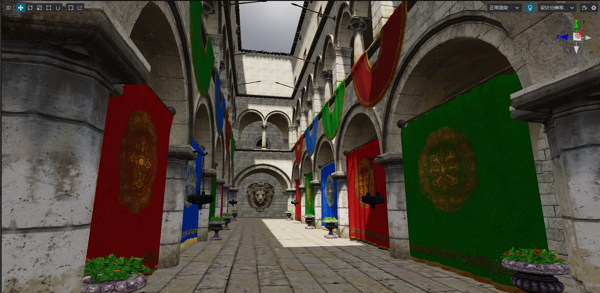

# 基于图像的光照

由于实时计算光照对硬件要求过高，因此在游戏或三维仿真中大多会使用基于图像的光照（IBL，Image Based Lighting）以获取更高的性能，也就是将光照信息存储在计算机的存储介质上，在运行时通过采样图形中的信息对光照进行重建。

基于图像的光照通常由下列功能组成。

## 光照贴图

通过 [光照贴图](../lightmap.md) 开发者可以将场景的光照信息记录在贴图上，并在运行时使用。

## 天空盒

在 [天空盒](../../skybox.md) 中通过 **烘焙反射卷积图** 可以给环境贴图生成预卷积的反射效果。

## 光照探针

自 v3.7 开始，Cocos Creator 支持光照探针和反射探针。

光照探针是全局光照的一部分，将探针布置在场景内，通过探针检测光线在场景内的反弹，并对离线结果进行存储，用以提高光照效果，提升渲染品质。

光照探针将探针所在位置的辐照度信息进行捕获，在运行时重建光照信息。

## 反射探针

和光照探针类似，反射探针是通过探针，检测场景内的间接反射光，并将其记录在纹理上，以在运行时提供真实可信的光照信息。

通过结合 [天空盒](../../skybox.md)、[光照贴图](../lightmap.md)、[光照探针](./index.md) 以及 [反射探针](reflection-probe.md) 以获得更加真实可信同时兼顾性能的光照效果。

## 内容

本章将包含以下内容：

- [光照探针](light-probe.md)
    - [光照探针面板](light-probe-panel.md)
- [反射探针](reflection-probe.md)
    - [反射探针面板](reflection-probe-panel.md)
- [探针示例](light-probe-sample.md)
- [天空盒](../../skybox.md)
- [光照贴图](../lightmap.md)
