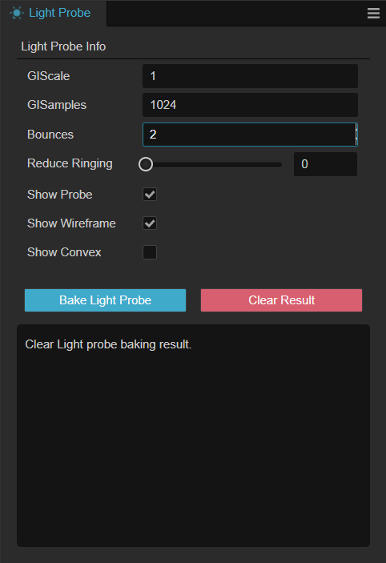
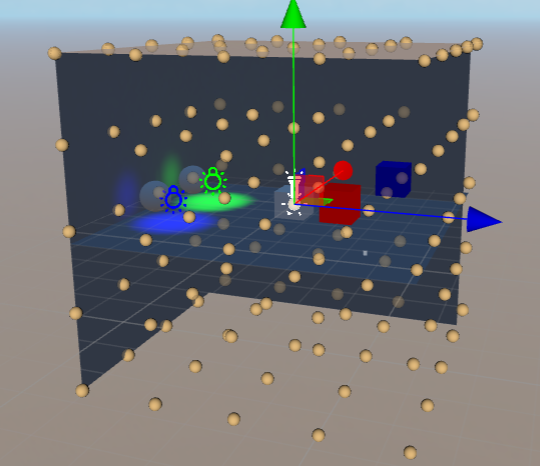
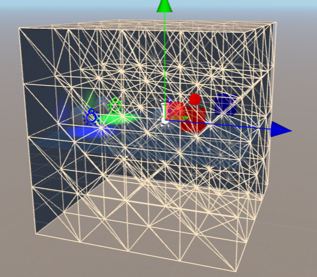
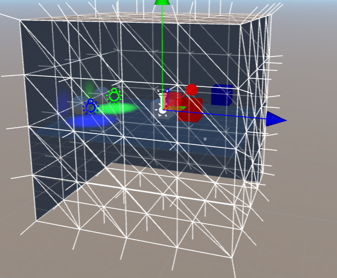

# 光照探针面板

通过编辑器顶部菜单，选择 **项目** -> **光照烘焙** -> **光照探针** 可以打开光照探针烘焙面板。

**光照烘焙面板** 会将 **场景编辑器** 内已布置好的 [光照探针](light-probe.md) 进行烘焙。烘焙后，静态物体的间接光信息将被记录到存储介质中；而所有被配置为 **Movable** 属性的节点将可以获取到更详细和真实可信的间接光光照效果。

## 属性

| 属性 | 说明 |
| :-- | :-- |
| **GIScale** | GI（[Global Illumination](https://en.wikipedia.org/wiki/Global_illumination)）的缩放系数 |
| **GISample** | GI 的采样系数 |
| **Bounces** | 光线反弹的次数，取值范围 [1, 4]   反弹的含义是当前光源照射到某个物体，反弹后抵达探针的过程   如光线的反弹次数超出该属性，将不会被记录到烘焙结果内   |
| **Reduceing Ringing** | 在某些情况下，光照探针的光照可能从亮部穿透到暗部从而形成环状，修改这个属性可以改善这种情况，但是可能会导致光照不真实的情况 |
| **Show Probe** | 是否显示光照探针   需要在 **层级管理器** 内选中带有 **LightProbeGroup** 组件的节点    |
| **Show Wireframe** | 是否显示光照探针间的连线   需要在 **层级管理器** 内选中带有 **LightProbeGroup** 组件的节点    |
| **Show Convex** | 是否显示凸包线框及顶点法线   需要在 **层级管理器** 内选中带有 **LightProbeGroup** 组件的节点   |
| **Bake Light Probe** | 烘焙光照探针 |
| **Clear Result** | 清除烘焙的结果 |
| **Cancel** | 取消烘焙过程，该按钮仅当点击 **Bake Light Probe** 后会生效 |

## 操作

点击 **Bake Light Probe** 可以烘焙光照探针，点击 **Clear Result** 清除烘焙的结果。

烘焙过程中可以点击 **Cancel** 取消烘焙。

在下方的信息展示面板可以查看到烘焙的进度。

开发者也可通过 **Show Probe**、**Show Wireframe** 以及 **Show Convex** 选项在场景内查看探针是否符合预期的结果。

可参考 [探针示例](sample.md) 以查看美术工作流。
