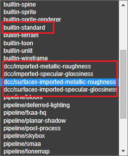
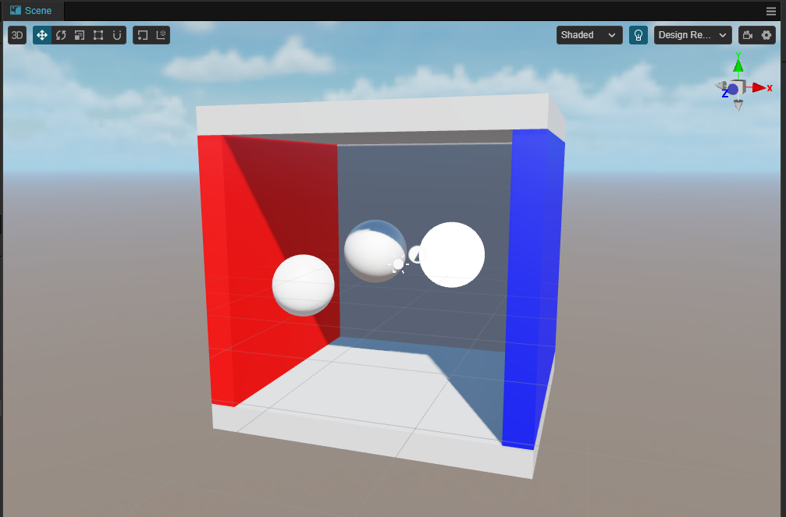
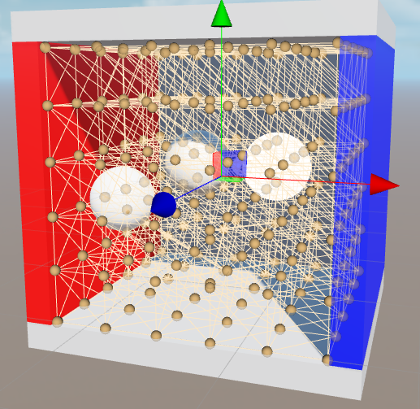
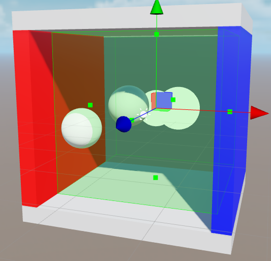
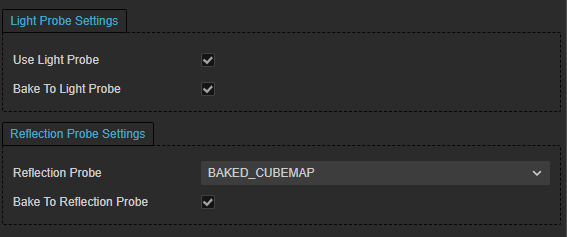
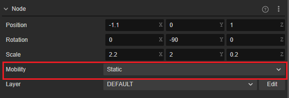
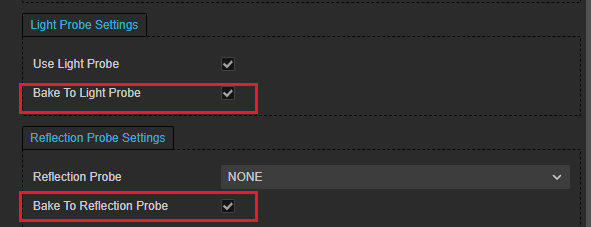
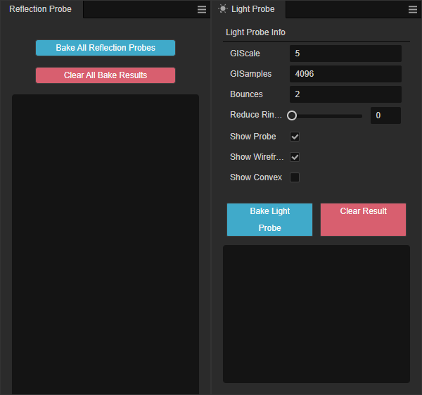
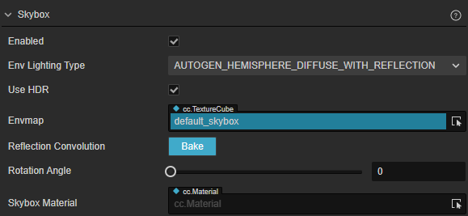
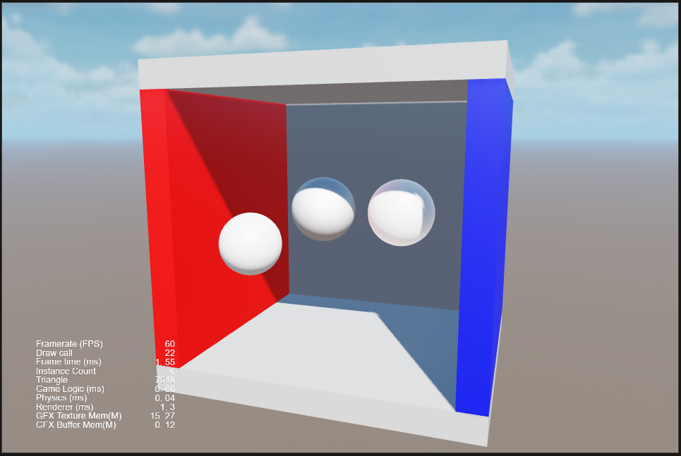

# 基于图像的光照示例

在 Cocos Creator 中开发者可通过组合基于图像光照的功能。这些功能包含：

- 通过 [天空盒](../../skybox.md) 的烘焙反射卷积图功能以提供更好的环境反射效果
- 通过 [光照贴图](../lightmap.md) 将光照信息烘焙到贴图以提高光照性能
- 通过 [光照探针](./light-probe.md)/[反射探针](./reflection-probe.md) 检测物体间的反射信息

本文将从艺术资产工作者的工作流演示如何在您的场景中添加基于图像的照明。

## 准备工作

由于光照探针和反射探针都是针对基于物理的光照模型，因此在制作美术资源时，请遵循 PBR 工作流程。

请提前准备好使用以下着色器的材质文件；或通过 [导入从 DCC 工具导出的模型](../../../../asset/model/dcc-export-mesh.md) 导出，导入到 **资源管理器** 后会自动识别模型内的材质并将其着色器转化为引擎支持的 PBR 着色器。

 

- builtin-standard：内置标准 PBR 着色器
- dcc/imported-metallic-roughness：基于 metallic-roughness 工作流导出的模型使用的着色器
- dcc/imported-specular-glossiness：基于 specular-glossiniess  工作流导出的模型使用的着色器
- surface/standard：内置标准表面 PBR 着色器
- dcc/surface-imported-metallic-roughness：内置标准表面基于 metallic-roughness 工作流导出的模型使用的着色器
- dcc/surface-imported-specular-glossiness：内置标准表面基于 specular-glossiniess  工作流导出的模型使用的着色器

也可以待模型导入到 **资源管理器** 后手动调整至使用上述标准着色器。

开发者也可以查看下列文档以便了解整个 PBR 的工作流。

- [基于物理的光照](../pbr-lighting.md)
- [基于物理的光照模型（Physically Based Rendering - PBR）](../../../../shader/effect-builtin-pbr.md)
- [导入从 DCC 工具导出的模型](../../../../asset/model/dcc-export-mesh.md)。
- [FBX 智能材质导入](../../../../importer/materials/fbx-materials.md)

## 烘焙光照

通过 [光照探针面板](light-probe-panel.md)、[反射探针面板](reflection-probe-panel.md) 和 [光照贴图](../lightmap.md) 可进行光照的烘焙用于生成基于图像的光照。

### 烘焙流程

以手动搭建的场景为例：

- 增加 [光照探针](light-probe.md)

    

- 添加 [反射探针](relfection-probe.md)

   

- 调整节点的属性
    - 对于需要使用烘焙结果的节点，调整其属性如下：

        

        

    - 对于要烘焙的节点
        - 确保其 **属性检查器** 内的 **Mobility** 属性为 **Static**：

        

        - 勾选其 **MeshRenderer** 属性的 **Bake To Light Probe** 以及 **Bake To Reflection Probe** 属性，并合理选取 **Reflection Probe**：

        

- 打开 **反射探针** 和 **光照探针** 面板。

    - 点击上述面板上的 **烘焙** 按钮并等待烘焙流程结束。

        

- 可以选择通过 **光照烘焙** 面板烘焙 [光照贴图](../lightmap.md):

    

- 在 **层级管理** 内 **场景节点**，在其 **属性检查器** 上找到 [天空盒](../../skybox.md) 组件并调整相应的属性以便获得更好的效果

    

    - 将 **Env Lighting Type** 调整为 **AUTOGEN_HEMISPHERE_DIFFUSE_WITH_REFLECTION（漫反射卷积图和环境反射）**
    - 点击 **天空盒** 组件上的烘焙按钮以烘焙反射卷积图。

    以此可以获取更真实的环境反射光照效果

- 检查烘焙的结果

    
