# 光照探针

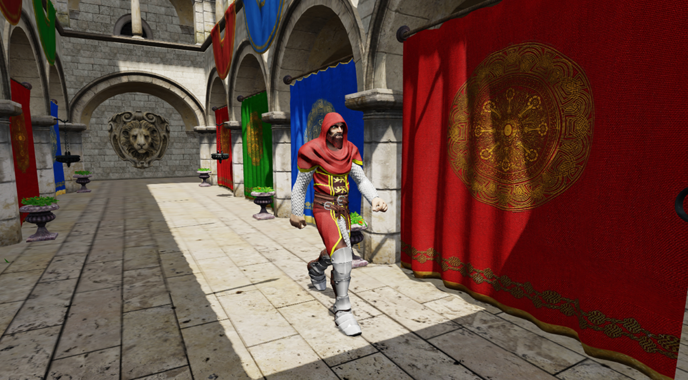

光照探针旨在通过预计算为场景内的物体提供高质量的光照信息；同时为需要 LOD 的物体提供光照信息。

在场景中光线在照射到某个物体后，可能反弹到另一个物体，这样的反弹可能会有多次。

下图演示了光线在场景反弹一次并被光照探针捕获的情景。

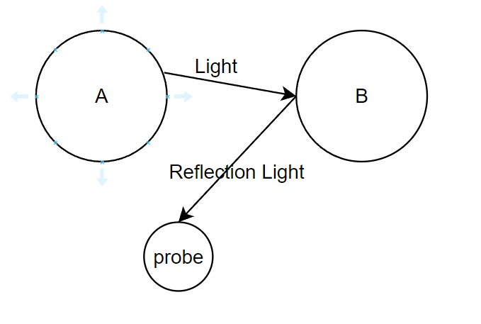

光线照射到 A 物体表面后，反射至 B 物体，通过光照探针，将 B 物体对此光线的反射情况捕获到贴图上，之后在运行时对光线进行重建，以此来获得场景内静态物体的间接反射光信息。

Cocos Creator 支持最大 4 次反弹，详情可参考 [光照探针面板](light-probe-panel.md)。

## 添加光照探针组

在 **主菜单** 选中 **节点** -> **光源** -> **光照探针组** 可以在场景内添加光照探针。

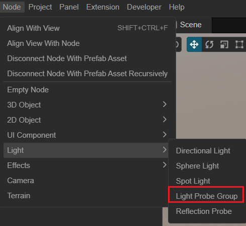

## 属性

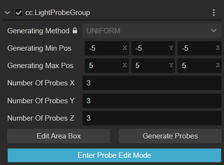

| 属性 | 说明|
| :-- | :-- |
| **Generating Method** | 生成方式，目前仅支持内置 |
| **Generating Min Pos** | 生成时的包围盒的最小值 |
| **Generating Max Pos** | 生成时的包围盒的最大值 |
| **Number Of Probes X** | X 轴上探针的数量 |
| **Number Of Probes Y** | Y 轴上探针的数量 |
| **Number Of Probes Z** | Z 轴上探针的数量 |
| **Edit Area Box**  | 编辑生成的包围盒   点击此按钮后在场景内会进入探针包围盒的编辑模式，请参考下方编辑文档获取更详细的信息   编辑的过程会影响到上述的 **Generating Min Pos** 以及 **Generating Max Pos** 的值 |
| **Generate Probes** | 生成光照探针   点击按钮后，会重新生成所有的探针，旧的探针会被删除   此时生成的探针是均匀的，如果需要手动调整，请点击下放 **Enter Probe Edit Mode** 按钮 |
| **Enter Probe Edit Mode** | 进入编辑探针模式   点击此按钮后在场景编辑器内可以通过 **鼠标左键** 选择不同的探针，并通过 **变换工具** 修改探针的位置 |

## 编辑探针

### 编辑探针范围

点击 **Edit Area Box** 可以进行光照探针范围编辑。此时场景内会以 **绿色** 包围盒的形式显示，点击包围盒上的绿色 Gizmo 即可调整其大小。

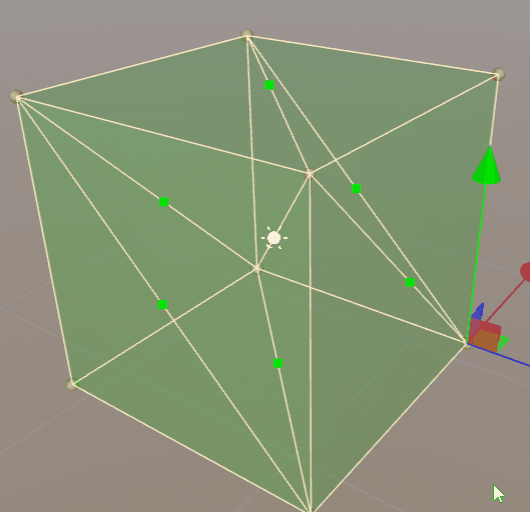

点击 **Done Edit** 按钮可以退出编辑模式：

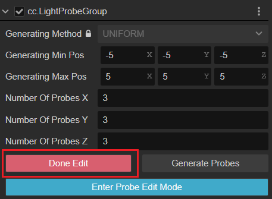

之后可以点击 **Generate Probes** 重新生成探针。

### 生成探针

点击 **Generate Probes** 按钮可以生成探针。此时旧的探针会被删除，如果需要重新烘焙探针，请参考下方 **烘焙光照探针** 部分。

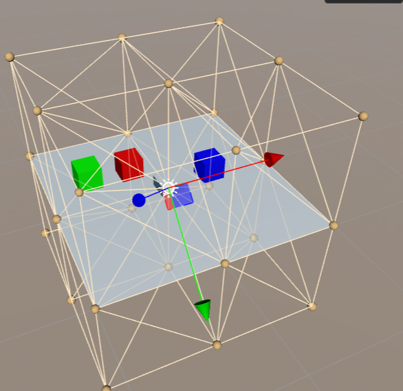

### 编辑探针位置

生成探针后，可以点击 **Enter Probe Edit Mode** 按钮进入探针编辑模式。

此时场景的探针才可以被选择。

通过鼠标拖拽这些 Gizmo 可以调整探针的位置。

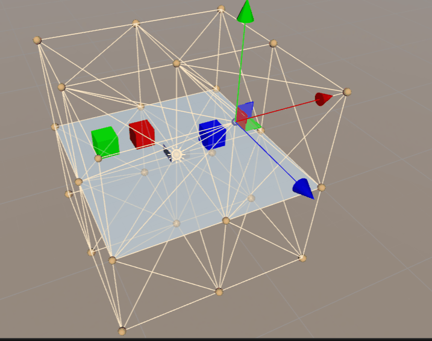

## 启用探针

在节点的 **属性检查器** 内勾选 **使用光照探针（Use Light Probe）** 并将节点的 **Mobility** 属性设置为 **Movable** 可启用节点探针。

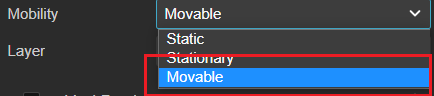

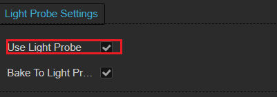

启用后在 **层级管理器** 内选中节点，可查看节点受那些探针影响，图示中的白色小点为光照探针。

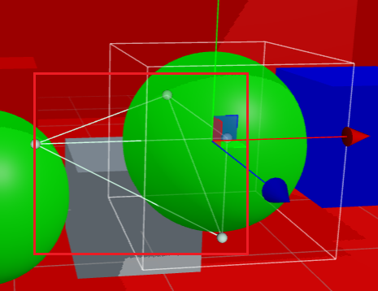

## 烘焙光照探针

对于需要烘焙的节点，可勾选节点的 **Bake To Light Probe**：

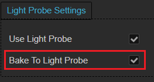

在编辑好光照探针后，可以选择 **项目** -> **光照烘焙** -> **光照探针** 打开 [光照探针面板](light-probe-panel.md)。

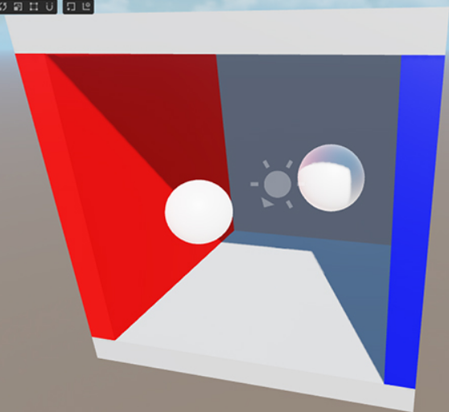

更多示例可参考 [基于图像的光照示例](example.md)。

## 理论参考

通常光照探针是通过球谐函数计算，对于技术细节感兴趣的开发者，我们也准备了一些参考文档：

- [Spherical Harmonic Lighting: The Gritty Details](http://www.cse.chalmers.se/~uffe/xjobb/Readings/GlobalIllumination/Spherical%20Harmonic%20Lighting%20-%20the%20gritty%20details.pdf)
- [Spherical harmonic lighting Wiki](https://en.wikipedia.org/wiki/Spherical_harmonic_lighting)
- [Fourier Transform Wiki](https://en.wikipedia.org/wiki/Fourier_transform)
- [Spherical Harmonic](https://en.wikipedia.org/wiki/Spherical_Harmonic#:~:text=.%20In%20mathematics%20and%20physical%20science%2C%20spherical%20harmonics,solving%20partial%20differential%20equations%20in%20many%20scientific%20fields.)
