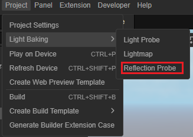
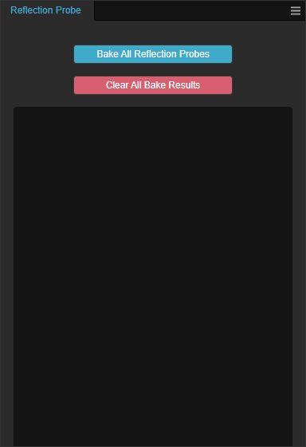

# 反射探针面板

通过主菜单上的 **项目** -> **光照烘焙** -> **反射探针** 可以打开反射探针烘焙面板。

反射探针烘焙面板会对项目中所有含有 [反射探针](reflection-probe.md) 组件的节点进行烘焙。

烘焙的结果会放在项目的 **资源管理器** 内以 **reflectionProbe_** 命名。

## 属性

| 属性 | 说明 |
| :-- | :-- |
| **Bake All Reflection Probes** | 烘焙按钮，点击后会开始烘焙整个场景内所有的反射探针 |
| **Clear All Bake Results** | 清除烘焙的结果，点击后会将项目内已经存在的反射探针烘焙结果 |
| **Cancel** | 取消当前的烘焙进程，仅在烘焙按钮被按下后起效    |

## 美术工作流

美术工作流请参考 [反射探针](reflection-probe.md) 或 [探针示例](light-probe-sample.md)。
