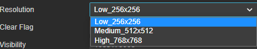
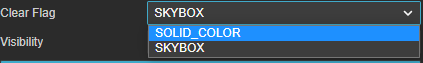
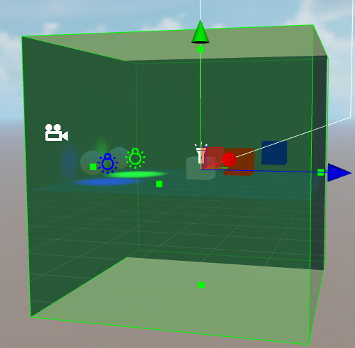
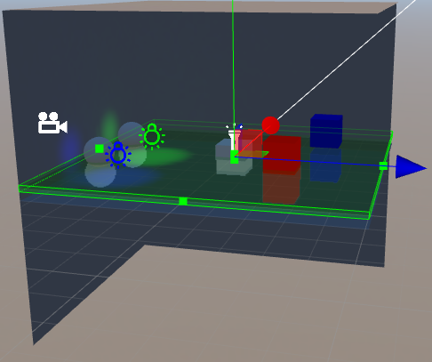
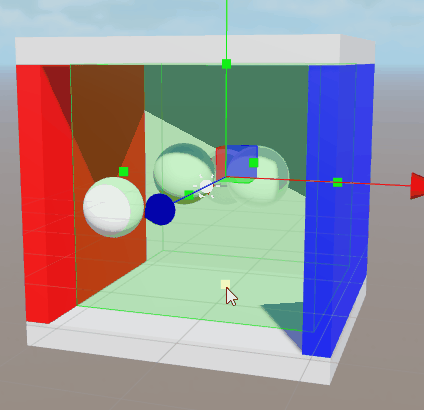
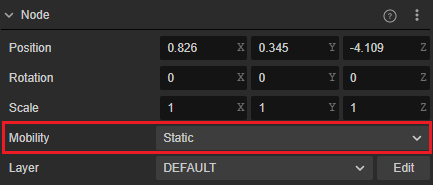
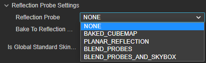
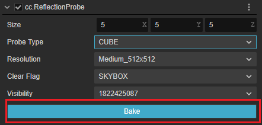
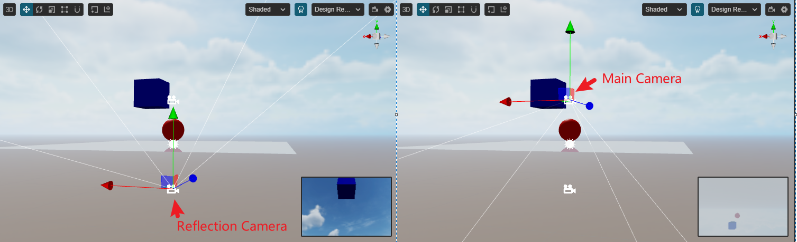
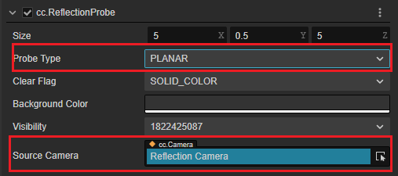

# 反射探针

自 v3.7 开始，Cocos Creator 支持反射探针。

反射探针是将选择范围内的反射光，使用烘焙或实时的方式应用到当前场景上，以提高场景光照可信度的组件。

在 **层级管理器** 或顶部菜单上选择 **光源** -> **反射探针** 即可在场景内创建反射探针。

## 属性

| 属性 | 说明 |
| :-- | :-- |
| **Size** | 反射探针的范围，在场景内可以通过操作 Gizmo 来调整反射探针的大小 |
| **Probe Type** | 反射探针的类型   可选项：  **CUBE**：支持烘焙的反射探针   **PLANNAR**：支持实时反射的反射探针   |
| **Resolution** | 反射探针烘焙后的立方体贴图每个面的分辨率   可选项： **Low_256x256**/**Medium_512x512**/**Hight_768x768**   该选项仅在 **Probe Type** 为 **CUBE** 时生效   |
| **Background Color** | 背景颜色，仅在 **Probe Type** 为 **PLANNAR** 时生效 |
| **Clear Flag** | 相机的缓冲清除标志位，指定帧缓冲的哪部分要每帧清除。包含：  SOLID_COLOR：清空颜色、深度与模板缓冲；  SKYBOX：启用天空盒，只清空深度    |
| **Visibility** | 可见性掩码，声明在当前反射探针中可见的节点层级集合   通过下拉菜单选择   |
| **Source Camera** | 指定实时反射的相机   该属性仅在 **Probe Type** 为 **PLANNAR** 时生效 |
| **Bake** | 烘焙按钮，点击后即可以对反射探针进行烘焙 |

### 探针类型

Cocos Creator 的反射探针有两种类型，分别为：

- **CUBE**：将区域内的反射信息烘焙到一张 CUBE Map 上。

    

    在反射探针选择为 **CUBE** 时，开发者可以通过下方的 **RESOLUTION** 下拉菜单选择最终烘焙贴图的大小。

- **PLANNAR**：实时反射探针。

    常用模拟水面、镜子、大理石或者湿润的地面等。

    

    当反射探针的类型修改为 **PLANNAR** 时，开发者需要配置 **Source Camera** 属性以决定使用哪个相机作为反射探针的相机。

通过 **场景编辑器** 内的 Gizmo，可以调整 **Size** 属性，以此来修改反射探针的范围。

## 美术工作流示例

### 烘焙反射探针工作流

- 在场景内创建 **反射探针** 节点

- 将需要烘焙反射的节点的 **Mobility** 属性修改为 **Static**

    

- 在需要烘焙反射的节点的 **属性检查器** 上下拉找到 **Reflection Probe Settings**，并调整其对应的属性：

    

    - **Reflection Probe**: 选择反射探针的类型
    - **Bake To Reflection Probe**: 勾选是否将该网格渲染器的反射信息烘焙至反射探针相关的贴图

    详情请参考 [MeshRenderer 组件参考](../../../../engine/renderable/model-component.md)

- 烘焙

    - 点击 **属性检查器** 上的 **Bake** 按钮，烘焙当前已选择的反射探针：

        

    - 主菜单上选择 **项目** -> **光照烘焙** -> **反射探针**，打开 [反射探针面板](reflection-probe-panel.md)，通过点击面板上的烘焙按钮进行烘焙。

- 检查烘焙结果

    烘焙完成后，**资源管理器** 内会创建以 **reflectionProbe_** 开头为命名的贴图。开发者可查看这些贴图是否满足预期。

更多示例请参考 [基于图像的光照示例](example.md)。

### 实时反射探针工作流示例

- 搭建如图示的场景：

    

- 创建一个相机，其参数和主相机相同，以上述场景中的 Plane 节点作为镜面，与主相机呈镜面对称状态。

    

    镜面对称的两个相机：

    

- 场景中创建 **反射探针** 节点:

    - 修改 **探针类型** 为 **PLANNAR**
    - 配置 **Source Camera** 属性为上述步骤中创建的 **Reflection Camera** 节点

    

- 修改场景中 **Plane** 节点的 **MeshRenderer** 属性的 **Reflection Probe** 为 **PLANNAR_REFLECTION**：

    

- 此时可以观察到场景内，该平面的反射变化：

    