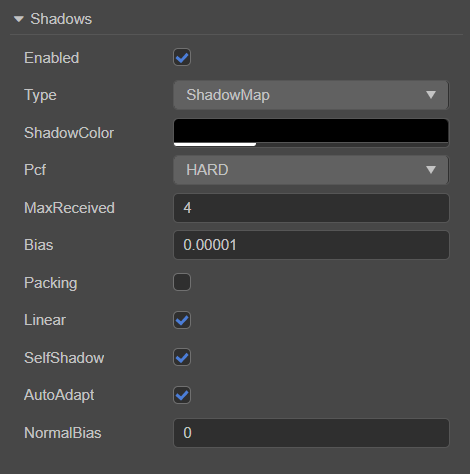

# 阴影

在 3D 世界中，光与影一直都是极其重要的组成部分，它们能够丰富整个环境，质量好的阴影可以达到以假乱真的效果，并且使得整个世界具有立体感。

Creator 3.0 目前支持 **Planar** 和 **ShadowMap** 两种阴影类型。

## 开启阴影

物体开启阴影效果的步骤如下：

1. 在 **层级管理器** 中选中 **Scene**，然后在 **属性检查器** 的 **shadows** 组件中勾选 **Enabled** 属性。

    

2. 在 **层级管理器** 中选中需要显示阴影的 3D 节点，然后在 **属性检查器** 的 **MeshRenderer** 组件中将 **ShadowCastingMode** 属性设置为 **ON**。

    

    若阴影类型是 **ShadowMap**，还需要将 MeshRenderer 组件上的 **ReceiveShadow** 属性设置为 **ON**。

> **注意**：如果阴影无法正常显示，需要调整一下方向光的照射方向。

## shadows 类型

阴影类型可在 shadows 组件的 **Type** 属性中设置。

### Planar shadow

Planar 阴影类型一般用于较为简单的场景。

| 属性  | 说明  |
| :--- | :--- |
| **Enabled**     | 是否开启阴影效果      |
| **Type**        | 阴影类型             |
| **ShadowColor** | 设置阴影颜色         |
| **Normal**      | 垂直于阴影的法线，用于调整阴影的倾斜度  |
| **Distance**    | 阴影在法线的方向上与坐标原点的距离     |

调节方向光照射的方向可以调节阴影的投射位置。

> **注意**：Planar 类型的阴影只有投射在平面上才能正常显示，不会投射在物体上，也就是说 MeshRenderer 组件中的 **ReceiveShadow** 属性是无效的。

### ShadowMap

ShadowMap 是以光源为视点来渲染场景的。从光源位置出发，场景中看不到的地方就是阴影产生的地方。

| 属性  | 说明  |
| :--- | :--- |
| **Enabled**         | 是否开启阴影效果     |
| **Type**            | 设置阴影类型    |
| **ShadowColor**     | 设置阴影颜色     |
| **Pcf**             | 设置阴影边缘反走样等级，目前包括 **HARD**、 **FILTER_X5**、**FILTER_X9**、**FILTER_X25** 四种，详情可参考下文 **PCF 软阴影** 部分的介绍。   |
| **MaxReceived**     | 最多支持产生阴影的光源数量，默认为 4 个，可根据需要自行调整     |
| **Bias**            | 设置阴影偏移值，防止 z-fitting    |
| **Packing**       | shadowMap 压缩，部分不支持浮点纹理的设备可开启该项。该项可优化性能，但纹理质量较低（与 Linear 项互斥，二者只能选其一）     |
| **Linear**       | 开启线性深度，仅对聚光灯生效，可用于提高聚光灯的阴影质量（与 Packing 项互斥）     |
| **SelfShadow**       | 开启场景中物体的自阴影效果     |
| **NormalBias**          | 设置法线偏移值，取值范围为 **-1 ~ 1**。当开启了 **SelfShadow** 后，物体的弯曲表面出现漏光现象，可以通过调整该项的值来解决（该项仅在勾选了 SelfShadow 后显示）     |
| **AutoAdapt**       | 若勾选该项，则自动计算阴影产生的范围，详情可参考下文介绍。 若不勾选该项，则启用下列属性来手动设置阴影产生的范围  |
| **Near**       | 设置主光源相机的近裁剪面     |
| **Far**       | 设置主光源相机的远裁剪面     |
| **orthoSize**       | 设置主光源相机的正交视口大小     |
| **ShadowMapSize**       | 设置阴影的纹理贴图大小     |
| **Aspect**       | 设置主光源相机的正交投影矩阵长宽比     |

ShadowMap 在开启了物体 **MeshRenderer** 组件上的 **ReceiveShadow** 后，就会接收并显示其它物体产生的阴影效果。

ShadowMap 一般用于要求光影效果比较真实，且较为复杂的场景。但不足之处在于如果不移动光源，那么之前生成的 Shadow Map 就可以重复使用，而一旦移动了光源，那么就需要重新计算新的 ShadowMap。

#### PCF 软阴影

百分比渐近过滤（PCF）是一个简单、常见的用于实现阴影边缘反走样的技术，通过对阴影边缘进行平滑处理来消除阴影贴图的锯齿现象。原理是在当前像素（也叫做片段）周围进行采样，然后计算样本跟片段相比更接近光源的比例，使用这个比例对散射光和镜面光成分进行缩放，然后再对片段着色，以达到模糊阴影边缘的效果。

目前 Cocos Creator 支持 5 倍、9 倍 和 25 倍采样，倍数越大，采样区域越大，阴影边缘也就越模糊。

#### AutoAdapt 自适应阴影计算技术

AutoAdapt 自适应阴影计算会自动计算视口（lightView）下阴影产生的范围，以及阴影相机的远近。

## 支持动态合批提高性能

对于材质中已经开启 instancing 的模型，平面阴影也会自动同步使用 instancing 绘制，详情请参考 [动态合批](../../engine/renderable/model-component.md#%E5%85%B3%E4%BA%8E%E5%8A%A8%E6%80%81%E5%90%88%E6%89%B9)。
