# 天空盒

游戏中的天空盒是一个包裹整个场景的立方体，可以很好地渲染并展示整个场景环境，在基于 PBR 的工作流中天空盒也可以贡献非常重要的 IBL 环境光照。

## 开启天空盒

在 **层级管理器** 中选中场景根节点，然后在 **属性检查器** 的 **Skybox** 组件中勾选 **Enabled** 属性即可开启天空盒。

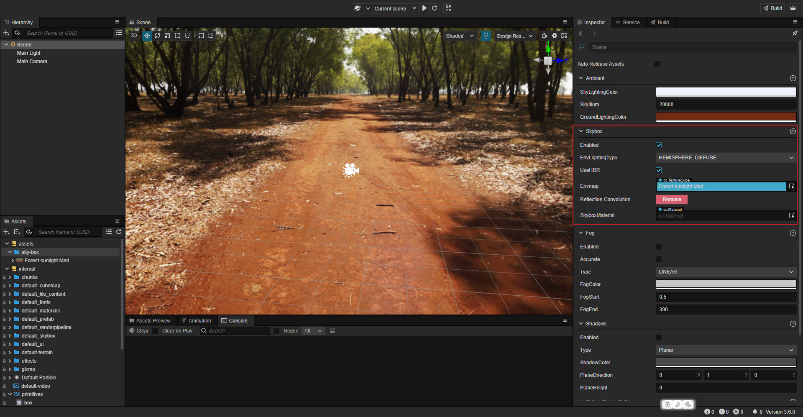

Skybox 组件属性如下：

| 属性 | 说明 |
| :---| :--- |
| **Enabled** | 勾选该项即可开启天空盒 |
| **Env Lighting Type** | 环境光类型，请参考下文 **漫反射照明** 获取更多参考 |
| **UseHDR** | 若勾选该项则开启 HDR（高动态范围），若不勾选该项，则使用 LDR（低动态范围）。详情请参考下文 **切换 HDR/LDR 模式** 部分的内容。 |
| **Envmap** | 天空盒的环境贴图，[TextureCube](../../asset/texture-cube.md) 类型，具体设置方法可参考下文介绍。 当该属性为空时，天空盒默认使用和显示的是像素贴图 |
| **Reflection Convolution** | 点击bake按钮后会生成一张低分辨率的环境贴图并且会对此图进行卷积计算，卷积图用于环境反射 |
| **Reflection Map** | 自动生成的用于环境反射的卷积图，不支持手动编辑。渲染效果参考下文 **烘焙反射卷积图** 部分的内容。 |
| **DiffuseMap**      | 自动生成的用于高级漫反射的卷积图，不支持手动编辑。  该选项只在 **Env Lighting Type** 为 **DIFFUSEMAP_WITH_REFLECTION** 时生效 |
| **Reflection Convolution** | 反射卷积，详情请参考下方 **反射卷积** 部分 |
| **SkyboxMaterial** | 为天空盒添加自定义的材质。请参考下方 **天空盒材质** 部分 |

## 设置天空盒的环境贴图

开启天空盒之后还需要设置天空盒的环境贴图，用于在场景中产生环境光照。将贴图资源拖拽到 Skybox 组件的 **Envmap** 属性框中，或者点击 **Envmap** 属性框后面的箭头按钮选择所需的贴图资源即可。若不设置，则天空盒默认使用和显示的是像素贴图。

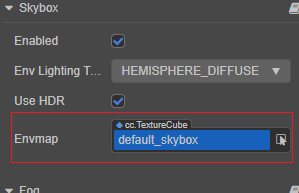

天空盒的环境贴图资源支持：

1. TextureCube 类型的单张贴图，可在 Creator 中设置。

    - Cube Cross 图片

    - PNG 或 HDR 格式的图片

2. 图片文件形式的 CubeMap（立方体贴图）

3. 在 Creator 中手动创建的由六张 texture 类型的贴图组合而成的 CubeMap

### 通过设置 TextureCube 类型的贴图资源

1. 导入贴图资源，直接将图片资源拖拽到 **资源管理器** 面板即可。

2. 选中导入的贴图资源，在右侧的 **属性检查器** 面板中将 **Type** 属性设置为 **texture cube**，然后点击右上角的绿色打钩按钮保存设置。

    

3. 在 **层级管理器** 中选中 **Scene**，然后将设置好的图片资源拖拽到 **属性检查器** 中 **skybox** 组件的 **Envmap** 属性框中：

    

这样子就设置完成了，开发者可以直接在 **场景编辑器** 中看到设置后的天空盒的环境贴图。若贴图没有正确显示，需要检查 **SkyIllum 参数** 的值是否太低，或者 **修改 Camera 的 Clear Flag**。

### 使用引擎内置的资源

在 **资源管理器 -> internal** 目录下，引擎提供了部分内置的 TextureCube 资源，开发者也可以根据上述步骤按需使用。

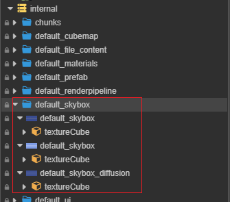

#### SkyIllum 参数

在 **层级管理器** 中选中场景根节点，然后在 **属性检查器** 的 **ambient** 组件中即可看到 SkyIllum 参数，默认值为 20000。

若 SkyIllum 参数值设置 **太低** 可能会导致天空盒的环境贴图无法在 **场景编辑器** 中正确显示。一般情况下：

- 当 SkyIllum 参数值小于 300 时，天空盒的环境贴图便无法正常显示。

- 当 SkyIllum 参数值为 5000 时，效果相当于月夜的光照强度。

#### 修改 Camera 的 Clear Flag

若 **场景编辑器** 中天空盒的环境贴图已经可以正确显示，但是在项目运行之后仍然没有生效，此时就需要修改 Camera 组件的 **ClearFlag** 属性为 **SKYBOX**：

### 制作 CubeMap（立方体贴图）

可在 Creator 中手动通过六张普通贴图生成一张立方体贴图，操作步骤如下：

1. 在 **资源管理器** 中将准备好的六张贴图资源全部选中，然后在 **属性检查器** 中将这些贴图资源的 **Type** 属性批量设置为 **texture**，并点击右上角的绿色打钩按钮。

   

2. 新建 CubeMap 资源。在 **资源管理器** 中选中要存放 CubeMap 的文件夹，点击左上角的 **+** 按钮，然后选择 **CubeMap** 即可。或者也可以右键点击要存放 CubeMap 的文件夹，选择 **新建 -> CubeMap**。

    

3. 将刚才设置为 texture 类型的 6 张贴图拖拽到 CubeMap 对应的属性框中，完成后点击右上方的绿色打钩按钮，这样就完成了一张 CubeMap。

    

    > **注意**：
    >
    > 1. CubeMap 中未设置贴图的属性框将使用默认资源进行填充。
    > 2. CubeMap 中的 6 个属性框 **不要使用同一张贴图**，否则会导致某些平台无法正常显示。

### 漫反射照明

Creator 支持以下三种方式的环境漫反射照明，可以在 **Env Lighting Type** 属性的下拉列表中进行选择。

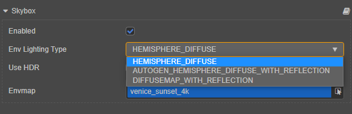

其类型与描述如下所示：

| 类型 | 描述 |
| :-- | :-- |
| **HEMISPHERE_DIFFUSE** | 半球漫反射 |
| **AUTOGEN_HEMISPHERE_DIFFUSE_WITH_REFLECTION** | 半球漫反射和环境反射 |
| **DIFFUSEMAP_WITH_REFLECTION** | 漫反射卷积图和环境反射 |

1. **半球漫反射**：当 **Env Lighting Type** 属性为 **HEMISPHERE_DIFFUSE** 时，使用半球光漫反射。该方式由 **Ambient** 组件中的 **SkyLightingColor** 和 **GroundLightingColor** 属性控制，渲染性能更高，但是细节度不够，照明方向性差。**可手动调节，但可能会和环境贴图变得不统一**。在此模式下，IBL 将不可用，环境贴图对反射不起作用。

    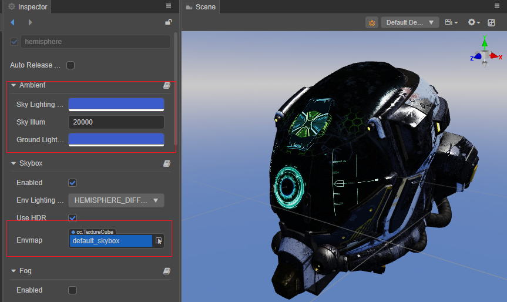

2. **半球漫反射和环境反射**：当 **Env Lighting Type** 属性为 **AUTOGEN_HEMISPHERE_DIFFUSE_WITH_REFLECTION** 时，该方式可以通过 **Ambient** 组件中的 **SkyLightingColor** 和 **GroundLightingColor** 属性控制漫反射。同时也会表达环境贴图所产生的镜面反射效果。

    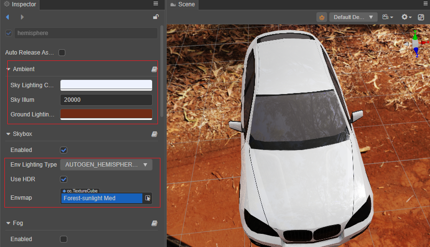

3. **漫反射卷积图和环境反射**：当 **Env Lighting Type** 属性为 **DIFFUSEMAP_WITH_REFLECTION** 时，使用卷积图漫反射。该方式是高级漫反射，可以正确表达环境贴图产生的漫反射照明，有较好的照明方向性和细节。但和 **AUTOGEN_HEMISPHERE_DIFFUSE_WITH_REFLECTION** 不同的是漫反射是由自动生成的卷积图来表达，不允许编辑。

    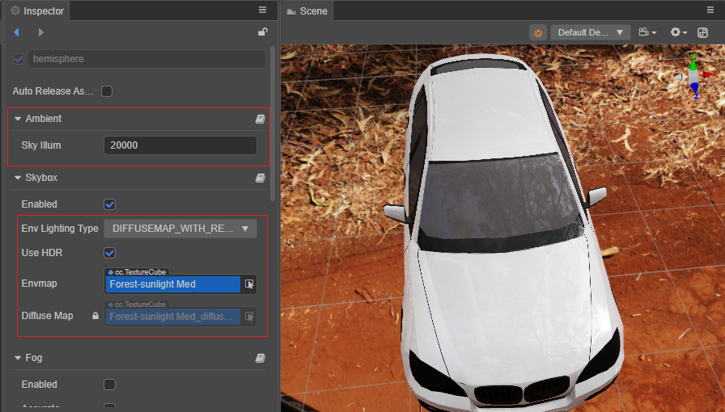

通过下面的 GIF 图可以更明显地看到 **AUTOGEN_HEMISPHERE_DIFFUSE_WITH_REFLECTION** 与 **DIFFUSEMAP_WITH_REFLECTION** 的对比，在 **Env Lighting Type** 为 **DIFFUSEMAP_WITH_REFLECTION** 的情况下背光面较暗，突出了整体的层次感，明暗对比细节也有较大的提升。

> **注意**：当更换 **Envmap** 属性中的环境贴图时，Creator 会自动计算对应的环境光照信息，以及漫反射光照（仅支持图片文件形式的 CubeMap，不包括手动制作的 CubeMap）

## 切换 HDR/LDR 模式

Skybox 组件中的 **UseHDR** 选项用于切换 HDR/LDR 模式，当勾选时使用 HDR 模式。

- HDR（High Dynamic Range）：高动态范围，配合 **光源的光度学强度** 和 **相机的曝光参数** 可以实现更真实的明暗对比层次。若使用该模式，则所有的光源（包括平行光、点光源、聚光灯等）**强度会变成光度学物理单位**，环境光立方体贴图应使用 **HDR 格式的图片** 以提供高动态范围的数据源。

- LDR（Low Dynamic Range）：低动态范围。若使用该模式，则 **光源强度会变成无单位**，不再与光度学和相机曝光有任何联系。此模式适用于希望无任何色染的体现原贴图颜色的情景，环境光立方体贴图可使用 **PNG 等格式的图片**。

## 天空盒材质

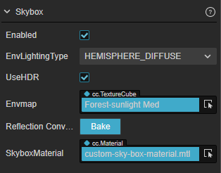

天空盒材质默认使用的着色器是 **资源管理器 -> internal/pipeline/skybox.effect**，如想自定义材质，可参考 [新建材质](../../asset/material.md) 创建新的材质并选择 [自定义着色器](../../shader/write-effect-overview.md)：

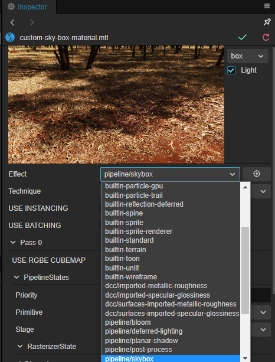

## 反射卷积

使用 GGX BRDF 光照模型对环境贴图生成预卷积的反射结果，在生成时会考虑粗糙度的影响，并将最终的结果按照粗糙度顺序存储在 Mipmap 中（粗糙度从 0 到 1，粗糙度为 0 时， Mipmap 等级为 0）。

由于该算法考虑了粗糙度对环境反射的影响（即随着粗糙度增加，环境反射更模糊），因此使 PBR 材质产生更加逼真的反射效果。

## 烘焙反射卷积图

在 **属性检查器** 内点击 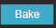 按钮则可以进行反射卷积贴图的烘焙工作。在生成完成之后，也可以选择点击 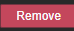 按钮进行删除。

生成的环境反射卷积图会填充到 TextureCube 的 mipmaps，在 Shader 中根据材质粗糙度采样对应层级的 mipmap，从而提供更加真实的IBL效果，通过下面的 GIF 图可以明显看到对比效果。

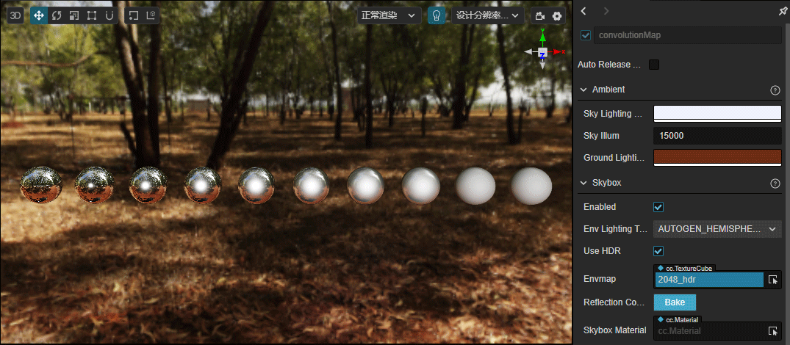
