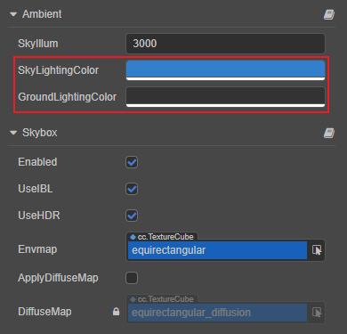
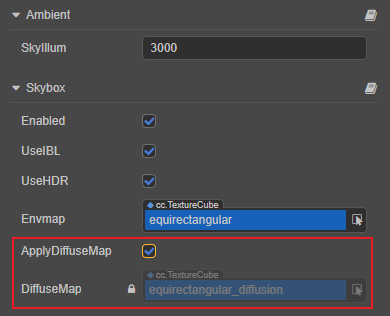
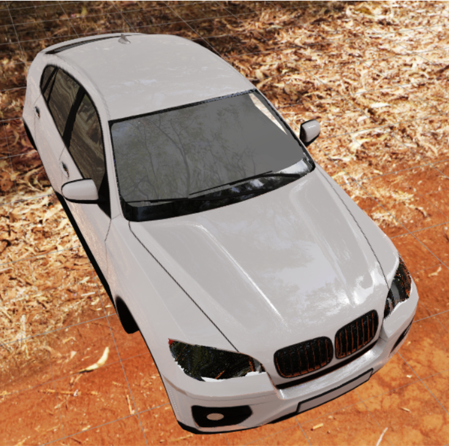
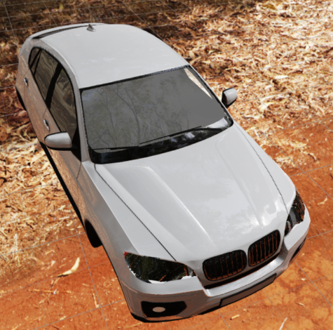
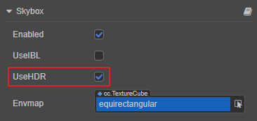

# 天空盒

游戏中的天空盒是一个包裹整个场景的立方体，可以很好地渲染并展示整个场景环境，在基于 PBR 的工作流中天空盒也可以贡献非常重要的 IBL 环境光照。

## 开启天空盒

在 **层级管理器** 中选中场景根节点，然后在 **属性检查器** 的 **Skybox** 组件中勾选 **Enabled** 属性即可开启天空盒。

Skybox 组件属性如下：

| 属性 | 说明 |
| :---| :--- |
| **Enabled** | 勾选该项即可开启天空盒 |
| **UseIBL** | 是否使用环境光照，详情请参考下文 **使用 IBL** 部分的内容。 |
| **UseHDR** | 若勾选该项则开启 HDR（高动态范围），若不勾选该项，则使用 LDR（低动态范围）。详情请参考下文 **切换 HDR/LDR 模式** 部分的内容。 |
| **Envmap** | 天空盒的环境贴图，TextureCube 类型，具体设置方法可参考下文介绍。 当该属性为空时，天空盒默认使用和显示的是像素贴图 |
| **ApplyDiffuseMap** | 若勾选该项，场景物体将使用更精确的漫反射图来取代默认的半球光照。该项仅在勾选 **UseIBL** 后显示。详情请参考下文 **漫反射照明** 部分的内容。 |
| **DiffuseMap**      | 勾选 **ApplyDiffuseMap** 属性后，自动生成的用于高级漫反射的卷积图，不支持手动编辑。该项仅在勾选 **UseIBL** 后显示。 |

## 设置天空盒的环境贴图

开启天空盒之后还需要设置天空盒的环境贴图，将贴图资源拖拽到 Skybox 组件的 **Envmap** 属性框中，或者点击 **Envmap** 属性框后面的箭头按钮选择所需的贴图资源即可。若不设置，则天空盒默认使用和显示的是像素贴图。

天空盒的环境贴图资源支持：

1. TextureCube 类型的单张贴图，可在 Creator 中设置。

    - Cube Cross 图片

    - PNG 或 HDR 格式的图片

2. 图片文件形式的 CubeMap（立方体贴图）

3. 在 Creator 中手动创建的由六张 texture 类型的贴图组合而成的 CubeMap

### 通过设置 TextureCube 类型的贴图资源

1. 导入贴图资源，直接将图片资源拖拽到 **资源管理器** 面板即可。

2. 选中导入的贴图资源，在右侧的 **属性检查器** 面板中将 **Type** 属性设置为 **texture cube**，然后点击右上角的绿色打钩按钮保存设置。

    

3. 在 **层级管理器** 中选中 **Scene**，然后将设置好的图片资源拖拽到 **属性检查器** 中 **skybox** 组件的 **Envmap** 属性框中：

    

这样子就设置完成了，开发者可以直接在 **场景编辑器** 中看到设置后的天空盒的环境贴图。若贴图没有正确显示，需要检查 **SkyIllumination 参数** 的值是否太低，或者 **修改 Camera 的 Clear Flag**。

#### SkyIllumination 参数

在 **层级管理器** 中选中 **Scene**，然后在 **属性检查器** 的 **ambient** 组件中即可看到 SkyIllumination 参数，默认值为 20000。

若 SkyIllumination 参数值设置 **太低** 可能会导致天空盒的环境贴图无法在 **场景编辑器** 中正确显示。一般情况下：

- 当 SkyIllumination 参数值小于 300 时，天空盒的环境贴图便无法正常显示。

- 当 SkyIllumination 参数值为 5000 时，效果相当于月夜的光照强度。

#### 修改 Camera 的 Clear Flag

若 **场景编辑器** 中天空盒的环境贴图已经可以正确显示，但是在项目运行之后仍然没有生效，此时就需要修改 Camera 组件的 **ClearFlag** 属性为 **SKYBOX**：

### 制作 CubeMap（立方体贴图）

可在 Creator 中手动通过六张普通贴图生成一张立方体贴图，操作步骤如下：

1. 在 **资源管理器** 中将准备好的六张贴图资源全部选中，然后在 **属性检查器** 中将这些贴图资源的 **Type** 属性批量设置为 **texture**，并点击右上角的绿色打钩按钮。

   

2. 新建 CubeMap 资源。在 **资源管理器** 中选中要存放 CubeMap 的文件夹，点击左上角的 **+** 按钮，然后选择 **CubeMap** 即可。或者也可以右键点击要存放 CubeMap 的文件夹，选择 **新建 -> CubeMap**。

    

3. 将刚才设置为 texture 类型的 6 张贴图拖拽到 CubeMap 对应的属性框中，完成后点击右上方的绿色打钩按钮，这样就完成了一张 CubeMap。

    

    > **注意**：
    >
    > 1. CubeMap 中未设置贴图的属性框将使用默认资源进行填充。
    > 2. CubeMap 中的 6 个属性框 **不要使用同一张贴图**，否则会导致某些平台无法正常显示。

## 使用 IBL

若勾选 **UseIBL** 属性，则场景中的物体使用的是天空盒产生的环境照明的镜面反射，同时允许使用更精确的漫反射照明（卷积图）。

若禁用 **UseIBL** 属性，则场景中的物体只能使用半球光方式的漫反射照明。

### 漫反射照明

Creator 支持以下两种方式的环境漫反射照明，可通过是否勾选 **ApplyDiffuseMap** 属性来切换使用，需要注意的是该属性仅在勾选 **UseIBL** 后显示。

1. **半球光**：不勾选 **ApplyDiffuseMap** 属性时，使用半球光漫反射。该方式由 **Ambient** 组件中的 **SkyLightingColor** 和 **GroundAlbedoColor** 属性控制，渲染性能更高，但是细节度不够，照明方向性差。**可手动调节，但可能会和环境贴图变得不统一**。

    

2. **卷积图**：勾选 **ApplyDiffuseMap** 属性时，使用卷积图漫反射。该方式是高级漫反射，可以正确表达环境贴图产生的漫反射照明，有较好的照明方向性和细节。但 **DiffuseMap** 属性中的卷积图是自动生成来进行漫反射的，不允许手动编辑。

    

当使用半球光漫反射时，效果如下：

当使用卷积图漫反射时，效果如下图。相比上图可以明显看出下图左侧背光面较暗，突出了整体的层次感，明暗对比细节也有较大的提升。

通过下面的 GIF 图可以更明显地看到对比：

> **注意**：
>
> 1. 当更换 **Envmap** 属性中的环境贴图时，Creator 会自动计算对应的环境光照信息，以及漫反射光照（仅支持图片文件形式的 CubeMap，不包括手动制作的 CubeMap）
> 2. 勾选了 Use IBL 选项，但不勾选 Apply DiffuseMap，使用的是半球光漫反射，效果与不勾选 Use IBL 是一样的。

## 切换 HDR/LDR 模式

Skybox 组件中的 **UseHDR** 选项用于切换 HDR/LDR 模式，当勾选时使用 HDR 模式。

- HDR（High Dynamic Range）：高动态范围，配合 **光源的光度学强度** 和 **相机的曝光参数** 可以实现更真实的明暗对比层次。若使用该模式，则所有的光源（包括平行光、点光源、聚光灯等）的 **强度会变成光度学物理单位**，环境光立方体贴图应使用 **HDR 格式的图片** 以提供高动态范围的数据源。

- LDR（Low Dynamic Range）：低动态范围。若使用该模式，则 **光源强度会变成无单位**，不再与光度学和相机曝光有任何联系。此模式适用于希望无任何色染的体现原贴图颜色的情景，环境光立方体贴图可使用 **PNG 等格式的图片**。
