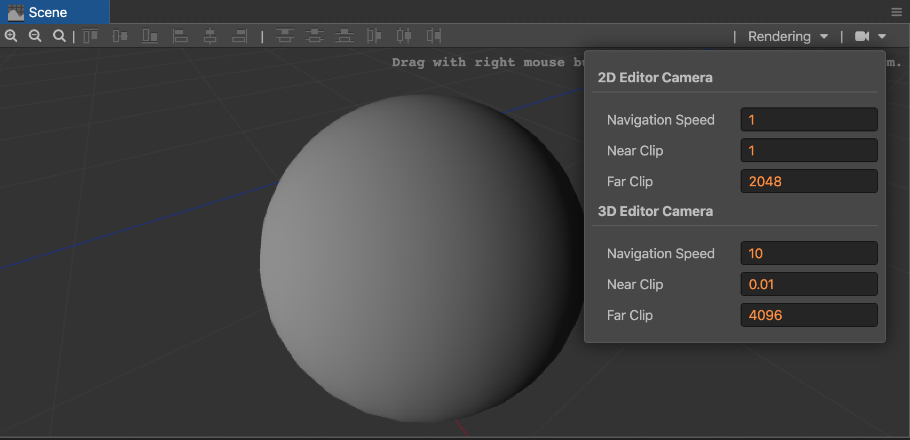

# 场景摄像机配置面板

场景摄像机配置面板可以配置编辑器场景摄像机的操作以及渲染参数。

- 2D Editor Camera - 针对 2D 编辑模式下的参数
- 3D Editor Camera - 针对 3D 编辑模式下的参数

## 配置参数

- Navigation Speed - 编辑器移动或缩放摄像机的速度。
  - 2D 模式下影响 滚轮缩放 模式
  - 3D 模式下影响 滚轮缩放 和 漫游 模式
- Near Clip & Far Clip - 场景摄像机视椎体的远近距离，在视椎体外的物体会被裁减掉。
