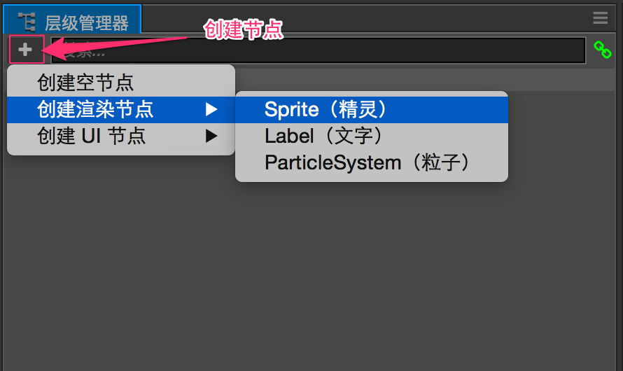
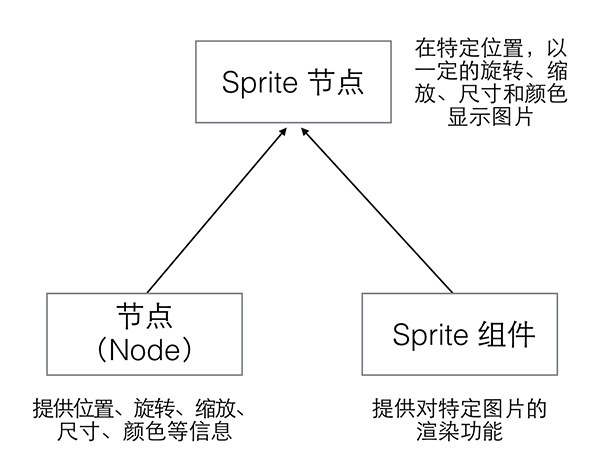

# 节点和组件

Cocos Creator 的工作流程是以组件式开发为核心的，组件式架构也称作 **组件 — 实体系统**（或 [Entity-Component System](https://en.wikipedia.org/wiki/Entity_component_system)），简单的说，就是以组合而非继承的方式进行实体的构建。

在 Cocos Creator 中，**节点（Node）** 是承载组件的实体，我们通过将具有各种功能的 **组件（Component）** 挂载到节点上，来让节点具有各式各样的表现和功能。接下来我们看看如何在场景中创建节点和添加组件。

## 创建节点（Node）

要最快速的获得一个具有特定功能的节点，可以通过 **层级管理器** 左上角的 **创建节点** 按钮。我们以创建一个最简单的 Sprite（精灵）节点为例，点击 **创建节点** 按钮后选择 **创建渲染节点 -> Sprite（精灵）**：

之后我们就可以在 **场景编辑器** 和 **层级管理器** 中看到新添加的 Sprite 节点了。新节点命名为 `New Sprite`，表示这是一个主要由 Sprite 组件负责提供功能的节点。您也可以尝试再次点击 **创建节点** 按钮，选择其他的节点类型，可以看到它们的命名和表现会有所不同。

## 组件（Component）

### Sprite 组件

我们有了一些节点，现在我们就来看看什么是组件，以及组件和节点的关系。选中我们刚才创建的 `New Sprite` 节点，可以看到 **属性检查器** 中的显示：

**属性检查器** 中以 `Node` 标题开始的部分就是节点的属性，节点属性包括了节点的位置、旋转、缩放、尺寸等变换信息和锚点、颜色、不透明度等其他信息。我们将在 [搭建场景图像](scene-editing.md) 部分进行详细介绍。

接下来以 `Sprite` 标题开始的部分就是 Sprite 组件的属性，在 2D 游戏中，Sprite 组件负责游戏中绝大部分图像的渲染。Sprite 组件最主要的属性就是 `Sprite Frame`，我们可以在这个属性指定 Sprite 在游戏中渲染的图像文件。让我们试试从 **资源管理器** 中拖拽任意一张图片资源到 **属性检查器** 的 `Sprite Frame` 属性中：

可以看到刚才的默认 Sprite 图片变成了我们指定的图片，这就是 Sprite 组件的作用：渲染图片。

> 组件上设置好的任何资源，如这里的 SpriteFrame，都会在场景加载时自动同时加载好。你也可以在自定义的组件中声明需要设置和自动加载的资源类型，详见 [获取和设置资源](../scripting/load-assets.md)。

### 节点属性对 Sprite 组件的影响

节点和 Sprite 组件进行组合之后，就可以通过修改节点属性来控制图片渲染的方式，您可以按照下图中红线标记属性的设置对您的节点进行调整，可以看到图片的旋转、比例、颜色和不透明度都发生了变化：

我们前面提到了组件式的结构是以组合方式来实现功能的扩展的，下图中就展示了节点和 Sprite 组件的组合。

## 节点颜色（Color）和不透明度（Opacity）属性

上图中节点的 **颜色（Color）** 属性和 **不透明度（Opacity）** 属性直接影响了 Sprite 组件对图片的渲染。颜色和不透明度同样会影响 [文字（Label）](../components/label.md) 这样的渲染组件的显示。

这两个属性会和渲染组件本身的渲染内容进行相乘，来决定每个像素渲染时的颜色和不透明度。此外不透明度（Opacity）属性还会作用于子节点，可以通过修改父节点的 `Opacity` 轻松实现一组节点内容的淡入淡出效果。

## 添加其他组件

在一个节点上可以添加多个组件，来为节点添加更多功能。在上面的例子中，我们可以继续选中 `New Sprite` 这个节点，点击 **属性检查器** 面板下面的 **添加组件** 按钮，选择 **UI 组件 -> Button** 来添加一个 Button（按钮）组件。

之后按照下图对 Button 组件的属性进行设置（具体的颜色属性可以根据爱好自由设置）：

接下来点击工具栏上面的 **运行预览** 按钮：

并在浏览器运行窗口中将鼠标悬停在图片上，可以看到图片的颜色发生变化，也就是我们为节点添加的 Button 组件行为生效了！

## 小结

上面的例子里，我们先是将 Sprite 组件和节点组合，有了可以指定渲染图片资源的场景图像，接下来我们通过修改节点属性，能够对这个图像进行缩放和颜色等不同方式的显示。现在我们又为这个节点添加了 Button 组件，让这个节点具有了根据按钮的不同状态（普通、悬停、按下等）的行为。这就是 Cocos Creator 中组件式开发的工作流程，我们可以用这样的方式将不同功能组合在一个节点上，实现如主角的移动攻击控制、背景图像的自动卷动、UI 元素的排版和交互功能等等复杂目标。

值得注意的是，一个节点上只能添加一个渲染组件，渲染组件包括 **Sprite（精灵）**、**Label（文字）**、**Particle（粒子）** 等。

## 参考阅读

- [理解组件 - 实体系统 - i_dovelemon的博客](http://blog.csdn.net/i_dovelemon/article/details/25798677)
