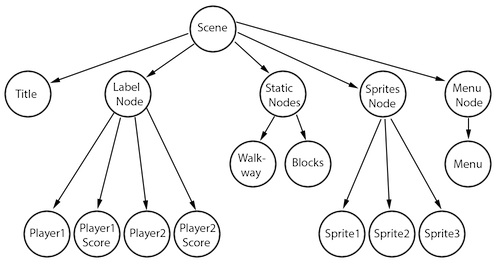
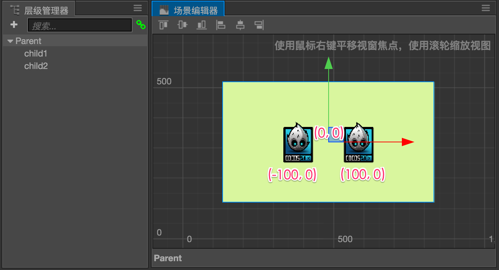

# 管理节点层级和显示顺序

通过前面的内容，我们了解了通过节点和组件的组合，能够在场景中创建各种图像、文字和交互元素。当场景中的元素越来越多时，我们就需要通过节点层级来将节点按照逻辑功能归类，并按需要排列它们的显示顺序。

## 了解层级管理器

创建和编辑节点时，**场景编辑器** 可以展示直观的可视化场景元素。而节点之间的层级关系则需要使用 **层级管理器** 来检查和操作。请先阅读 [层级管理器](../getting-started/basics/editor-panels/node-tree.md) 面板介绍，来掌握 **层级管理器** 的使用方法。

## 节点树

通过层级管理器或运行时脚本的操作，建立的节点之间的完整逻辑关系，就叫做节点树。

我们用来自 [Cocos2d-x Programmer Guide](https://docs.cocos.com/cocos2d-x/manual/zh/basic_concepts/) 的一组图片来展示什么是节点树：

下面是一个简单的游戏场景，包括背景图像，三个角色，标题文字，分数文字和开始游戏的按钮：

每个视觉元素都是一个节点，通常我们不会把所有节点平铺在场景上，而是会按照一定的分类和次序组织成如下图所示的节点树：

节点树中由箭头连接的两个节点之间就是父子关系，我们把显示在上面的叫做父节点，下面的叫子节点。在 **层级管理器** 中，上面的节点树就会是这个样子：

这就是如果依照类别创建几个父节点，然后把同类节点放在一个父节点下构建出的节点树。在实际游戏项目中我们还可以根据需要用其他各种方式组织节点树，下面我们就来仔细看看节点树和节点父子关系的实际作用，以及我们如何组织节点树的策略。

### 节点本地坐标系

在前一节的 [本地坐标系相关介绍](transform.md#-world-coordinate-local-coordinate-) 中，我们了解了节点父子关系的重要作用之一就是让我们能够在 **本地坐标系** 下使用子节点的变换属性。

我们知道世界坐标系的原点是屏幕左下角，如果我们场景中所有节点都是平行排列，当我们需要将两个节点放在背景节点上面比较靠近中间的位置时，我们可以看到节点的 **位置** 属性如下图所示：

由于两个主要节点和背景节点没有任何关系，因此它们的位置都是在世界坐标系下的数值，基本上没有规律，当我们需要让节点在背景范围内移动时，要计算出节点新的位置也需要动一番脑筋。

下面我们再来看看借助节点父子关系和本地坐标系，我们把两个主要节点拖拽到 `Parent` 节点下面作为子节点，这时两个节点的 **位置** 属性会变成怎样：

由于 `Parent` 节点的锚点属性是 `(0.5, 0.5)`，也就是以中心点作为本地坐标系原点，所以靠近父物体中心摆放的两个子节点的位置现在变成了 `(-100, 0)` 和 `(100, 0)`，使用本地坐标系的位置信息能够直观的反应两个子节点的摆放逻辑，也就是「靠近背景中心左右对称摆放」。这样的工作方式能够更直接的体现设计师在搭建场景时的想法，在后续让节点在背景范围内运动的过程中，也更容易获得边界范围，比如父节点最右边的本地坐标，就是 `(parentNode.width/2, 0)`。

另外当需要将一组节点作为一个整体进行移动、缩放、旋转时，节点的父子关系也可以让我们只关心父节点的变换操作，而不需要再去对子节点进行一一的遍历和计算。下图就是我们把上面例子里的父节点进行旋转和缩放的结果，可以看到子节点像印在父节点上一样，和父节点一起进行变换。

我们经常会遇到由很多节点组合成的复杂角色，游戏控制这些角色互动时，就需要这种基于父节点整体变换的功能。下面我们就来看看都有哪些基于逻辑关系的节点树管理方式。

### 管理节点逻辑关系

在游戏中经常需要控制复杂的玩家角色，这种角色通常不会只由单个节点组成，我们看看下面这张图里的英雄角色，就由三个不同的部分组成。

我们将英雄角色的 Sprite 图像显示和帧动画组件放在 `body` 节点上，然后需要跟随角色移动的阴影 Sprite 单独拿出来作为 `shadow` 节点。最后把负责生命值显示的进度条作为一组独立功能的节点，形成自己的迷你节点树 `HPBar`。

上面的例子就是典型的根据逻辑需要来组织节点关系，我们可以根据游戏逻辑操作英雄角色节点的动画播放、左右翻转；根据角色当前血量访问 `HPBar` 节点来更新生命值显示；最后它们共同的父节点 `player` 用于控制角色的移动，并且可以作为一个整体被添加到其他场景节点中。

### 管理节点渲染顺序

在上面的例子中，我们可以注意一下 `body` 和 `shadow` 节点的排列顺序，在 **层级管理器** 中会按照节点排列顺序依次渲染，也就是显示在列表上面的节点会被下面的节点遮盖住。`body` 节点在列表里出现在下面，因此实际渲染时会挡住 `shadow` 节点。

我们可以看到父节点永远是出现在子节点上面的，因此子节点永远都会遮盖住父节点，这点需要特别注意。这也是我们为什么必须把英雄角色 Sprite 单独分离出来作为 `body` 节点的原因，因为如果英雄的 Sprite 处在 `player` 节点上，我们就无法使英雄图像挡住他脚下的阴影了。

## 性能考虑

注意，虽然前面我们说父节点可以用来组织逻辑关系甚至是当做承载子节点的容器，但节点数量过多时，场景加载速度会受影响，因此在制作场景时应该避免出现大量无意义的节点，应该尽可能合并相同功能的节点。
