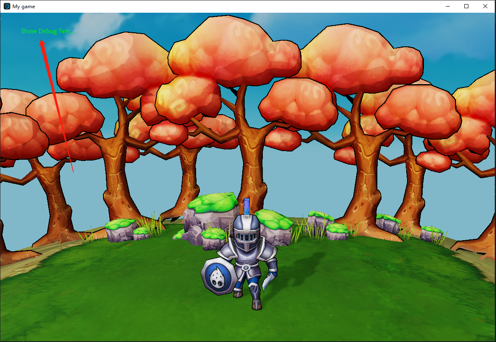
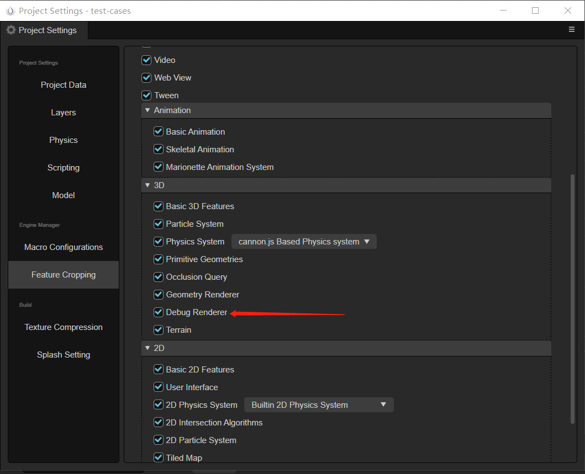

# 调试渲染器（Debug-Renderer）

调试渲染器是引擎提供的一种批量渲染屏幕文字的功能接口，主要用于调试，输出任意的文字调试信息到屏幕上。目前仅支持原生平台。

其效果图如下所示：



## 使用方式

1，确保在项目设置面板中，调试渲染器处于勾选状态


2，由于每帧渲染完这些文字后会清空顶点缓存，所以需要在 ``update`` 等函数中，每帧添加调试文本，示例 `TS` 代码如下：

```TS
import { native, Vec2 } from 'cc';
import { NATIVE } from 'cc/env';

if (NATIVE) {
    native.DebugRenderer.getInstance().addText("Stanley", new Vec2(100, 100));
}
```

## C++接口描述

```cpp
void addText(const ccstd::string &text, const Vec2 &screenPos, const DebugTextInfo &info = DebugTextInfo());
```

其参数描述如下：

- text：要输出的文字
- screenPos：文字展示的位置
- info：定义字体的样式

DebugTextInfo 可以定制输出文字的外观，其参数描述如下：

| 属性 | 说明 |
| :-- | :-- |
| color             | 文字颜色 |
| bold              | 是否粗体 |
| italic            | 是否斜体 |
| shadow            | 是否开启阴影效果 |
| shadowThickness   | 阴影宽度 |
| shadowColor       | 阴影颜色 |
| scale             | 文字缩放比例 |
