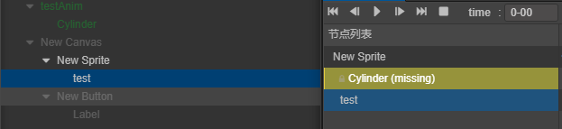
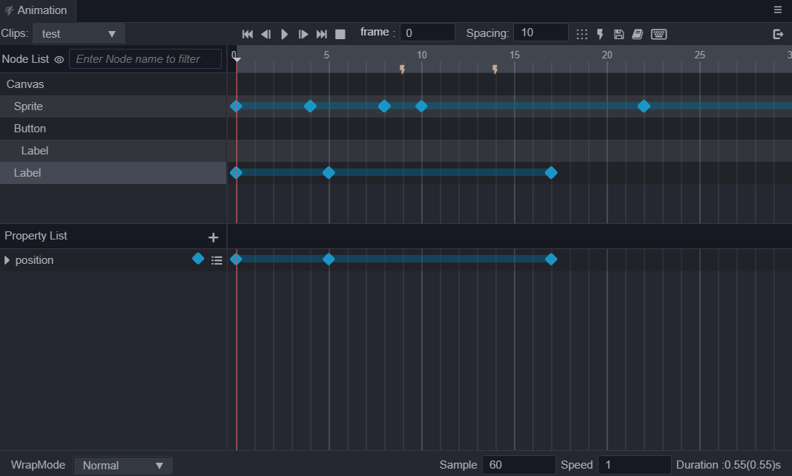
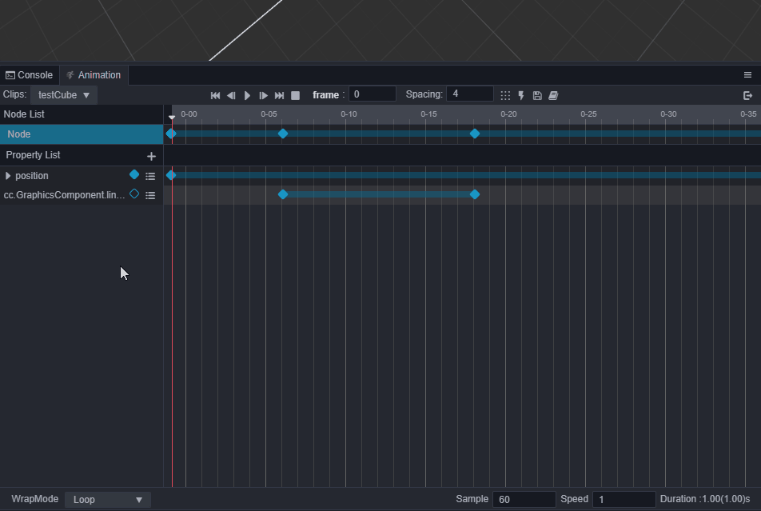
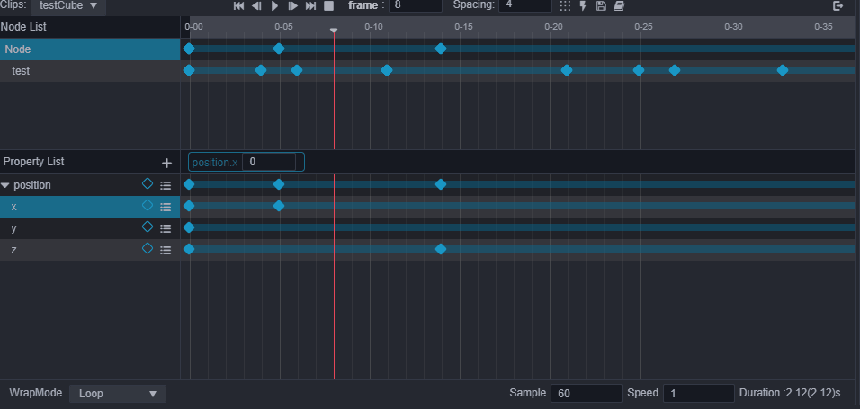

# 编辑动画序列

在节点上挂载了动画剪辑后，点击 **进入动画编辑模式** 就可以进入动画编辑模式了，之后便可以在动画剪辑中创建一些动画帧数据。

首先需要了解一下动画属性，动画属性包括了节点自有的 `position`、`rotation` 等属性，也包含了组件 Component 中自定义的属性。
组件包含的属性前会加上组件的名字，比如 `Sprite.spriteFrame`。属性轨道上对应的蓝色棱形就是关键帧。

Animation（动画） 组件可以以动画方式驱动所在节点和子节点上的节点和组件属性，包括用户自定义脚本中的属性。根据这个特性，可以灵活实现各种动画需求。具体的动画实现依不同的动画需求，步骤不同，案例可以参考官方的 [example-3d](https://github.com/cocos-creator/example-3d)。这里主要介绍一些常见的编辑操作方法，便于快速的编辑实现效果

## 修改 clip 常见属性

**sample**：定义当前动画数据每秒的帧率，默认为 60，这个参数会影响时间轴上每两个整数秒刻度之间的帧数量（也就是两秒之内有多少格）。

**speed**：当前动画的播放速度，默认为 1。

**duration**：当动画播放速度为 1 的时候，动画的持续时间。

**real time**：动画从开始播放到结束，真正持续的时间，对应编辑器右下角括号内的数字。

**wrap mode**：循环模式，具体配置效果请参见 [循环模式](../../engine/animation/animation-clip.md#循环模式)。

在编辑器面板上的对应控件修改对应属性后，焦点离开后即生效。

更多关于动画序列的设计部分以及脚本编写动画的内容，可以参见 [动画剪辑](../../engine/animation/animation-clip.md)。

## 节点数据常见操作

动画剪辑通过节点的名字定义数据的位置，本身忽略了根节点，其余的子节点通过与根节点的 **相对路径** 索引找到对应的数据。

### 清空节点数据

在动画编辑器的节点项位置右键，选择 **清空数据**，在弹窗提示后选择 **清除** 即可

### 迁移节点数据

有时候我们会在制作完成动画后，将节点重命名，这样会造成动画数据所以出现问题，如下图：

这时候我们可以在丢失节点上右键点击 **迁移数据**，之后再去点击其他节点，将数据迁移上去。如果点击迁移数据后不想迁移了，直接在时间轴区域点击或者是在点击其他节点后的弹窗点击取消即可。

> 注意：节点数据迁移默认将会覆盖原节点上的数据

### 复制 / 粘贴节点数据

在动画编辑器的节点项位置右键，选择 **复制节点数据**，在需要粘贴的节点项处右键选择 **粘贴节点数据** 即可。该复制粘贴支持快捷键、以及跨编辑器的数据粘贴。

**注意：**

- 在使用 **快捷键复制粘贴节点数据** 时，请 **确保当前未选择任何属性轨道或者关键帧**，因为当存在选中的属性轨道或关键帧时将会优先复制该动画数据。

- 粘贴目标节点如果不存在复制动画数据内的属性轨道时并不会自动创建，请先预先创建好需要的组件。

## 属性轨道数据常见操作

一个动画剪辑内可能包含了多个节点，每个节点上挂载多个动画属性，每个属性内的数据才是实际的关键帧，属性内的关键帧操作上面已经提到过了。这边主要介绍一些针对整个属性轨道的操作：

### 添加属性轨道

点击属性列表旁边的 **+** 小按钮，弹出可添加的属性菜单后，点击需要添加的属性即可

### 移除属性轨道

右键点击属性列表项，选择移除属性轨道，或者选中当前属性轨道按下 **Delete** 或者 **Cmd + Backspace** 快捷键移除。

### 清空轨道数据

右键点击属性列表项，选择清空属性轨道

### 复制、粘贴轨道数据

右键点击属性列表项，选择复制轨道数据或者按下 Ctrl + C，之后点击与该复制轨道同类型的轨道，右键点击将会看到粘贴选项，点击或者按下 Ctrl + V 即可粘贴；

> 注意：轨道动画数据的复制粘贴仅支持同类型数据，这里的类型指的是 ccType 类型。

## 关键帧常见操作

在动画的制作过程中，经常会有一些对关键帧的操作处理，这里集合了动画编辑器的各种对关键帧处理的方法，了解这些方法技巧能更快编辑动画剪辑。

### 选中关键帧

点击我们创建的关键帧后，关键帧会呈现选中状态，此时关键帧由蓝变白，目前有以下方式可以选中：

- 右键点击关键帧即可选中，按下 Ctrl 再右击可多选
- 直接在关键帧区域拖动框选关键帧
- 在 **选中属性轨道** 后，按下 Ctrl / Cmd + A 可以全选轨道关键帧

### 添加关键帧

- 在对应的属性轨道位置上右键，选择 **添加关键帧** 即可，右键菜单上同时也会出现当前添加关键帧帧数

    

- **选中对应节点和对应的属性**，移动时间控制线到需要添加关键帧的位置，按下 I（inset）键

    

- 移动时间控制线到需要添加关键帧的位置，在对应的属性列表项里，点击 即可

    

- 选中对应节点和对应属性轨道后，动画编辑器的中部将会出现对应属性的编辑器控件，修改即可打上关键帧
    

- 添加属性轨道后，直接在属性检查器的对应位置修改属性或者进行场景操作即可自动生成关键帧

### 移除关键帧

- **选中** 需要删除的关键帧，按下 delete / Cmd + backspace 键
- 在需要删除的关键帧位置 **右键点击**，弹出菜单后，选中 `移除关键帧`
- 拖动时间控制线到需要移除关键帧的位置或者直接 **双击** 关键帧后，在对应的属性列表项里，点击  即可。

  

### 修改关键帧数据

在时间轴上 **双击** 需要修改的关键帧，时间控制线将会移动到该位置或者直接拖动时间控制线到对应位置，直接在 **属性检查器** 内修改相对应的属性即可（确保动画编辑器处于编辑状态）。例如属性列表中有 position、x、y 三个属性轨道，选中关键帧之后，则可以修改 **属性检查器** 中的 position、x、y 属性。

在动画编辑模式下，将时间控制线移动到时间轴上没有关键帧的位置，然后在属性检查器中修改相对应的属性，也会自动插入一帧。

### 移动关键帧

选中关键帧后，在选中的关键帧上按住右键不放进行拖动，松开鼠标即移动完成。单选关键帧在移动过程中会在关键帧下方出现白色小方框，里面有移动距离和最终位置帧数的信息提示。多选关键帧则会在首尾的辅助线旁，分别有首尾关键帧的移动后的位置信息提示。

### 缩放关键帧

在选中多个关键帧后，会显示出左右两个控制辅助杆，拖动任意一个控制杆移动即可进行关键帧的整体缩放

### 间隔排列关键帧

选中多个关键帧后，调整好间隔关键帧数，按下间隔排列关键帧按钮后，选中的关键帧将会按照设置的间隔数依次排列好各个关键帧。

### 复制/粘贴关键帧

- A 选中关键帧后，按照常规快捷键 C / V 即可进行复制粘贴，注意快捷键粘贴的位置将会以当前关键帧（小红线位置）为起点
- B 选中关键帧后，在选中的关键帧上右键，选择 `复制关键帧`，之后选择其他位置右键，选择 `粘贴关键帧` 即可

目前关键帧数据的复制粘贴，支持跨节点、跨 clip 使用

> **注意**：A、B 两种粘贴有区别，使用快捷键粘贴关键帧数据时将会按照复制的轨道数据顺序一一粘贴过去，而在目标的属性轨道上右键选择粘贴则会只会有目标属性轨道上会被粘贴上复制数据。分量轨道作为单独的轨道也将遵循这个规则，例如在主轨道上复制了数据后，在目标分量轨道上粘贴只有目标分量轨道才会被添加上数据。请务必根据实际需要粘贴的位置来复制对应数据，以免产生预期之外的结果。目前的粘贴规则如果有异议，还请在论坛上告知我们。

