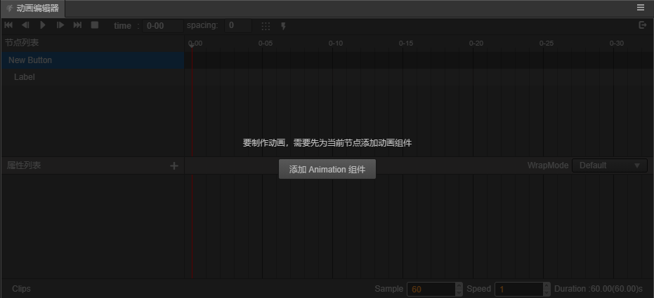
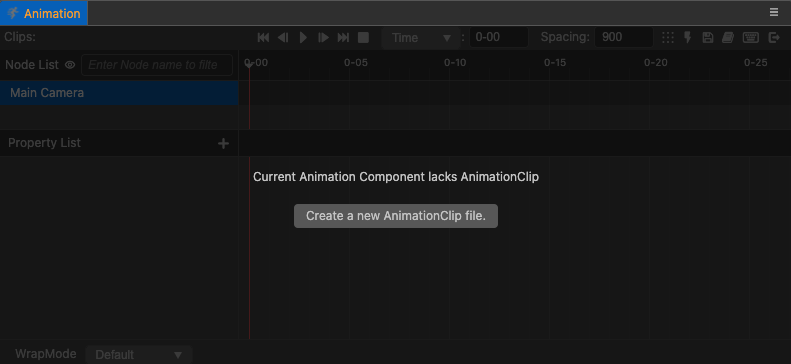

# 创建 Animation 组件和动画剪辑

## 创建 Animation 组件

在每个节点上，我们都可以添加不同的组件。如果我们想在这个节点上创建动画，也必须为它新建一个 Animation 组件。
创建的方法有两种：

- 选中相应的节点，在属性检查器中点击下方的 **添加组件**，在 Components 中选择 Animation。
- 打开 **动画编辑器**，然后在 **层级管理器** 中选中需要添加动画的节点，在 **动画编辑器** 中点击 **添加 Animation 组件** 按钮。

  

具体 Animation 组件的参数使用可以参考 [Animation 组件](./../../engine/animation/animation-component.md)。

## 创建与挂载动画剪辑

现在节点上已经有了 Animation 组件了，但是还没有相应的动画剪辑数据，创建动画剪辑有以下两种方式：

- 在资源管理器中点击左上方的 **+**，或者右键空白区域，选择 Animation Clip，这时候会在管理器中创建一个名为 'New AnimationClip' 的剪辑文件。 
  单单创建还是不够的，需要再次在层级管理器中点选刚刚的节点，在 **属性检查器** 中找到 Animation，这时候的 Clips 显示的是 0，将它改成 1。 
  然后将刚刚在资源管理器中创建的'New AnimationClip'，拖入刚刚出现的 **animation-clip 选择框** 内。
- 在 **动画编辑器** 中直接点击 **新建 AnimationClip** 按钮，根据弹出的窗口创建一个新的动画剪辑文件，新建完的动画剪辑会自动添加到动画组件上。
  > **注意**：如果选择覆盖已有的剪辑文件，被覆盖的文件内容会被清空。

  

至此我们已经完成了动画制作之前的准备工作，下一步就是要 [编辑动画序列](animation-clip.md) 了。
