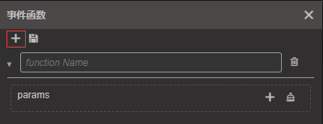

# 动画事件

在游戏中，经常需要在动画结束或者某一帧的特定时刻，执行一些函数方法。这时候就可以通过添加动画事件来实现，在某个关键帧上添加事件函数后，动画系统将会在动画执行到该关键帧时，去匹配动画根节点身上的对应函数方法并执行它们。在脚本内添加帧事件的相关处理，以及更多内容请参考 [帧事件](./../../engine/animation/animation-component.md#帧事件)。

## 添加事件帧

首先将时间控制线移动到需要添加事件的位置，然后点击工具栏区域的按钮，这时候在对应的时间轴上会出现一个一样的金色图标，这就是我们添加的事件。

## 删除事件帧

在添加的时间帧位置，右键点击，选择删除即可，在此处的删除将会删除该时间位置所有的时间帧函数。

## 添加事件帧函数
在事件函数编辑器的左上方点击 `+` 按钮，即可添加新的事件帧函数

## 删除时间帧函数
需要单独删除对应时间位置的某个帧函数，可以在事件函数编辑器中，点击函数名旁边的删除按钮。

## 编辑指定事件触发函数

双击刚添加的事件帧，可以打开事件编辑器，在编辑器内，我们可以手动输入需要触发的 function 名字，触发的时候会根据这个函数名，去动画根节点的各个组件内匹配相应的方法。

如果需要添加传入的参数，则在 Params 旁点击 `+` 或者 `-`，目前只支持 Boolean、String、Number 三种类型的参数。

出现修改后，事件函数编辑器的标题旁会出现红色的星号，事件函数的修改是需要手动保存的，修改后点击上方的保存按钮即可保存。如果没有保存，在关闭事件编辑器也会有提示保存的弹框。

