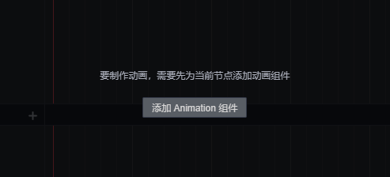

# 关于Animation

在制作动画之前首先需要先为节点添加动画组件，并为组件挂载 clip 文件后才能编辑。在此之前，有必要先了解一下 clip 动画剪辑和 Animation 组件的相关概念。

## Animation 组件

之前我们了解到 Cocos Creator 3.0 是组件式的结构，那么 Animation 也不例外，它也是节点上的一个组件，只有为节点添加动画组件后，才能赋予节点参与到动画的的能力。因而点击相关节点后，如果节点没有动画组件，**动画编辑器** 的界面上将会显示 **添加 Animation 组件** 按钮，点击即可添加。

动画组件接口请参考 [MeshRenderer API](https://docs.cocos.com/creator3d/api/zh/classes/animation.animation-1.html)。

## Clip 动画剪辑

动画剪辑就是一份动画的声明数据，我们将它挂载到 Animation 组件上，就能够将这份动画数据应用到节点上，一个动画组件可以挂载多份动画剪辑。在没有 clip 的节点上是不能够编辑动画的，点击相关节点后，如果节点只有 Animation 组件却没有 clip 文件，**动画编辑器** 将会显示 **创建 clip 文件** 按钮，点击即可创建并赋给组件。在动画编辑模式下亦可以通过 **动画编辑器** 左下角的 clip 选项来切换编辑不同的动画剪辑。

## 动画编辑模式

动画在普通模式下是不允许编辑的，只有在动画编辑模式下才可以编辑动画文件。但是在动画编辑模式下，无法对节点进行添加/删除/重命名操作。

打开编辑模式有以下两种方式：

- 选中一个包含 Animation 组件，并且包含一个以上 clip 文件的节点，然后在 **动画编辑器** 中点击 **进入动画编辑模式** 按钮。
- 快捷键 Ctrl/Cmd + E

退出编辑模式有以下三种方式：

- 点击 **动画编辑器** 右上角的 **退出** 按钮
- 点击 **场景编辑器** 左上角的 **关闭** 按钮
- 快捷键 Ctrl/Cmd + E

更多内容请参考 Animation 的 [系统设计](./../../engine/animation/index.md) 和 [脚本控制](./../../engine/animation/animation-component.md) 文档。
