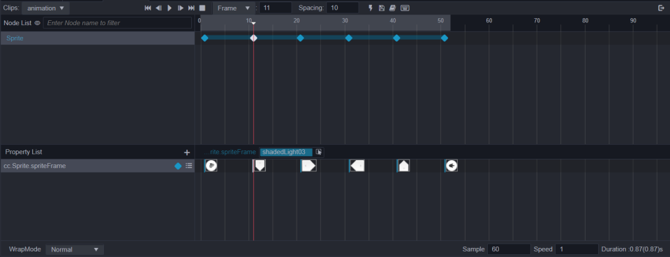

# 制作帧动画

我们刚刚了解了属性帧的操作，现在来看看具体怎么创建一个帧动画。

## 为节点新增 Sprite 组件

首先我们需要让节点能正常显示纹理，所以需要为节点增加Sprite组件。
选中节点后在属性检查器中通过 **添加组件** 按钮，选择 `UI -> Render -> Sprite`。

## 在属性列表中添加 Sprite.spriteFrame

节点可以正常显示纹理后，还需要为纹理创建一个属性轨道。
在动画编辑器属性列表旁点击 `+`，然后选择 `Sprite -> spriteFrame`

## 添加帧

从资源管理器中，将纹理拖拽到属性帧区域，放在 `Sprite.spriteFrame` 轨道上。
再将下一帧需要显示的纹理拖到指定位置，然后点击播放就可以预览刚刚创建的动画了。

如果同时拖拽多个纹理到属性轨道上，轨道上将按钮纹理选中的顺序，将其按照顺序，以工具栏上显示间隔数来排列生成关键帧。

## 排列修改关键帧间隔

帧动画的间隔帧数通常是固定的，有时添加了多个张纹理后，想要调整间隔数，就可以先在工具栏上方填写想要的间隔帧数，之后选中需要排列的关键帧，点击工具栏上的排列按钮或者在选中的关键帧上右击，选择 `排列选中的关键帧` 即可。
