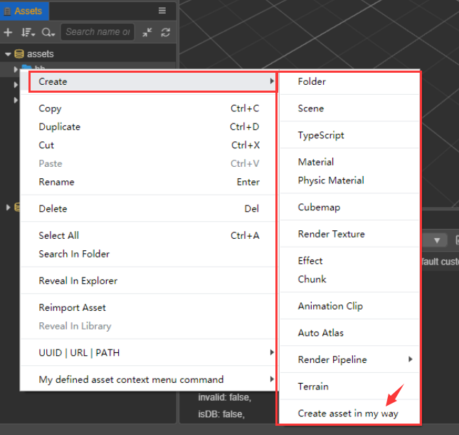

# 扩展资源管理器面板

## 扩展右击菜单

右击菜单的显示机制，是在显示之前获取实时的菜单数据。插件预先在自己的 `package.json` 中注册 `assets` 模块，就能获取 **资源管理器** 面板的右击菜单显示事件，并通过事件返回要显示的菜单数据，然后再统一显示出来。注册完成的菜单一般显示在现有菜单的后面。

假设 **资源管理器** 面板的某个位置 (`where`) 有右击菜单事件，目前支持扩展的位置 (`where`) 有：

- `createMenu` -- 创建资源的两个入口: 一是面板左上角的 **+** 按钮；二是右击菜单中的 **新建** 选项。
- `dbMenu` -- 资源数据库根节点
- `assetMenu` -- 资源普通节点
- `panelMenu` -- 面板空白区域

具体实现步骤：

- 在编辑器顶部的菜单栏中选择 **扩展 -> 创建扩展**，根据需要在 **全局/项目** 目录下新建一个插件。插件包就会生成在根目录/项目目录的 `extensions` 目录下。
- 打开插件包的 `package.json` 文件，然后配置 `contributions.assets.menu` 属性，其中 `methods` 引入 `assets-menu.js` 文件。其他属性如 `createMenu` 为上述 `where` 的显式声明，对应的 `onCreateMenu` 是 `assets-menu.js` export 出来的方法:

  ```json5
  // package.json
  {
    "contributions": {
      "assets": {
        "menu": {
          "methods": "./assets-menu.js", // 下面 Demo 示例中有这个文件
          "createMenu": "onCreateMenu",
          "assetMenu": "onAssetMenu",
          "dbMenu": "onDBMenu",
          "panelMenu": "onPanelMenu",
        },
      },
    },
  }
  ```

- 文末的 **Demo 示例** 中 `assets-menu.js` 部分代码示例如下：

  Javascript

  ```javascript
  // assets-menu.js
  exports.onCreateMenu = function (assetInfo) {
    return [
      {
        label: 'i18n:extend-assets-demo.menu.createAsset',
        click() {
          if (!assetInfo) {
            console.log('get create command from header menu');
          } else {
            console.log('get create command, the detail of diretory asset is:');
            console.log(assetInfo);
          }
        },
      },
    ];
  };

  exports.onAssetMenu = function (assetInfo) {
    return [
      {
        label: 'i18n:extend-assets-demo.menu.assetCommandParent',
        submenu: [
          {
            label: 'i18n:extend-assets-demo.menu.assetCommand1',
            enabled: assetInfo.isDirectory,
            click() {
              console.log('get it');
              console.log(assetInfo);
            },
          },
          {
            label: 'i18n:extend-assets-demo.menu.assetCommand2',
            enabled: !assetInfo.isDirectory,
            click() {
              console.log('yes, you clicked');
              console.log(assetInfo);
            },
          },
        ],
      },
    ];
  };
  ```

  Typescript

  ```typescript
  // assets-menu.js
  export function onCreateMenu(assetInfo: any) {
    return [
      {
        label: 'i18n:extend-assets-demo.menu.createAsset',
        click() {
          if (!assetInfo) {
            console.log('get create command from header menu');
          } else {
            console.log('get create command, the detail of diretory asset is:');
            console.log(assetInfo);
          }
        },
      },
    ];
  };

  export function onAssetMenu(assetInfo: any) {
    return [
      {
        label: 'i18n:extend-assets-demo.menu.assetCommandParent',
        submenu: [
          {
            label: 'i18n:extend-assets-demo.menu.assetCommand1',
            enabled: assetInfo.isDirectory,
            click() {
              console.log('get it');
              console.log(assetInfo);
            },
          },
          {
            label: 'i18n:extend-assets-demo.menu.assetCommand2',
            enabled: !assetInfo.isDirectory,
            click() {
              console.log('yes, you clicked');
              console.log(assetInfo);
            },
          },
        ],
      },
    ];
  };
  ```

- `assets-menu.js` 中 `onCreateMenu(assetInfo)` 函数及同类函数说明：

  - 参数 `assetInfo` Object

    - `displayName` String - 资源用于显示的名字
    - `extends` (可选) String[] - 继承类
    - `importer` String - 导入器名字
    - `isDirectory` Boolean - 是否是文件夹
    - `instantiation` (可选) String - 虚拟资源可以实例化成实体的话，会带上这个扩展名
    - `imported` Boolean - 是否导入完成
    - `invalid` Boolean - 是否导入失败
    - `name` String - 资源名字
    - `file` String - 资源文件所在的磁盘绝对路径
    - `redirect` Object - 跳转指向资源
      - `type` String - 资源类型
      - `uuid` String - 资源 ID
    - `readonly` Boolean - 是否只读
    - `type` String - 资源类型
    - `url` String - db:// 开头的资源地址
    - `uuid` String - 资源 ID

  - 返回值 `MenuItem[]`, `MenuItem` Object

    - `type` (可选) String - 可选，normal、separator、submenu、checkbox 或 radio
    - `label` (可选) String - 显示的文本
    - `sublabel` (可选) String - 显示的二级文本
    - `submenu` (可选) MenuItem[] - 子项菜单
    - `click` (可选) Function - 点击事件
    - `enable` (可选) Boolean - 是否可用，不可用会有置灰样式
    - `visible` (可选) Boolean - 是否显示
    - `accelerator` (可选) String - 显示快捷键
    - `checked` (可选) Boolean - 当 type 为 `checkbox` / `radio` 时是否选中

    更多属性可参考 [electron menu-item](https://www.electronjs.org/docs/api/menu-item) 的数据格式。

实现扩展的效果图如下：



## 扩展拖入识别

识别一个可被接受的类型，需要编辑器 UI 组件 `<ui-drag-item>` 的支持，其中一个重要的属性是 `type`, `<ui-drag-item type="xxx">`。自定义一个拖入类型，并注入到 **资源管理器** 面板的识别范围内，后续在编辑器其他面板将含有该自定义类型的 `<ui-drag-item>` 元素拖入 **资源管理器** 面板时，**资源管理器** 面板便能识别到它，并给自定义类型的注册方（插件）发送消息，注册方便能执行一个自定义的动作，比如执行新建一组资源。

具体实现步骤，大致跟上述的 **扩展右击菜单** 一样，打开插件的 `package.json` 文件做对应的配置。

```json5
// package.json
{
  "contributions": {
    "assets": {
      "drop": [
        {
          "type": "my-defined-asset-type-for-drop", // 对应 Demo 示例中 panel.html 的用法
          "message": "drop-asset",
        },
      ],
      "menu": "./assets-menu.js",
    },
  },
  "messages": {
    "drop-asset": {
      "methods": ["default.dropAsset"], // 'default' 是指当前插件的默认面板
    },
  },
}
```

- 文末的 **Demo 示例** 中 `panel.js` 文件：

  Javascript
  
  ```javascript
  exports.methods = {
    dropAsset(assetInfo, dragInfo) {
      console.log(Editor.I18n.t('extend-assets-demo.drop.callback'));
      console.log(assetInfo);
      console.log(dragInfo);
    },
  };
  ```

  Typescript

  ```typescripscript
  export const methods = {
    dropAsset(assetInfo: any, dragInfo: any) {
      console.log(Editor.I18n.t('extend-assets-demo.drop.callback'));
      console.log(assetInfo);
      console.log(dragInfo);
    },
  };
  ```

  `assetInfo` 参数说明：

    - `uuid` String - 拖拽资源时，鼠标释放位置的资源 uuid
    - `type` String - 该资源的类型
    - `isDirectory` Boolean - 该资源是否是文件夹

- 文末的 **Demo 示例** 中 `panel.html` 文件：

  ```html
  <ui-drag-item
    type="my-defined-asset-type-for-drop"
    additional='{"value":"this additional is dragInfo data."}'
  >
    <ui-label>Drag me to assets panel, and look conosole log.</ui-label>
  </ui-drag-item>
  ```

## Demo 示例

两个扩展功能的可执行代码可下载 <a href="img/extend-assets-demo.zip" target="_blank">范例</a> 查看
