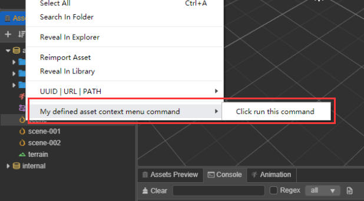

# 资源管理器

**资源管理器** 面板是用来访问和管理项目资源的重要工具。<br>
在开始制作游戏时，**导入资源** 通常是必须的步骤。您可以在新建项目时使用模板项目，新建步骤完成后会自动打开项目。默认布局中包含了 **资源管理器** 面板，里面有两个资源库，简称 DB，包括 **assets** 和 **internal**，**internal** 属于默认的内置资源，内置资源可以复制出来，但不能直接修改。

面板操作预览：


## 面板介绍

**资源管理器** 面板主要可以分为 **头部菜单区** 和 **树形列表区** 两部分内容：

- **头部菜单区** 的功能包括 **新建资源**、**排序方式**、**搜索过滤**、**搜索框**、**全部折叠或展开**、**刷新列表** 等。

- **树形列表区** 主要体现资源之间的关系，根节点 `assets` 类似操作系统里的文件管理器，在编辑器中称之为一个 DB。
  - `assets`：项目资源，新项目中默认为空；
  - `internal`：内置资源，属于只读资源，不可进行增删改操作，但可以作为资源模板，复制粘贴到 Assets DB 上，即新建了一个项目资源。
  - 面板和节点都有右击菜单事件，是重要的操作功能，灰色则为不可用菜单。

- 面板目前支持操作资源的快捷方式：
  - 复制：Ctrl 或者 Cmd + C
  - 粘贴：Ctrl 或者 Cmd + V
  - 克隆：Ctrl 或者 Cmd + D，Ctrl + 拖动资源
  - 删除：Delete
  - 上下选择：上下箭头
  - 文件夹的折叠：左箭头
  - 文件夹的展开：右箭头
  - 多选：Ctrl 或者 Cmd + 点击
  - 全选：Ctrl 或者 Cmd + A
  - 多选：Shift + 点击
  - 重命名：Enter/F2
  - 取消输入：Esc

### 新建资源

新建资源有两种方式，一种是点击 **资源管理器** 左上方的 **+** 号按钮。另一种是在 **资源管理器** 面板中点击鼠标右键，然后选择 **创建**。


文件夹内新增资源，会先出现一个 **输入框** 要求填入新资源的名称，名称不能为空。

### 打开资源

- 双击资源可打开该资源，比如 scene、script、image
- 双击文件夹则折叠或展开文件夹，切换子集资源的显示状态。

### 选中资源

选中资源包括以下几种方式：

- 单击可单选资源
- 键盘上下箭头可以上下切换选中资源
- 键盘左右箭头可以展开或折叠父级类型的资源，如文件夹
- 按住 Ctrl/Cmd，然后选择资源，可以多选资源
- 按住 Shift，然后选择资源，可以多选资源

右击菜单中的 **在文件夹内全选** 或快捷键 **Ctrl + A** 可实现在文件夹内全部子资源的选中，多次全选操作会逐层往上全选。

### 移动资源

通过拖动来实现资源的移动：

- 移动资源，资源从树形列表中的一个文件夹里拖拽到另一个文件夹，此时会出现一个目标文件夹范围的框，表示放置的位置。
- 拖拽资源到 **场景编辑器** 或 **层级管理器** 面板可生成节点，目前支持拖拽 `cc.Prefab`、`cc.Mesh`、`cc.SpriteFrame` 资源。
- 从 **系统的文件管理器** 拖拽文件到 **资源管理器** 列表中，即可导入资源。
- 从 **层级管理器** 面板拖拽节点到 **资源管理器** 面板的某个文件夹中，可将节点保存为为一个 `cc.Prefab` 资源，详见 [预制资源（Prefab）](../../asset/prefab.md)。


### 删除资源

选中要删除的资源，然后点击右键并选择 **删除**，或者使用快捷键 **Delete**，支持多选资源批量删除。资源删除后保留在 **系统的回收站** 里，必要时可将其还原。

### 折叠资源

折叠分为单一折叠或含子集的全部折叠：

- **头部菜单** 中的 **全部折叠/展开** 按钮作用于全局；
- 单击一个父级资源如文件夹的三角图标，可以展开或折叠它的子集；
- 使用快捷键 **Alt + 点击三角图标** 可全部展开或折叠子资源；
- 记录当前的折叠状态，下次打开编辑器时会保持当前的折叠状态。

### 排序资源

- 头部菜单中的 **排序方式** 按钮有 2 种排序方式：**按名称排序** 和 **按类型排序**；
- 记录当前的排序方式，下次打开编辑器时会保持当前的排序方式。

### 搜索资源

搜索功能是一种组合功能，可限定搜索类型，且指定搜索字段。

- **限定搜索类型**，可多选。类型为资源类型 assetType，不是后缀名称或 importer 名称。

  

- 指定搜索字段有 3 种方式：**搜索名称或 UUID**、**搜索 UUID**、**搜索 URL**。名称不区分大小写。其中 **UUID** 和 **URL** 可从右击菜单最后一项中输出数据。

  

- 在搜索结果列表中选中资源，双击资源等同于在正常模式下的操作。清空搜索，视窗会重新定位到选中的资源。

- 右击菜单中的 **在文件夹中查找** 可缩小搜索范围。

### 重命名资源

选中需要重命名的资源，使用快捷键 **F2** 或者 **Enter**，即可进入名称修改。
- 快捷键 **Esc** 用于取消重命名
- 此外 TypeScript 脚本资源的初始名称会处理为它的 `className`，而 `className` 是不能重复的。

### 在文件管理器中显示

右击菜单中的 **在文件管理器中显示** 即可定位资源所在的系统目录。

### 重新导入资源

右击菜单中的 **重新导入资源** 即可更新资源到项目的 `./library` 文件夹，支持多选批量导入。

### 大图预览

在 **资源管理器** 中选中文件夹，文件夹中的大图子资源便会按类型排列显示在 **资源预览** 面板中，对于图片资源会较为直观。


## 扩展 Assets 面板菜单

目前支持的扩展包括 **拖入识别** 和 **右击菜单**。

注入扩展的主要流程为：

- 新建一个插件
- 插件 package.json 

```json
{
  "name": "extend-assets-menu",
  "contributions": {
    "assets": {
      "drop": [
        {
          "type": "my-defined-asset-type-for-drop",
          "message": "drop-asset"
        }
      ],
      "menu": [
        {
          "path": "create",
          "label": "i18n:extend-assets-menu.menu.createAsset",
          "message": "create-asset"
        },
        {
          "path": "asset",
          "label": "i18n:extend-assets-menu.menu.assetCommand",
          "submenu": [
            {
              "label": "extend-assets-menu.menu.runCommand",
              "message": "asset-command"
            }
          ]
        }
      ]
    },
  }
}
```

``` html
<ui-drag-item type="my-defined-asset-type-for-drop" additional='[{"type":"my-defined-asset-type-for-drop","value":"xxx"}]'>
    <ui-label>拖动到 assets 面板，有值</ui-label>
</ui-drag-item>

<ui-drag-item type="my-defined-asset-type-for-drop" >
    <ui-label>拖动到 assets 面板，无值</ui-label>
</ui-drag-item>
```

```typescript
/**
 * 拖入识别
 * message ipc 返回参数 info: DropCallbackInfo
 */
interface DropItem {
  type: string;
  message: string;
}
export const Drop: DropItem[] = [];

export interface DropCallbackInfo {
    type: string; // 拖什么类型过去
    values?: IDragAdditional[]; // 可能是拖了多选值
    to: string; // 到哪个资源 uuid 上
}

export interface IDragAdditional {
    type: string; // 资源类型
    value: string; // 资源 uuid
    name?: string; // 资源名称
}
```

```typescript
/**
 * 扩展右击菜单使用 Eelectron MenuItem
 * https://www.electronjs.org/docs/api/menu-item
 * 
 * path 扩展的区域可选值：
    "create" 位置：创建资源
    "asset" 位置：普通资源的右击菜单

    以下尚不支持
    "db" 位置：DB 资源 (根节点) 的右击菜单
    "panel" 位置：面板空白区域的右击菜单
    "sort" 位置：面板头部排序按钮的菜单
    "search" 位置：面板头部搜索按钮的菜单

  * message ipc 返回参数 info: MenuCallbackInfo
  */

  interface Menu extends MenuItem {
    label: string; // 显示的文字
    path: string; // 添加的位置
    message: string; // Message
}
export const Menu: Menu;

export interface MenuCallbackInfo {
    type: string;
    uuid: string;
}
```

细节太多，附上一个 demo 源码，<a href="img/extend-assets-menu.zip" target="_blank">点击下载 extend-assets-menu.zip</a>




