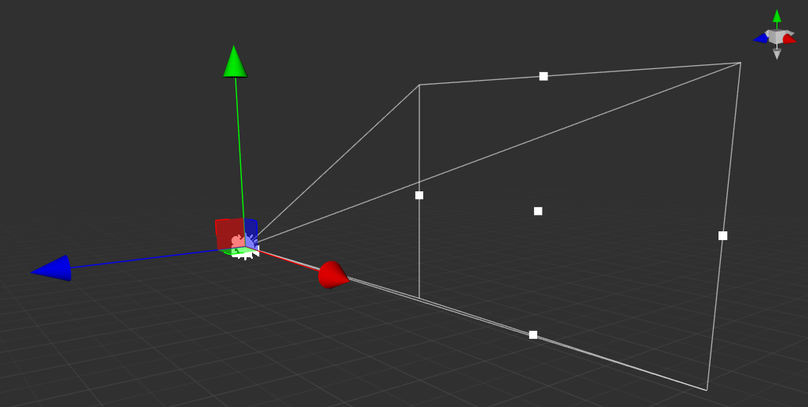
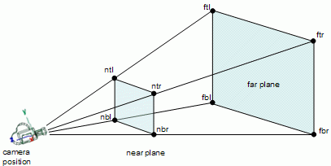
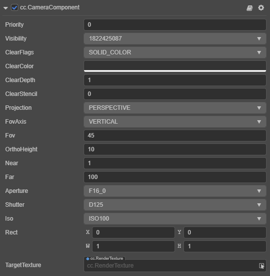
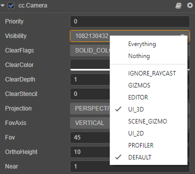
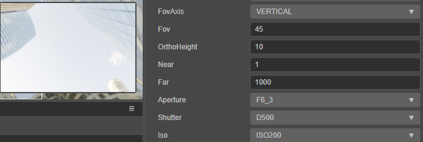
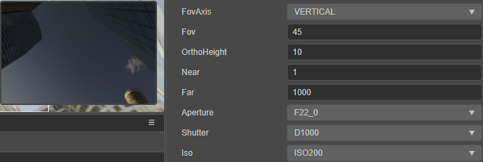

# 相机

游戏中的相机是用来捕捉场景画面的主要工具。我们通过调节相机相关参数来控制可视范围的大小，在 Cocos Creator 编辑器中相机呈如下表示：



相机的可视范围是通过 6 个平面组成一个 **视锥体（Frustum）** 构成，**近裁剪面（Near Plane）** 和 **远裁剪面（Far Plane）** 用于控制近处和远处的可视距离与范围，同时它们也构成了视口的大小。



相机组件接口请参考 [Camera API](__APIDOC__/zh/#/docs/3.4/zh/component-camera/Class/Camera)。

## 相机组件

相机组件是我们用来呈现场景画面的重要功能组件。



| 属性名称 | 说明 |
|:-------|:---|
| Priority | 相机的渲染优先级，值越小越优先渲染 |
| Visibility | 可见性掩码，声明在当前相机中可见的节点层级集合 |
| ClearFlags | 相机的缓冲清除标志位，指定帧缓冲的哪部分要每帧清除。包含：<br>DONT_CLEAR：不清空；<br>DEPTH_ONLY：只清空深度；<br> SOLID_COLOR：清空颜色、深度与模板缓冲；<br> SKYBOX：启用天空盒，只清空深度 |
| ClearColor | 指定清空颜色 |
| ClearDepth | 指定深度缓冲清空值 |
| ClearStencil | 指定模板缓冲清空值 |
| Projection | 相机投影模式。分为 **透视投影（PERSPECTIVE）** 和 **正交投影（ORTHO）** |
| FovAxis | 指定视角的固定轴向，在此轴上不会跟随屏幕长宽比例变化 |
| Fov | 相机的视角大小 |
| OrthoHeight | 正交模式下的视角 |
| Near | 相机的近裁剪距离，应在可接受范围内尽量取最大 |
| Far | 相机的远裁剪距离，应在可接受范围内尽量取最小 |
| Aperture | 相机光圈，影响相机的曝光参数 |
| Shutter | 相机快门，影响相机的曝光参数 |
| Iso | 相机感光度，影响相机的曝光参数 <br> **Aperture**，**Shutter** 和 **Iso** 属性请参考下方 **曝光量** 获取更多信息 |
| Rect | 相机最终渲染到屏幕上的视口位置和大小 |
| TargetTexture | 指定相机的渲染输出目标贴图，默认为空，直接渲染到屏幕 |

## 相机分组渲染

分组渲染功能是通过相机组件的 Visibility 属性配合节点的 [Layer 属性](../../concepts/scene/node-component.md#%E8%AE%BE%E7%BD%AE%E8%8A%82%E7%82%B9%E7%9A%84-layer-%E5%B1%9E%E6%80%A7) 共同决定的。用户可通过代码设置 Visibility 的值来完成分组渲染。所有节点默认都属于 DEFAULT 层，在所有相机都可见。

### 设置 Visibility 属性

Visibility 属性用于设置哪些层级（Layer）的节点应该被相机观察到，可同时选择多个 Layer。

> **注意**：从 Cocos Creator 3.0 开始，2D 元素（例如 Sprite）的渲染也遵从 Layer 与 Visibility 的判断，开发者可以根据需要自行调整 Layer 与 Visibility。

当开发者在 Visibility 属性中勾选了多个 Layer 时，Visibility 属性值便是通过将多个 Layer 的属性值执行 `|` 操作计算得出。

例如，下图中相机的 Visibility 属性同时勾选了 **UI_3D** 和 **DEFAULT** 这两个 Layer，通过 [查询 Layer 属性值](../../concepts/scene/layer.md) 可以知道 **UI_3D** 的属性值是 **1 << 23**，**DEFAULT** 的属性值是 **1 << 30**，那么 Visibility 属性值便是 **1 << 23 | 1 << 30  = 1820327937**。



关于 Layer 的实现详情，请参考 [层级](../../concepts/scene/layer.md) 文档。

### 相机的可见性计算

Visibility 属性可以同时选择多个 Layer，同时 Node 上的 Layer 也有自身的值，因此相机的 Visibility 属性是一个 2<sup>32</sup> 位的整数，每一种可见的 layer 占一位，采用位操作运算，最高支持 32 个不同的 Layer 标签（每一种 Layer 值占一位，即用 2<sup>32</sup> 表示）。在相机 culling 时，每个节点的 layer 值会跟相机进行 `&` 操作运算，如果相机的 Visibility 属性包含这个 Layer，那么当前节点就会被相机所看见，反之则看不见。

### 曝光量

**Aperture**, **Shutter**，**Iso** 这三个相机的物理参数会决定进光量，进而影响曝光量（Exposure Value）。仅在场景开启 HDR 的情况下生效。其算法通常为：

```math
ev = log_2(ApertureValue^2/ShutterValue*k/IsoValue)
```

其中 `ApertureValue`、`ShutterValue` 和 `IsoValue` 通过 **Aperture**, **Shutter**，**Iso** 这三个属性的枚举值查表得出。

下图演示了曝光量对场景的影响：





若要启用场景 HDR 可以参考：[切换 HDR/LDR 模式](../../concepts/scene/skybox.md#E5%88%87%E6%8D%A2-hdrldr-%E6%A8%A1%E5%BC%8F)。
