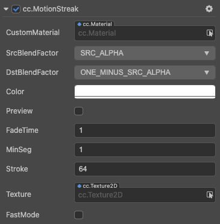
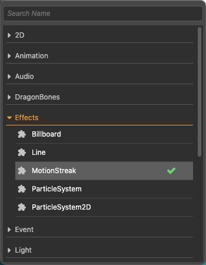

# MotionStreak（拖尾）组件参考

MotionStreak（拖尾）是运动轨迹，用于在游戏对象的运动轨迹上实现拖尾渐隐效果。

点击 **属性检查器** 下方的 **Add Component** 按钮，然后从 **Effects** 中选择 **MotionStreak**，即可添加 MotionStreak 组件到节点上。

拖尾的脚本接口请参考 [MotionStreak API](__APIDOC__/api/zh/classes/particle2d.motionstreak.html)。

## MotionStreak 属性

| 属性 |   功能说明
| -------------- | ----------- |
| CustomMaterial | 自定义材质。 |
| SrcBlendFactor | 源混合因子值。 |
| DstBlendFactor | 目标混合因子值。 |
| Color | 拖尾的颜色。 |
| Preview | 是否启用预览。 |
| FadeTime | 拖尾的渐隐时间，以秒为单位。|
| MinSeg   | 拖尾之间的最小距离。|
| Stroke   | 拖尾的宽度。|
| Texture  | 拖尾的贴图。|
| FastMode | 是否启用快速模式。当启用快速模式，新的点会被更快地添加，但精度较低。|
