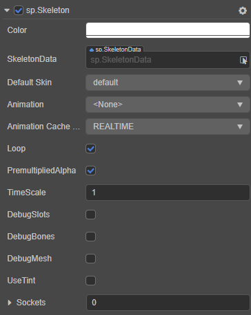
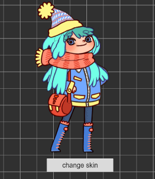
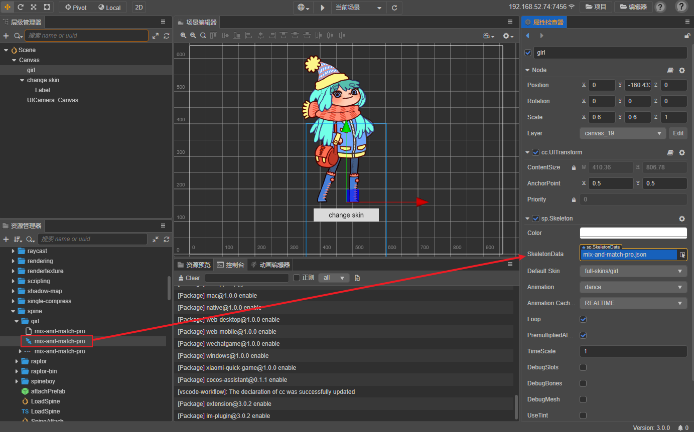
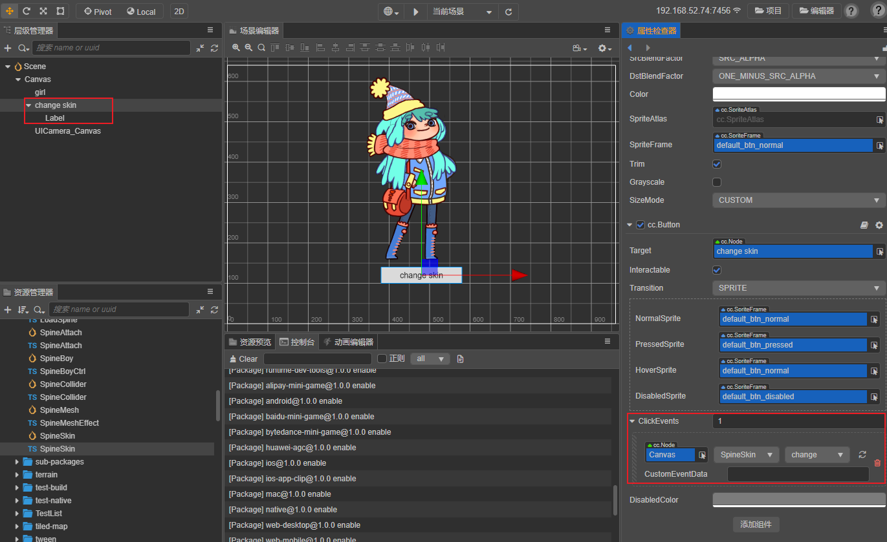
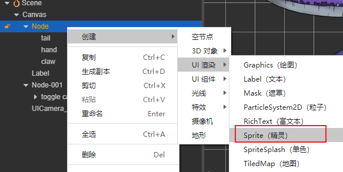
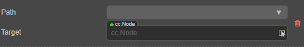
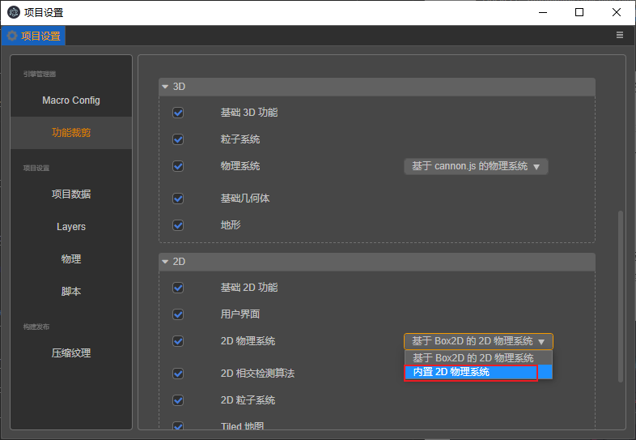
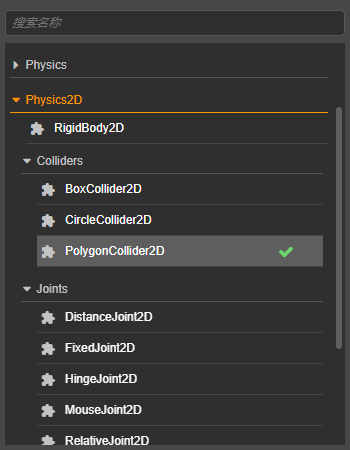
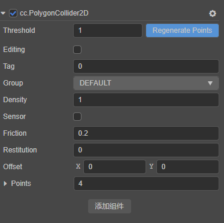

# Spine（骨骼动画）Skeleton 组件参考

Spine（骨骼动画）Skeleton 组件支持 Spine 官方工具导出的数据格式，并对 Spine（骨骼动画）资源进行渲染和播放。



选中节点，点击 **属性检查器** 下方的 **添加组件 -> 渲染组件 -> Spine Skeleton** 按钮，即可添加 Skeleton 组件到节点上。

Spine 的脚本接口请参考 [Skeleton API](__APIDOC__/zh/classes/Skeleton.html)。

## Spine 属性

| 属性 | 功能说明
| :-------------------- | :----------------- |
| CustomMaterial | 自定义材质，使用方法参考 [自定义材质](../../ui-system/components/engine/ui-material.md)
| Color                 | 颜色设置
| SkeletonData          | 骨骼信息数据，拖拽 Spine 导出后的骨骼资源到该属性中
| Default Skin          | 选择默认的皮肤
| Animation             | 当前播放的动画名称
| Animation Cache Mode  | 渲染模式，默认 `REALTIME` 模式。<br>1. **REALTIME** 模式，实时运算，支持 Spine 所有的功能。<br>2. **SHARED_CACHE** 模式，将骨骼动画及贴图数据进行缓存并共享，相当于预烘焙骨骼动画。拥有较高性能，但不支持动作融合、动作叠加，只支持动作开始和结束事件。至于内存方面，当创建 N(N>=3) 个相同骨骼、相同动作的动画时，会呈现内存优势。N 值越大，优势越明显。综上 `SHARED_CACHE` 模式适用于场景动画，特效，副本怪物，NPC 等，能极大提高帧率和降低内存。<br>3. **PRIVATE_CACHE** 模式，与 `SHARED_CACHE` 类似，但不共享动画及贴图数据，所以在内存方面没有优势，仅存在性能优势。当想利用缓存模式的高性能，但又存在换装的需求，因此不能共享贴图数据时，那么 `PRIVATE_CACHE` 就适合你。
| Loop                  | 是否循环播放当前动画
| Premultiplied Alpha   | 图片是否启用贴图预乘，默认为 True。<br>当图片的透明区域出现色块时需要关闭该项，当图片的半透明区域颜色变黑时需要启用该项。
| Time Scale            | 当前骨骼中所有动画的时间缩放率
| Debug Slots           | 是否显示 slot 的 debug 信息
| Debug Bones           | 是否显示骨骼的 debug 信息
| Debug Mesh            | 是否显示 mesh 的 debug 信息
| Use Tint              | 是否开启染色效果，默认关闭。
| Sockets               | 挂点系统，用来将某些外部节点挂到指定的骨骼关节上

> **注意**：当使用 Skeleton 组件时，**属性检查器** 中 Node 组件上的 **Anchor** 与 **Size** 属性是无效的。

> **注意**：当使用 Skeleton 组件时，由于其拥有 Use Tint 属性，所以其自定义材质需要有两个颜色信息，可参考引擎内置的 [builtin-spine effect](https://github.com/cocos-creator/engine/blob/v3.0.0/editor/assets/effects/builtin-spine.effect) 实现，否则 spine 的染色效果可能会出错。

## Spine 换装

下面通过一个范例介绍 Spine 如何换装。



首先在 **层级管理器** 中新建一个空节点，重命名为 girl。在 **属性检查器** 中添加 Skeleton 组件，并将资源拖拽至 Skeleton 组件的 SkeletonData 属性框中。可更改 Skeleton 组件的 Animation 属性用于设置开发者想要播放的动画。



1. 在 **资源管理器** 中新建一个 TypeScript 脚本，编写组件脚本。脚本代码如下：

    ```ts
    import { _decorator, Component, sp } from 'cc';
    const { ccclass, property } = _decorator;

    @ccclass('SpineSkin')
    export class SpineSkin extends Component {


        @property({ type:sp.Skeleton })
        spine: sp.Skeleton | null = null;

        skinId: number = 0;

        start () {
            // Your initialization goes here.
        }

        change() {
            const skins =['girl', 'boy', 'girl-blue-cape', 'girl-spring-dress'].map(x=> `full-skins/${x}`);
            this.skinId = (this.skinId + 1) % skins.length;
            this.spine!.setSkin(skins[this.skinId]);
        }

        // update (deltaTime: number) {
        //     // Your update function goes here.
        // }
    }
    ```

2. 然后将脚本组件挂载到相关节点上（此处利用 Button 组件的点击事件来触发脚本的 change 回调）。

    

3. 点击编辑器上方的预览按钮，点击 change skin 按钮，可以看到人物皮肤已被替换。

    

## Spine 顶点效果

顶点效果只有当 Spine 的 `Animation Cache Mode` 处于 **REALTIME** 模式时有效，下面通过一个范例介绍 Spine 如何设置顶点效果。

1. 首先在 **层级管理器** 中新建一个空节点并重命名。然后在 **属性检查器** 中添加 Skeleton 组件，并将资源拖拽至 Skeleton 组件的 SkeletonData 属性框中，设置好 Skeleton 组件属性。

2. 在 **资源管理器** 中新建一个 TypeScript 脚本，编写组件脚本。脚本代码如下：

    ```ts
    import { _decorator, Component, sp } from 'cc';
    const { ccclass, property } = _decorator;

    @ccclass('SpineExample')
    export class SpineExample extends Component {

        @property({ type:sp.Skeleton })
        spine: sp.Skeleton | null = null;

        skinId: number = 0;

        start () {
            this._jitterEffect = new sp.VertexEffectDelegate();
            // 设置好抖动参数。
            this._jitterEffect.initJitter(20, 20);
            // 调用 Skeleton 组件的 setVertexEffectDelegate 方法设置效果。
            this.skeleton.setVertexEffectDelegate(this._jitterEffect);
        }
    });
    ```

3. 然后将脚本组件挂载到 Canvas 节点或者其他节点上，即将脚本拖拽到节点的 **属性检查器** 中。再将 **层级管理器** 中的节点拖拽到脚本组件对应的 spine 属性框中，并保存场景。

4. 点击编辑器上方的预览按钮，即可看到 Spine 动画的顶点抖动的效果。关于代码可参考 [SpineMesh](https://github.com/cocos-creator/test-cases-3d/tree/v3.0/assets/cases/spine) 范例。

## Spine 挂点

在使用骨骼动画时，经常需要在骨骼动画的某个部位上挂载节点，以实现节点与骨骼动画联动的效果。我们可以通过使用编辑器和脚本两种方式来实现 Spine 挂点，下面用一个范例来介绍 Spine 如何使用挂点将星星挂在龙的尾巴，前爪和人物的手上，并随着 Spine 节点一起晃动。


### 通过编辑器实现 Spine 挂点

1. 首先在 **层级管理器** 中新建一个空节点并重命名。选中该节点然后在 **属性检查器** 中添加 Skeleton 组件，并将资源拖拽至 Skeleton 组件的 SkeletonData 属性框中，设置好 Skeleton 组件属性。

2. 然后在 **层级管理器** 中右键点击 Spine 节点，选择 **创建 -> UI 渲染 -> Sprite** 为其添加一个子节点 Sprite (下图中的 tail、hand 和 claw 节点)。

    

3. 在 **层级管理器** 中选中想要设置挂点的 Spine 节点， 通过设置 **属性检查器** 中的 Sockets 为子节点添加挂点信息（Sockets 的值代表了挂点的数量）

    

4. 设置 Sockets 的 Path 和 Target，分别选择想要挂载的位置和子节点对象

    

    即可看到在 **场景编辑器** 中龙的尾巴上已经挂了一个 Sprite。其他挂点同理。

    

5. 最后将星星资源拖拽到 Sprite 组件的 `SpriteFrame` 属性上。保存场景，点击编辑器上方的预览按钮，即可看到星星挂在龙的尾巴上，并随着龙的尾巴一起晃动。具体可参考 example-case 中的 [SpineAttach](https://github.com/cocos-creator/test-cases-3d/tree/v3.0/assets/cases/spine) 范例。

## Spine 碰撞检测

通过 Spine 挂点功能可以对骨骼动画的某个部位做碰撞检测，Spine 如何实现挂点请参考前面 Spine 挂点部分章节。下面通过一个范例来介绍 Spine 如何实现碰撞检测，通过判断人物脚与地面接触与否来实现当人物跑动时，动态地改变地面颜色。


1. 首先需要在项目设置中将 2D 物理引擎设置为 **内置物理引擎**。

    

2. 与通过编辑器实现 Spine 挂点的前两个步骤一样，创建好 Spine 节点和其挂载的子节点。

3. 然后在 **层级管理器** Spine 节点下的骨骼节点树中选中目标骨骼节点（人物的脚）作为父节点，再创建一个空节点（重命名为 frontFoot）作为子节点。

    

4. 在 **层级管理器** 中选中要设置的节点（重命名为 frontFoot），在 **属性检查器** 中点击 **添加组件 -> Physics2D -> Colliders -> Polygon Collider**，然后设置好碰撞组件参数。该节点便会随着骨骼动画一起运动，从而碰撞组件的包围盒也会实时地与骨骼动画保持同步。

    

    

5. 在 **层级管理器** 中创建一个 Sprite 节点作为地面。选中该节点，然后在 **属性检查器** 中设置好位置大小等属性，并添加 **BoxCollider2D** 碰撞组件。

6. 在 **资源管理器** 中新建一个 TypeScript 脚本，然后将脚本挂载到地面节点（图中的 platform 节点）上。脚本代码如下:

    ```ts
    import { _decorator, Component, Node, PhysicsSystem2D, Contact2DType, Collider2D, Color, Sprite, ParticleSystem2D, EPhysics2DDrawFlags } from 'cc';
    const { ccclass } = _decorator;

    @ccclass('SpineCollider')
    export class SpineCollider extends Component {

        touchingCountMap : Map<Node, number> = new Map;

        private debugDrawFlags : number = 0;
        start () {
            // Your initialization goes here.
            PhysicsSystem2D.instance.on(Contact2DType.BEGIN_CONTACT, this.onBeginContact, this);
            PhysicsSystem2D.instance.on(Contact2DType.END_CONTACT, this.onEndContact, this);
            this.debugDrawFlags = PhysicsSystem2D.instance.debugDrawFlags;
        }

        onEnable () {
            PhysicsSystem2D.instance.debugDrawFlags = this.debugDrawFlags | EPhysics2DDrawFlags.Shape;
        }
        onDisable () {
            PhysicsSystem2D.instance.debugDrawFlags = this.debugDrawFlags;
        }

        addContact (c: Collider2D) {
            let count = this.touchingCountMap.get(c.node) || 0;
            this.touchingCountMap.set(c.node, ++count);

            let sprite = c.getComponent(Sprite);
            if (sprite) {
                sprite.color = Color.RED;
            }
        }

        removeContact (c: Collider2D) {
            let count = this.touchingCountMap.get(c.node) || 0;
            --count;
            if (count <= 0) {
                this.touchingCountMap.delete(c.node);

                let sprite = c.getComponent(Sprite);
                if (sprite) {
                    sprite.color = Color.WHITE;
                }
            }
            else {
                this.touchingCountMap.set(c.node, count);
            }
        }

        onBeginContact (a: Collider2D, b: Collider2D) {
            this.addContact(a);
            this.addContact(b);
        }

        onEndContact (a: Collider2D, b: Collider2D) {
            this.removeContact(a);
            this.removeContact(b);
        }
    }
    ```

7. 点击编辑器上方的预览按钮，即可看到效果。具体可参考 example-case 中的 [SpineCollider](https://github.com/cocos-creator/test-cases-3d/tree/v3.0/assets/cases/spine) 范例。

> **注意**：由于挂点的实现机制导致基于挂点的碰撞检测，存在延迟一帧的问题。
