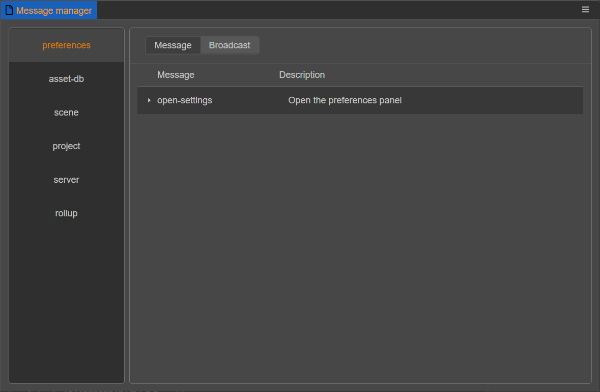
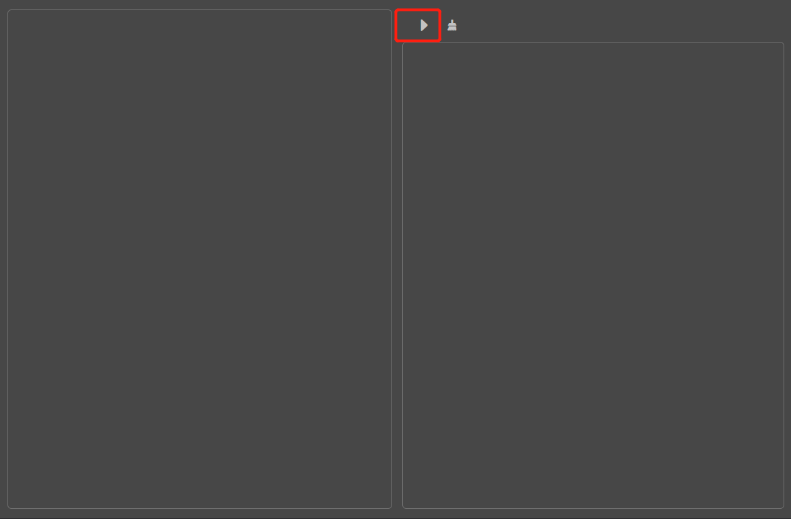
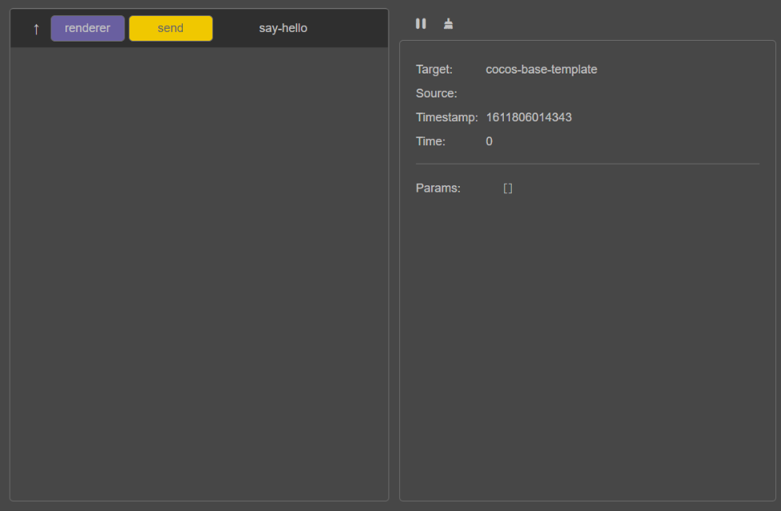

# 消息系统

Cocos Creator 3.0 中有许多独立运行的的进程，这些进程间是相互隔离的。所以在编辑器内需要与其他功能进行交互的时候，需要通过"消息"进行交互。

编辑器里的**消息系统**是 IPC（进程间通信）的功能扩展封装。这个系统承担起了整个编辑器内通讯交互的重担。

## 消息类型

消息交互分成了两种情况：

1. 普通消息：主动发送某条消息到某个功能（扩展）
2. 广播消息：某个功能（扩展）完成了一个操作后向所有人发送通知，告知操作已经完成

详细定义规则以及使用请参考 [扩展消息](../contributions/messages/index.md)

## 对外开放的消息列表

可以通过顶部菜单 **开发者 -> 消息列表** 查看编辑器和扩展对外开放的消息列表。



## 调试消息

为了方便调试，我们提供了一个记录消息的面板，可以通过顶部菜单 **开发者 -> 消息调试工具** 打开这个面板。

点击开始按钮，就会开始记录消息。



然后我们现在有个 `cocos-base-template` 插件。

```json

{
    "name": "cocos-base-template",
    "contributions":{
        "messages": {
            "say-hello": {
                "methods": [
                    "say_hello"
                ]
            },
        }
    }
}

```

打开调试控制台输入以下代码并回车。

```sh
Editor.Message.send('cocos-base-template','say-hello');
```



可以看到我们在渲染进程中向 `cocos-base-template` 这个插件发送了 `say-hello` 消息。
